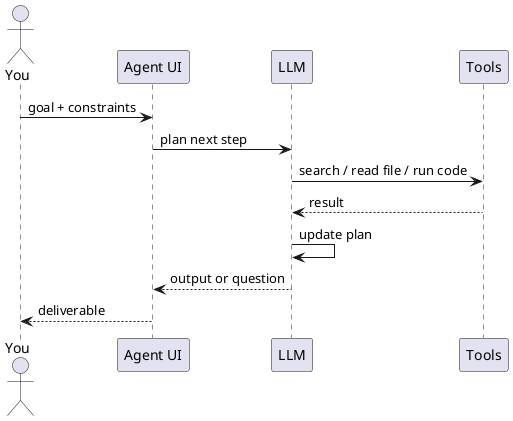

Chat, assistant & agent

## 1. Chat vs assistant vs agent

| Mode | You give | AI does |
|------|----------|---------|
| **Chat** | Question | Single reply |
| **Assistant** | Question + saved docs/instructions | Reply grounded in your knowledge |
| **Agent** | **Goal** | Plan → act → observe → repeat until done or blocked |

```text
Goal: "Find last quarter's churn drivers from these CSVs and slide outline"

Agent loop:
  1. Inspect files
  2. Run analysis / search
  3. Draft outline
  4. Ask you one clarifying question OR deliver
```

## 2. What “agentic orchestration” means for users

**Orchestration** = coordinating **steps and tools** to complete a workflow.

| Layer | User-facing example |
|-------|---------------------|
| **Single agent** | Cursor Agent: edit repo from a task description |
| **Tool use** | ChatGPT with browsing + Python + your Google Drive |
| **Multi-agent** (product-managed) | Research mode that searches, reads, synthesises |
| **External orchestration** | Zapier/Make: trigger → AI step → post to Slack |

You design **goals and guardrails**; the product runs the loop.

