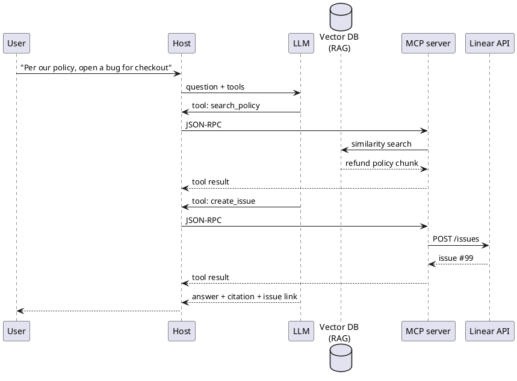

Vector DB, skills & reference

## 10. When you need MCP vs skills vs vector DB

These solve **different problems**. You often combine them.

| Need | Mechanism | Example |
|------|-----------|---------|
| **How to write a PR review** | [Skill](../skills-and-agent-instructions/i-overview.md) | Static playbook in `SKILL.md` |
| **Repo layout and test command** | `AGENTS.md` / rules | Always-in-context project facts |
| **Search 10k support PDFs by meaning** | **Vector DB + RAG** | “What’s our refund policy for EU?” |
| **Fetch live Linear issue #42** | **MCP** tool | Exact, current ticket data |
| **Run `SELECT * FROM orders WHERE id = …`** | **MCP** → Postgres/SQL | Structured lookup, not similarity |

```text
Skills / AGENTS.md     →  always-on instructions (small, static)
Vector DB (RAG)        →  semantic search over large text corpus
MCP tools              →  live actions & exact queries (APIs, SQL, GitHub)
```

### What is a vector DB for here?

A **vector database** stores **embeddings** — numeric representations of text — so you can find **“chunks similar in meaning”** to the user’s question, not just keyword matches.

```text
Offline:  docs → chunk → embed → store vectors (+ metadata)
Online:   question → embed → nearest-neighbour search → top-k chunks → prompt → LLM
```

That pattern is **[RAG](../../llms/v-rag-and-fine-tuning.md)**. The vector DB is the **retrieval engine**; the LLM still writes the answer using those chunks.

### When to use a vector DB

| Use vector DB when… | Why |
|---------------------|-----|
| **Large, changing document set** | Policies, manuals, wiki, past tickets — too big to paste into every prompt |
| **Questions are fuzzy / paraphrased** | User says “cancel subscription”; doc says “terminate plan” — similarity helps |
| **You need citations from prose** | Answer must quote handbook sections |
| **Keyword search fails** | Synonyms, typos, cross-language, conceptual questions |

### When you do **not** need a vector DB

| Skip vector DB when… | Use instead |
|----------------------|-------------|
| **Small, fixed context** | Skills, `AGENTS.md`, a few uploaded files (ChatGPT Project, Cursor rules) |
| **Exact ID or key lookup** | SQL, REST API via **MCP** (`get_order`, `fetch_issue`) |
| **Live operational state** | “Is deploy green?” → monitoring API, not doc search |
| **Structured filters** | `status=open AND team=billing` → database query, not k-NN |
| **Whole repo fits in agent context** | IDE indexes open files; `@docs` may be enough for one codebase |

### Where vector DBs sit relative to MCP

Vector DBs are **not** part of JSON-RPC or the MCP spec. They are **storage behind** retrieval — often reached in one of two ways:

**A) Product-built RAG (you don’t wire MCP)**

ChatGPT Projects, NotebookLM, Copilot — they chunk, embed, and search **inside the product**. You upload files; no vector MCP required.

**B) MCP exposes search as a tool**

Your app or a custom MCP server wraps the vector store:

```text
LLM → host → MCP tool "search_handbook" → vector DB (similarity) → chunks → tool result → LLM
```

Same JSON-RPC path as any other MCP tool; the server runs embed + k-NN, returns text chunks.

**C) Your backend does RAG before the agent**

```text
User question → your API retrieves from vector DB → builds prompt → LLM
Separate MCP tools for: create_ticket, run_sql, post_slack
```

Common in production: **RAG for knowledge**, **MCP for actions**.



### Quick decision tree

```text
Is it "find relevant paragraphs in lots of text"?
  Yes → vector DB (RAG), maybe via MCP search tool
  No ↓
Is it "get this exact record / call this API now"?
  Yes → MCP tool (SQL, REST, SDK)
  No ↓
Is it "how should the agent behave"?
  Yes → skill / AGENTS.md / custom GPT instructions
```

Skills = **playbook**. Vector DB = **semantic memory over documents**. MCP = **live hands** into systems.

**Deeper:** [RAG & fine-tuning](../../llms/v-rag-and-fine-tuning.md), [Custom assistants & knowledge](../custom-assistants-and-knowledge/i-overview.md).

## 11. Quick reference

| Question | Answer |
|----------|--------|
| What is JSON-RPC? | **Remote procedure call** — invoke a named **method** with JSON **params**, get JSON **result** or **error** |
| Is MCP gRPC? | **No** — JSON-RPC 2.0 |
| Does MCP server reply to the LLM directly? | **No** — reply goes to **host**, host passes **tool result** to LLM |
| Local Cursor MCP? | Usually **stdio** (subprocess) |
| Hosted team MCP? | **Streamable HTTP** (POST + optional SSE) |
| How does server reach Linear? | **HTTPS REST** (or vendor SDK) |
| Do I write JSON-RPC? | **No** — host and server handle it |
| When do I need a vector DB? | **Large text corpus + fuzzy semantic search** (RAG) — not for exact API/SQL lookups |
| Vector DB part of MCP? | **No** — optional **backend** behind an MCP search tool or your own RAG app |

## 12. Rehearsal questions

- What does JSON-RPC stand for, and what three fields identify a request?
- MCP vs vector DB — which for “open Linear issue #42” vs “what does our handbook say about refunds”?
- What protocol carries messages between MCP client and server?
- Who sits between the MCP server and the LLM?
- stdio vs Streamable HTTP — when is each used?
- Who calls Linear’s API — the LLM or the MCP server?

**Related:** [Tools & orchestration](../tools-and-orchestration/i-overview.md), [Agents & agentic workflows](../agents-and-agentic-workflows/i-overview.md), [Skills & agent instructions](../skills-and-agent-instructions/i-overview.md).