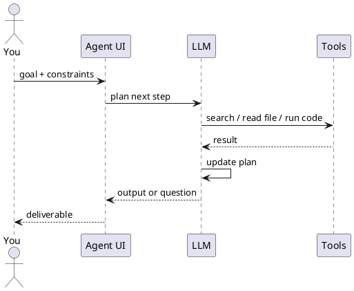

Chat, assistant & agent

## 1. Chat vs assistant vs agent

| Mode | You give | AI does |
|------|----------|---------|
| **Chat** | Question | Single reply |
| **Assistant** | Question + saved docs/instructions | Reply grounded in your knowledge |
| **Agent** | **Goal** | Plan → act → observe → repeat until done or blocked |

```text
Goal: "Find last quarter's churn drivers from these CSVs and slide outline"

Agent loop:
  1. Inspect files
  2. Run analysis / search
  3. Draft outline
  4. Ask you one clarifying question OR deliver
```

## 2. What “agentic orchestration” means for users

**Orchestration** = coordinating **steps and tools** to complete a workflow.

| Layer | User-facing example |
|-------|---------------------|
| **Single agent** | Cursor Agent: edit repo from a task description |
| **Tool use** | ChatGPT with browsing + Python + your Google Drive |
| **Multi-agent** (product-managed) | Research mode that searches, reads, synthesises |
| **External orchestration** | Zapier/Make: trigger → AI step → post to Slack |

You design **goals and guardrails**; the product runs the loop.



## 3. Adding more tools to your LLM

**Tools** are actions the model can **request** through the host app — search the web, read a file, run code, call an API — instead of only generating text. More tools = the LLM can **do** more in the agent loop above.

You do not modify model weights. You **expose capabilities** the product wires into the tool-calling loop.

```text
You enable tools  →  host registers tool names + descriptions  →  LLM picks tool  →  host runs it  →  result back to LLM
```

| What you add | What the LLM gains |
|--------------|-------------------|
| Web search | Current events, docs, citations |
| Code interpreter | Charts, CSV analysis, small scripts |
| File / drive connector | Read your docs without paste |
| GitHub / Linear MCP | Issues, PRs, live tickets |
| Terminal (IDE agent) | Tests, builds, git |
| Skill + script | Repeatable API workflow the agent runs on command |
| MCP / Action wrapping a script | Same script, exposed as a named `translate` tool |

### Option A — Built-in tools (toggle in the UI)

Most chat products ship tools; you **enable** them per chat or workspace.

| Product | Typical built-ins | How to add |
|---------|-------------------|------------|
| **ChatGPT** | Browsing, Code Interpreter, image | Model picker / agent mode; Custom GPT **Actions** for your APIs |
| **Claude** | Web search, analysis, computer use (where enabled) | Project or chat settings; **connectors** for Drive, GitHub |
| **Gemini** | Google Search, Workspace | Extensions in Gemini apps |
| **Cursor** | Codebase, terminal, browser, edit files | Agent mode; `@` files and docs |
| **Copilot** | M365 graph, repo context | Tenant plugins / Copilot Studio |

Start here before custom wiring — zero config beyond permissions.

### Option B — App connectors (OAuth)

**Connectors** let the host read or act in SaaS you already use.

```text
Settings → Connect Google Drive / Slack / GitHub → approve OAuth scopes → model can search or summarise connected data
```

| Good for | Watch out |
|----------|-----------|
| Less copy-paste | Only connect data you may expose to AI |
| Fresher context | Wrong connector scope = over-broad access |

Same idea as [orchestration patterns](../tools-and-orchestration/iii-orchestration-patterns.md) — connectors section.

### Option C — MCP servers (extend IDE and desktop agents)

**MCP (Model Context Protocol)** adds **custom tools** via small connector programs — Postgres, Sentry, internal APIs.

| Step | Action |
|------|--------|
| 1 | Pick or install an MCP server (`@modelcontextprotocol/server-github`, vendor plugin, team-hosted HTTP server) |
| 2 | Configure in host (`mcp.json` in Cursor, Claude Desktop settings) |
| 3 | Provide tokens via env vars — never in git |
| 4 | Restart host; tools appear in agent tool list |
| 5 | Ask in natural language; model chooses `search_issues`, `run_query`, etc. |

**Cursor `mcp.json` (conceptual):**

```json
{
  "mcpServers": {
    "github": {
      "command": "npx",
      "args": ["-y", "@modelcontextprotocol/server-github"],
      "env": { "GITHUB_PERSONAL_ACCESS_TOKEN": "..." }
    }
  }
}
```

Wire format is **JSON-RPC** (stdio or HTTP), not something you hand-author in prompts. Full detail: [How MCP works](../how-mcp-works/i-overview.md).

### Option D — Custom actions / your own API (power users)

| Mechanism | Fit |
|-----------|-----|
| **Custom GPT Actions** | OpenAPI schema → ChatGPT calls your HTTPS endpoints |
| **Claude tool use + MCP** | Same pattern for desktop / API integrations |
| **Zapier / Make / n8n** | LLM step in a workflow; tools = other SaaS nodes |
| **Your backend** | App calls LLM with `tools` parameter (OpenAI/Anthropic APIs) — builder path |

For **non-developers**, Custom GPT Actions and automation platforms are the usual way to “add one more tool” (e.g. create CRM record, post to Slack).

### Option E — Skills + script calling (are they tools?)

**Short answer:** a **skill is not a tool**; a **script can be**.

| Piece | What it is | Callable tool? |
|-------|------------|----------------|
| **Skill (`SKILL.md`)** | Instructions: when to act, which command, output format | **No** — loaded as **context** (playbook) |
| **Script** (`translate.py`) | Code that hits an API and prints a result | **Yes** — when the host can **run** it (terminal, MCP, Custom Action backend) |
| **Skill + script together** | Skill tells the agent *“for translation, run this script”* | **Indirect tool** — model calls **run terminal** or a wrapped **`translate`** tool |

```text
Skill     →  "Use scripts/translate.py for any translate request"
Script    →  calls Google Translate API, returns JSON/text
Host tool →  Shell (Cursor Agent) OR MCP tool OR HTTPS Action
LLM       →  sees tool result, writes answer to user
```

Three common ways to wire the same script:

| Wiring | Who runs the script | Model sees |
|--------|---------------------|------------|
| **IDE agent + skill** | Host runs `python scripts/translate.py …` in terminal | Terminal output in tool result |
| **MCP server** | MCP server invokes script or HTTP internally | `translate` in tool list |
| **Custom GPT Action** | Your small API runs script server-side | `translateText` in OpenAPI actions |

Skills and scripts are a good fit for **one team, one repo, one API key in env** — without building a full MCP server on day one.

#### Example: translate with Google Cloud Translation API

**1. Enable** [Cloud Translation API](https://cloud.google.com/translate/docs) and create an API key (restrict by IP or use a secrets manager in production).

**2. Script** — `scripts/translate.py` (stdlib only; key in env):

```python
#!/usr/bin/env python3
"""Usage: python scripts/translate.py "Hello team" ja"""
import json
import os
import sys
import urllib.parse
import urllib.request

API_KEY = os.environ["GOOGLE_TRANSLATE_API_KEY"]

def translate(text: str, target: str = "en") -> str:
    params = urllib.parse.urlencode({"q": text, "target": target, "key": API_KEY})
    url = f"https://translation.googleapis.com/language/translate/v2?{params}"
    with urllib.request.urlopen(url) as resp:
        data = json.load(resp)
    return data["data"]["translations"][0]["translatedText"]

if __name__ == "__main__":
    text = sys.argv[1]
    target = sys.argv[2] if len(sys.argv) > 2 else "en"
    print(translate(text, target))
```

```bash
export GOOGLE_TRANSLATE_API_KEY="your-key"
python scripts/translate.py "Welcome to the beta" ja
# → ベータ版へようこそ
```

**3. Skill** — `.cursor/skills/translate/SKILL.md` (or `.claude/skills/…`):

```markdown
---
name: google-translate
description: Translate user text via scripts/translate.py and Google Translation API. Use when the user asks to translate, localize, or convert text to another language.
---

# Translate

1. Detect target language from the user request (default `en`).
2. Run: `python scripts/translate.py "<text>" <target_lang_code>`
3. Return the script output verbatim; do not invent translations.
4. API key is in env `GOOGLE_TRANSLATE_API_KEY` — never print it.
```

**4. User asks in Cursor Agent:**

```text
Translate this sentence to Japanese: "Ship date is April 15."
```

**5. What happens:**

```text
Agent loads skill → chooses terminal tool → runs script → gets 「発売日は4月15日です」 → replies to you
```

That is **script calling as a tool**: the LLM did not call Google directly; the **host executed code** and fed the result back.

**Same script as a formal tool (MCP / API):** wrap `translate()` in an MCP server that exposes `tools/call` method `translate` with `{ "text", "target" }`, or expose `POST /translate` in OpenAPI for a Custom GPT Action — the HTTP/MCP layer is the tool; the script logic stays the same.

| Approach | Best when |
|----------|-----------|
| Skill + terminal | Solo dev, Cursor/Claude Code, quick internal utility |
| MCP wrapper | Shared tool list, audit, no arbitrary shell |
| Custom GPT Action | Non-technical users in ChatGPT only |

#### Does this reduce token usage?

**Sometimes yes — but skills and scripts affect tokens differently.**

| Piece | Token effect | Why |
|-------|--------------|-----|
| **Skill loaded into context** | **Costs tokens** | `SKILL.md` text is added to the prompt (often only when relevant — depends on product) |
| **Script / API tool result** | **Usually saves tokens** | Model gets a **short factual result** (one translated line) instead of generating or reasoning at length |
| **Fewer retry turns** | **Saves tokens** | Right command first time vs five “try again” chats |
| **Each tool call round** | **Costs tokens** | Tool name, args JSON, and result all go back into context for the next LLM turn |

**Translate example — compare:**

| Approach | Rough token picture |
|----------|---------------------|
| LLM translates in chat | Output tokens for full answer + sometimes chain-of-thought; quality risk |
| Paste Google API docs every time | Large **input** every session |
| Skill once + script call | One-time skill cost; tool result ≈ one short string; API docs stay **out** of the model |

```text
Expensive:  "Here is our 2-page translation policy…" pasted every chat
Cheaper:    SKILL.md (~30 lines, loaded when needed) + tool result "発売日は4月15日です"
```

**Net savings when:**

- The script returns **compact** data (translation, price, status code) — not megabytes of logs
- The skill replaces **repeated** long instructions you would otherwise paste
- You avoid **multi-turn** correction loops

**Net cost or no win when:**

- Skill file is **huge** (paste a manual into `SKILL.md` — use `reference.md` + short skill instead)
- **Many** tools fire in one task (each result added to context)
- You enable **dozens** of MCP tools — tool **descriptions** alone bloat the system prompt
- Script output is massive (dump entire DB) — trim before returning to the LLM

**Practical rule:** skills trade **a small fixed instruction cost** for **less chat thrash**; scripts trade **one tool round** for **not asking the model to simulate an API**. Together they often reduce **total session tokens** — not because the model does less work magically, but because you stop re-sending the same rules and stop generating what code already computed.

See [Skills & agent instructions](../skills-and-agent-instructions/i-overview.md) for keeping skills short; [How MCP works](../how-mcp-works/i-overview.md) to promote the script to a first-class MCP tool.

### What the model actually sees

The LLM does **not** get raw API keys. It sees a **tool catalog**:

| Field | Purpose |
|-------|---------|
| **Name** | `get_issue`, `search_docs` |
| **Description** | When to use it — quality matters for correct picks |
| **Parameters** | JSON schema the host validates |

Better descriptions → fewer wrong tool calls. If a tool misfires, tighten the description or reduce how many tools are enabled at once.

### Practical checklist

| Step | Do |
|------|-----|
| 1 | List what the agent must **read** vs **write** (read-only first) |
| 2 | Enable **built-ins** that cover 80% (search, files, code) |
| 3 | Add **connectors** for your doc stores |
| 4 | Add **MCP** only for live systems chat cannot reach |
| 5 | Narrow **OAuth / token scopes**; rotate secrets |
| 6 | Test with one clear goal: “Find open P1 bugs and summarise” |

| Avoid | Why |
|-------|-----|
| Enabling every MCP server at once | Model picks wrong tool; wider attack surface |
| Write tools without human review | Agents can post, delete, or charge APIs |
| Duplicating same data via connector + MCP + upload | Conflicting context |

**Related:** [Skills & agent instructions](../skills-and-agent-instructions/i-overview.md), [How MCP works](../how-mcp-works/i-overview.md), [Orchestration patterns](../tools-and-orchestration/iii-orchestration-patterns.md), [Directing agents](iii-directing-agents.md), [Trust & verify](../trust-privacy-and-verify/i-overview.md).