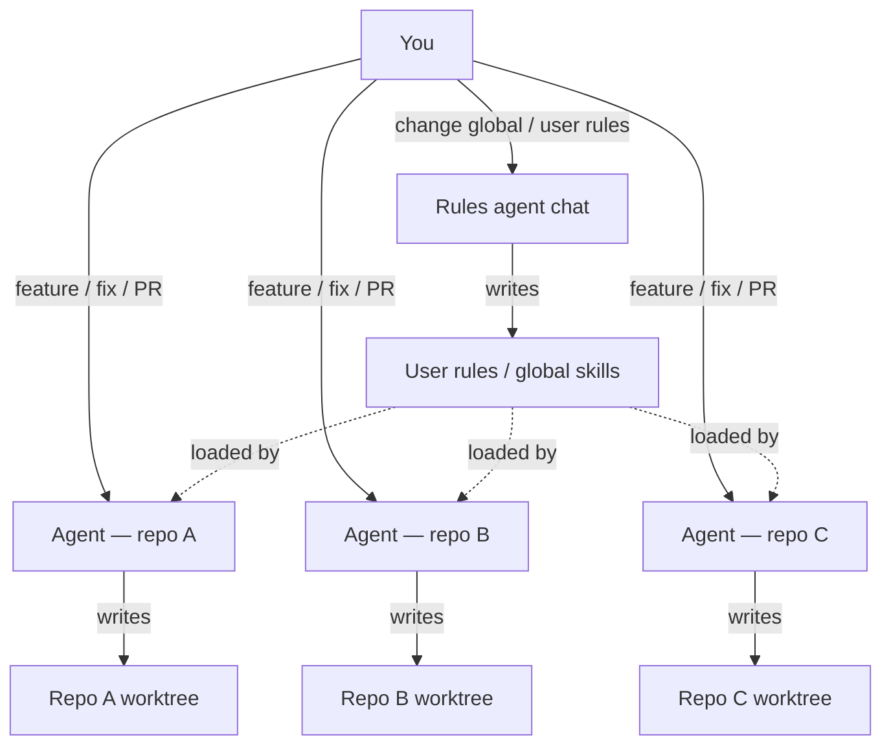
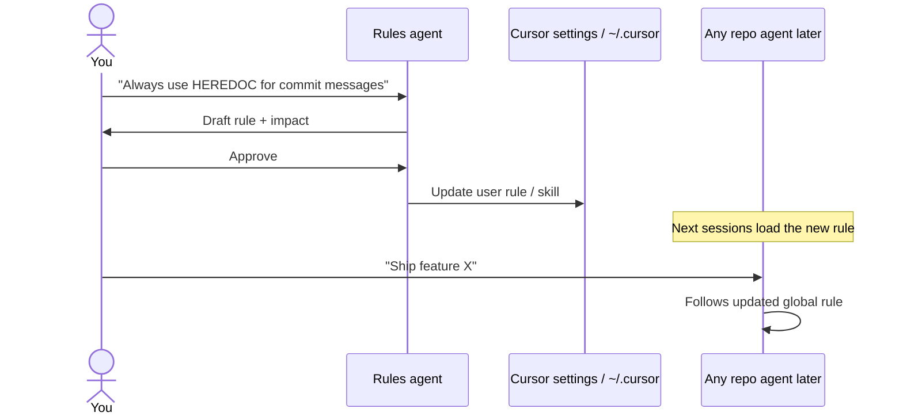
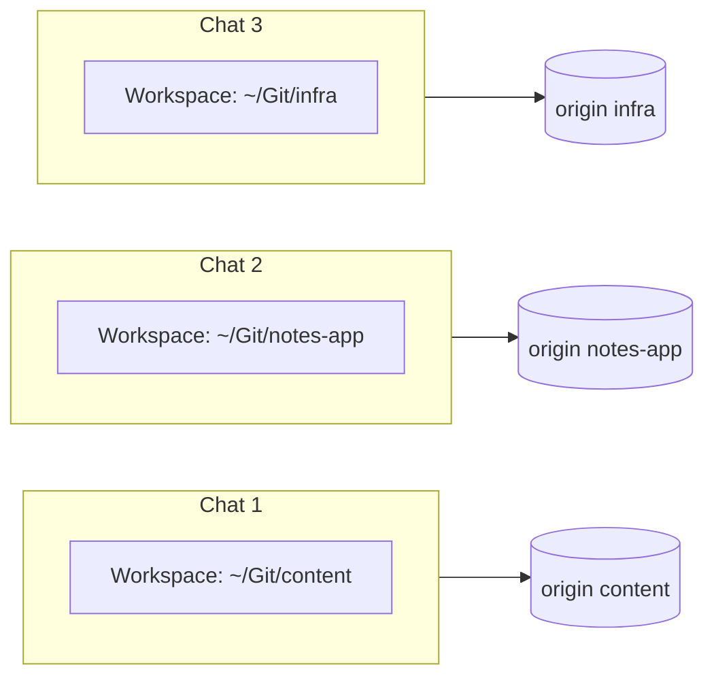
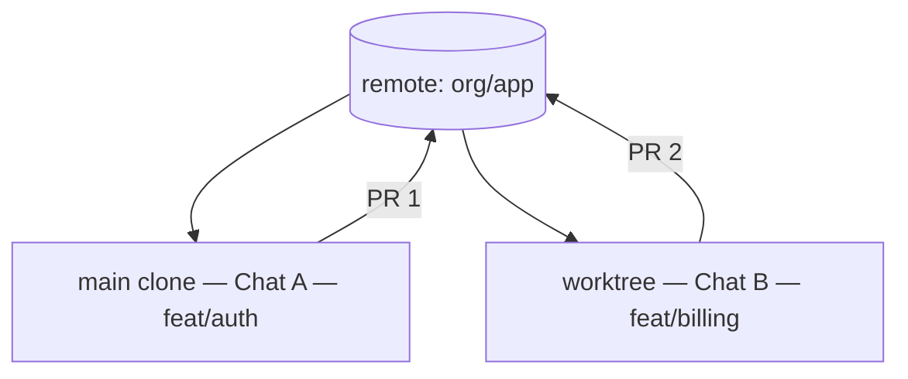
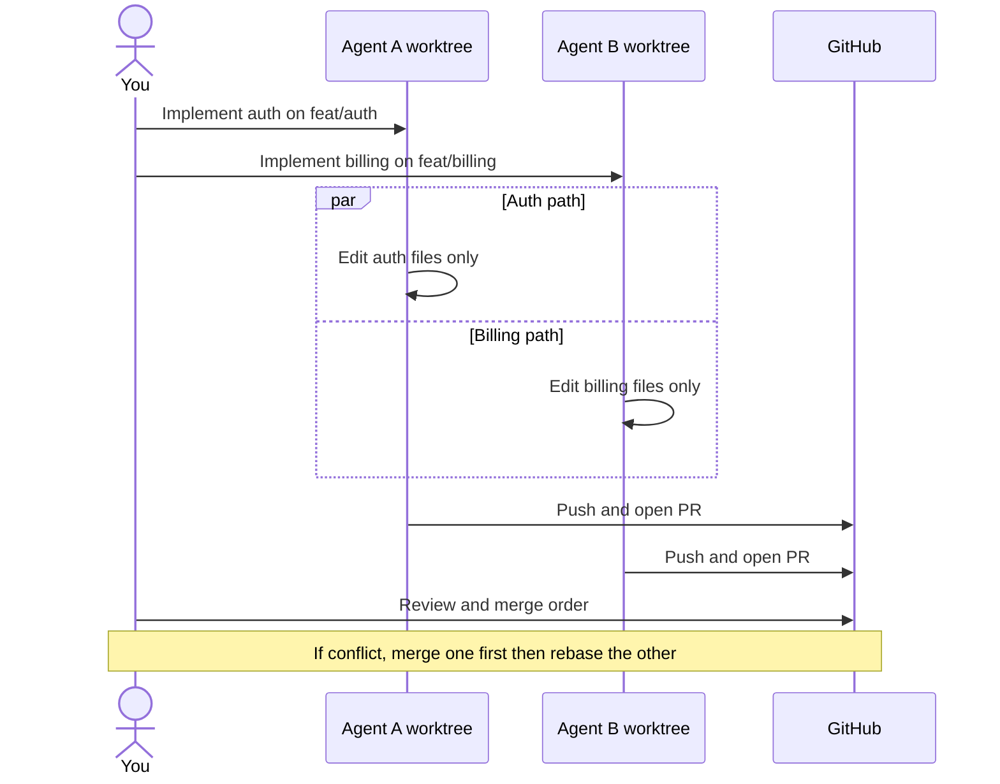
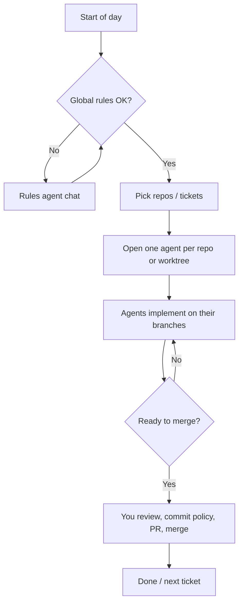

My setup — multi-agent Cursor workflow
How I run **Cursor agents** day to day: one chat owns **global rules**, other chats do **repo work**, and I keep **parallel work** safe when several agents touch the same codebase.

This is a personal operating model, not a product requirement. Related: [Directing agents](iii-directing-agents.md), [Cursor skills, rules & AGENTS.md](../skills-and-agent-instructions/iv-cursor-skills-rules-agents-md.md), [Agent orchestration](../skills-and-agent-instructions/using-skills-agents-and-hooks/vi-agent-orchestration.md).

## 1. Roles at a glance

| Agent chat | Owns | Does not own |
|------------|------|--------------|
| **Rules agent** | User rules, global habits, cross-repo conventions | Feature PRs in product repos |
| **Repo agents** | One (or few) git remotes / worktrees each | Editing my global rule set “while they’re at it” |
| **Me** | Merge decisions, which chat is allowed to write | Blind trust of every tool call |



**Rule:** the Rules agent changes **how all agents behave**. Repo agents change **code**. Mixing those jobs in one chat causes surprise diffs and half-finished rule edits.

## 2. Rules agent (global)

Use a **dedicated chat** (and often a scratch or notes workspace) whose only job is instruction surface area:

| Layer | Typical location | Scope |
|-------|------------------|-------|
| **User rules** | Cursor user rules (account / settings) | Every project |
| **User skills** | `~/.cursor/skills/` | Every project |
| **User hooks** | User-level hooks if you use them | Every project |
| **Team rules** | Only when you explicitly open that repo | That remote |

Prompt pattern for the Rules agent:

```text
You only edit global / user-level Cursor rules and skills.
Do not change application code in product repos.
Propose the rule text, show before/after, wait for my OK, then apply.
```



Keep a short **changelog** in the Rules chat (or a private note): date, what changed, why — so you can roll back bad global instructions.

## 3. Repo agents (different remotes)

Spin **one agent chat per active repo** (or per epic). Point the workspace root at that clone before asking for edits.



| Practice | Why |
|----------|-----|
| **Name the chat** after the repo / ticket | Less context bleed |
| **One branch per agent** when possible | Cleaner PRs |
| **Tell the agent the repo path** if roots can move | Avoid editing the wrong tree |
| **Don’t ask Chat B to “also fix global rules”** | That’s the Rules agent’s job |

## 4. Same repo, same time

Several agents on **one remote** is fine if they don’t fight over the same files. Prefer **git worktrees** (or separate clones) so each chat has its own checkout and branch.



### Coordination checklist

| Risk | Mitigation |
|------|------------|
| Two agents edit the same file | Split by directory / ownership; or serialize |
| Both commit on one branch | **One branch per agent**; rebase/merge via you |
| Stale context after pull | Tell each chat when `main` moved |
| Hook / lock file fights | Don’t run long installers in two trees at once without need |
| Rules change mid-flight | Pause repo agents; update Rules agent; resume |



### When *not* to parallelize

- Large renames / moves that touch the whole tree  
- Shared generated locks (`package-lock.json`) without a plan  
- “Refactor everything” + “ship a hotfix” in the same hours  

Then: **one agent**, or hotfix first, refactor second.

## 5. End-to-end day shape



## 6. Prompt snippets I reuse

**Rules agent**

```text
Scope: user-level Cursor rules only.
Output: proposed rule text, files touched, rollback note.
Do not modify any git repo application source.
```

**Repo agent**

```text
Repo: <path or name>. Branch: feat/<ticket>.
Do not change user/global Cursor rules.
If a standing rule should change, say so — I will run the Rules agent.
```

**Same-repo parallel**

```text
You own paths: <dirs>. Other agent owns: <dirs>.
Do not edit outside your paths. Worktree: <path>. Branch: <name>.
```

## 7. Related notes

| Topic | Note |
|-------|------|
| How to steer agents | [Directing agents](iii-directing-agents.md) |
| Where rules/skills live | [Cursor skills, rules & AGENTS.md](../skills-and-agent-instructions/iv-cursor-skills-rules-agents-md.md) |
| Human approval loops | [Products & human-in-the-loop](iv-products-and-human-in-the-loop.md) |

## Next

Return to [Agents & agentic workflows overview](i-overview.md).
