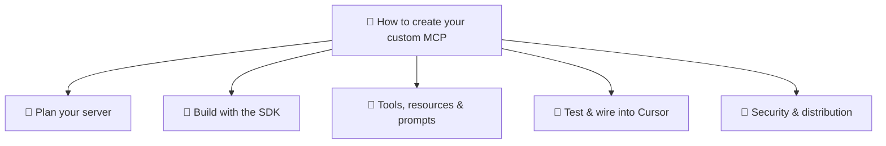

How to create your custom MCP — overview
Hands-on track for building an **MCP server** — a small program that exposes **tools** (and optionally **resources** / **prompts**) so Cursor, Claude Desktop, and other hosts can call **your** APIs, scripts, or data.

Read [How MCP works](../i-overview.md) first for JSON-RPC, stdio vs HTTP, and the host/client/server roles. This track is **implementation**: scaffold → define tools → test → wire into Cursor.

## Map of this submenu



Click a node to open that note. If clicks are disabled in your viewer, use the sidebar or search.

## What you are building

```text
Cursor (host)  →  MCP client  →  YOUR server (stdio)  →  your DB / API / script
```

| You write | Host handles |
|-----------|--------------|
| Tool names, input schemas, handler logic | Spawning process, JSON-RPC, LLM tool choice |
| Env-based secrets (`API_KEY`) | Injecting env from `mcp.json` |
| Returning text / JSON in MCP `content` | Feeding tool results back to the model |

## When a custom MCP makes sense

| Build custom MCP | Use existing / Skills instead |
|------------------|-------------------------------|
| Internal API or DB only your team has | Official `@modelcontextprotocol/server-*` already exists |
| Repeatable agent actions (create ticket, run query) | One-off instructions → [Skills](../../skills-and-agent-instructions/i-overview.md) |
| Same connector for Cursor + Claude Desktop | Static docs the model should read every time |

## Study order

[Plan your server](ii-plan-your-server.md) → [Build with the SDK](iii-build-with-the-sdk.md) → [Tools, resources & prompts](iv-tools-resources-and-prompts.md) → [Test & wire into Cursor](v-test-and-wire-cursor.md) → [Security & distribution](vi-security-and-distribution.md)

## Prerequisites

| Skill | Why |
|-------|-----|
| Basic **JSON** | Tool inputs/outputs are JSON-shaped |
| **Node 18+** or **Python 3.10+** | Official MCP SDKs |
| One **external system** to wrap | REST API, Postgres, filesystem path, shell script |

**Spec reference:** [modelcontextprotocol.io](https://modelcontextprotocol.io)
