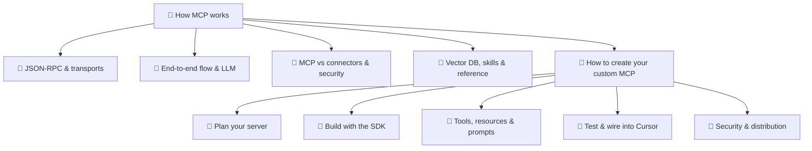

How MCP works — overview
Deep dive on **how mcp works** — split into focused notes below.

## Map of this submenu

Click a node to open that note (GitHub / Mermaid Live). If clicks are disabled in your viewer, use the sidebar or search.

How MCP works
**MCP (Model Context Protocol)** is how tools like **Cursor**, **Claude Desktop**, and **Claude Code** plug into **external systems** — databases, GitHub, Linear, Sentry — through small **connector programs** called **MCP servers**.

You configure them once; the agent **calls tools** the server exposes. This note explains **how that connection works** — API, gRPC, or something else.

## Study order

[JSON-RPC & transports](ii-json-rpc-and-transports.md) → [End-to-end flow & LLM](iii-end-to-end-flow-and-llm.md) → [MCP vs connectors & security](iv-mcp-vs-connectors-and-security.md) → [Vector DB, skills & reference](v-vector-db-skills-and-reference.md)

**Build your own:** [How to create your custom MCP](how-to-create-your-custom-mcp/i-overview.md) — after you understand transports and the end-to-end flow.
