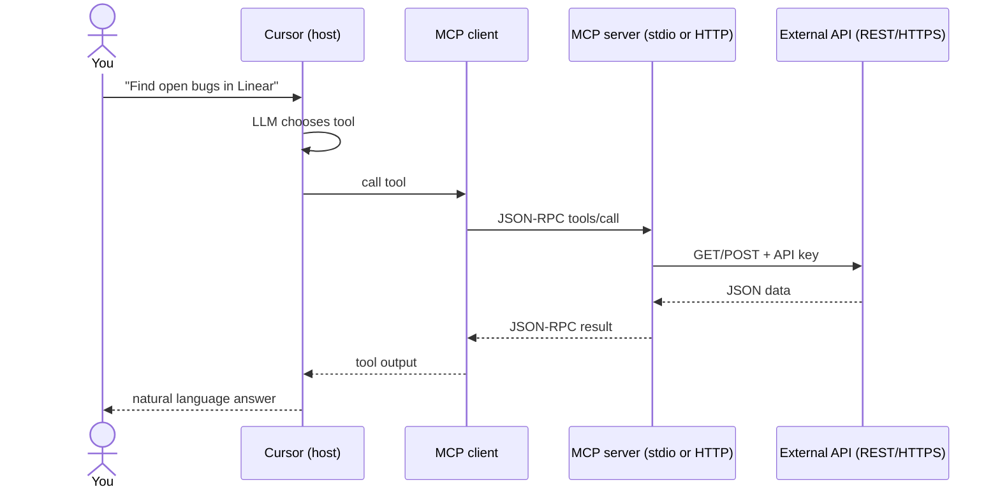
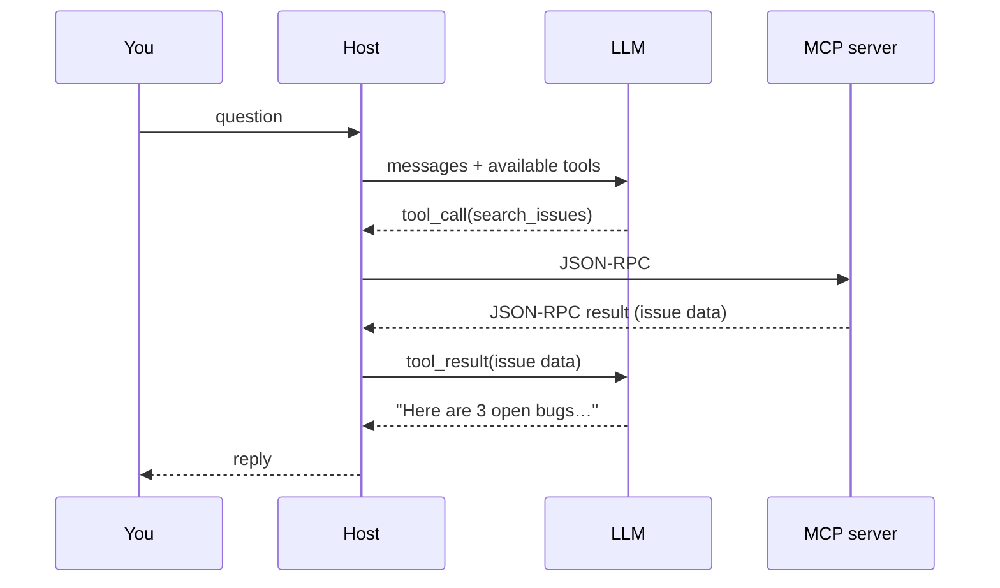

End-to-end flow & LLM

## 5. End-to-end flow



| Step | Protocol |
|------|----------|
| You ↔ Host | Chat UI |
| Host ↔ MCP server | **JSON-RPC** over stdio or HTTP |
| MCP server ↔ SaaS | **That product’s API** (REST, GraphQL, SDK) |

## 6. Does JSON go straight to the LLM?

**Almost — but not directly.** The MCP server sends JSON back to the **host’s MCP client**, not straight into the model API with no middle step. The **host** (Cursor, Claude Desktop) then **injects that result into the chat** as a **tool result**, and the **LLM reads it on the next turn**.

```text
1. You ask a question
2. LLM (in host) says: "call tool search_issues"
3. Host → MCP server (JSON-RPC request)
4. MCP server → Linear API → gets data
5. MCP server → Host (JSON-RPC response with tool output)
6. Host adds "tool result" to conversation context
7. LLM reads tool result → writes answer in plain English
8. You see the final reply
```

| Hop | What travels | Who sees it |
|-----|--------------|-------------|
| MCP client ↔ MCP server | **JSON-RPC** (wire protocol) | Host only — not shown in chat UI |
| Host ↔ LLM | **Tool call + tool result** (text/JSON in messages) | Model uses it as context |
| Host ↔ You | **Natural language** | What you read |

So yes: the **data** is usually JSON (issue list, query rows, file contents). The LLM **does** consume that content — but **via the host**, which wraps it in the standard **tool-calling** loop. The LLM does **not** open a socket to the MCP server itself.

The loop can repeat: LLM may call **several** MCP tools before answering you.



**What you see:** the final prose (and maybe tool-run indicators in the UI). **What you don’t see:** raw JSON-RPC between client and server — unless you debug logs.

## 7. What the MCP server exposes

After connect, the server advertises capabilities:

| Capability | Agent can… |
|------------|------------|
| **Tools** | Call functions (`create_issue`, `run_query`) |
| **Resources** | Read URIs (`file://`, `db://schema/users`) |
| **Prompts** | Use pre-built prompt templates (less common for users) |

The **LLM** sees tool **names and descriptions**; the host maps model intent to MCP **tool calls**.