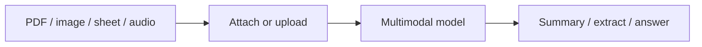

Multimodal & files — overview
Deep dive on **multimodal & files** — split into focused notes below.

## Map of this submenu

| Note | Focus |
|------|--------|
| [PDFs & documents](ii-pdfs-and-documents.md) | Part of multimodal & files track |
| [Images, spreadsheets & data](iii-images-spreadsheets-data.md) | Part of multimodal & files track |
| [Voice, code & limits](iv-voice-code-and-limits.md) | Part of multimodal & files track |

Multimodal and files
Modern AI tools accept **images**, **PDFs**, **spreadsheets**, **audio**, and **screenshots** — not just typed prompts. Using files well beats retyping content.

## Study order

[PDFs & documents](ii-pdfs-and-documents.md) → [Images, spreadsheets & data](iii-images-spreadsheets-data.md) → [Voice, code & limits](iv-voice-code-and-limits.md)
