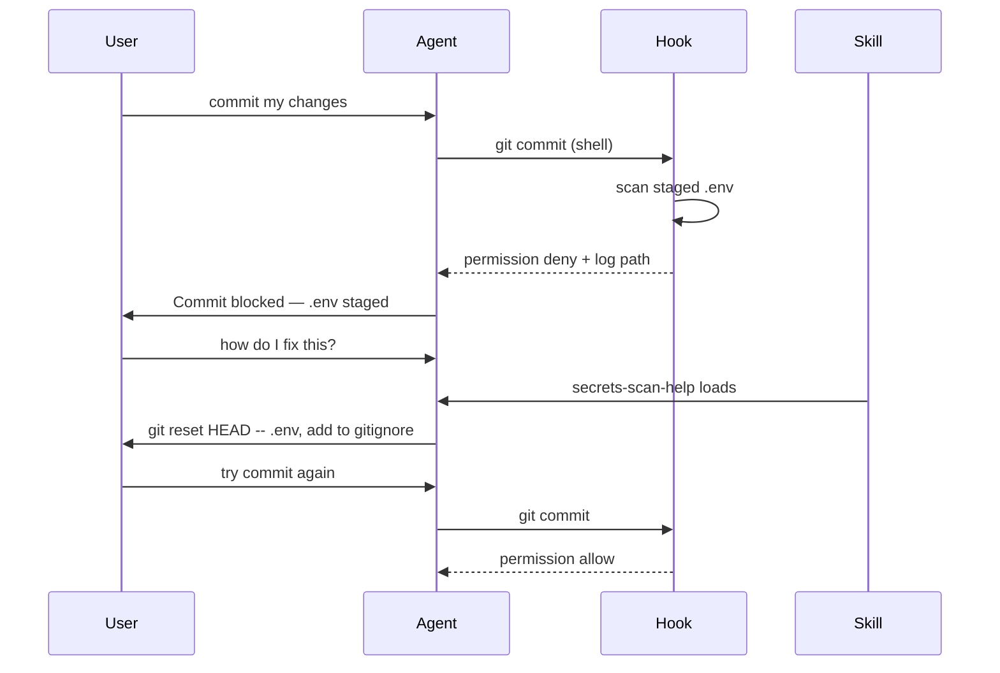

Combine skills, agents & hooks

Use **each layer for one job**. Together they cover: always-on context, on-demand expertise, and automatic gates.

## Full repo layout

```text
repo/
  AGENTS.md                           ← every session
  .cursor/
    hooks.json                        ← events (commit, edit, …)
    hooks/
      secrets_scan.py
    skills/
      pr-review-lite/                 ← user asks "review PR"
      deploy-check/                   ← user asks "deploy check"
      secrets-scan-help/              ← user asks "why commit blocked"
      hook-failure-help/              ← generic blocked-action help
```

Copy samples from [sample/](sample/.cursor/README.md) + scripts from [examples/.cursor/](../examples/.cursor/README.md).

## Scenario A — User asks for PR review (skill only)

```text
1. AGENTS.md → agent knows npm test, folder layout
2. User: "review this PR"
3. pr-review-lite skill loads
4. Agent reviews diff, cites AGENTS.md test command
5. No hook fires
```

## Scenario B — Agent tries to commit with `.env` staged (hook only)

```text
1. AGENTS.md → line: "Commits gated by secrets scan hook"
2. Agent: git commit -m "add config"
3. beforeShellExecution → secrets_scan.py → DENY
4. Commit never runs; agent sees agent_message from hook
5. secrets-scan-help skill can load if user says "why blocked"
```

## Scenario C — Deploy check before release (skill + script)

```text
1. AGENTS.md → links deploy-check skill
2. User: "are we ready to deploy?"
3. deploy-check skill → asks environment → confirms → runs script
4. Script writes JSON log → agent summarizes
5. Hook not involved unless user commits afterward
```

## Scenario D — Blocked commit → explain → fix → retry



## Responsibility matrix

| Concern | AGENTS.md | Skill | Hook |
|---------|-----------|-------|------|
| Test command | ✓ | | |
| PR checklist | index link | ✓ procedure | |
| Block bad commit | one-line note | explain fix | ✓ enforce |
| Parameterized deploy | index link | ✓ ask + run script | |
| JSON logs | | agent reads | hook writes |

## Anti-patterns

| Don’t | Do instead |
|-------|------------|
| Put full PR checklist in `AGENTS.md` | Skill + link from `AGENTS.md` |
| Put commit rules only in a skill | Hook for enforce; skill for explain |
| Make hook call the LLM | Hook = script; skill handles prose |
| Duplicate same text in 3 files | `AGENTS.md` indexes skills; skills reference scripts |

## Install checklist

1. [ ] `AGENTS.md` at repo root — [sample](sample/AGENTS.md)
2. [ ] `.cursor/skills/` — [pr-review-lite](sample/.cursor/skills/pr-review-lite/SKILL.md) + [examples skills](../examples/.cursor/README.md)
3. [ ] `.cursor/hooks.json` + `hooks/` — [examples hooks](../examples/.cursor/hooks.json)
4. [ ] `.gitignore` — `logs/` under skills and hooks
5. [ ] Fresh chat + test each path (review, deploy, staged `.env` commit)

## Related

- [Agent orchestration](vi-agent-orchestration.md) — full stack and advanced patterns
- [Examples overview](../examples/i-overview.md)
- [Writing & maintaining skills](../v-writing-and-maintaining-skills.md)
- [Loop prompting](../../loop-prompting/i-overview.md)
