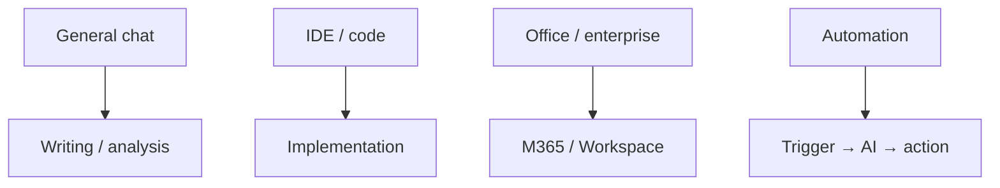

Tool map

## 1. Tool map

| Category | Examples | Best for |
|----------|----------|----------|
| **General chat** | ChatGPT, Claude, Gemini | Writing, analysis, brainstorming |
| **IDE / code** | Cursor, GitHub Copilot, Cody | Implementation, refactors, tests — use [Skills](../skills-and-agent-instructions/i-overview.md) |
| **Office / enterprise** | Microsoft Copilot, Google Duet | Email, slides, sheets in tenant |
| **Search + AI** | Perplexity, Gemini with search | Cited quick research |
| **Automation** | Zapier, Make, n8n | Trigger → AI step → action |
| **Meeting / voice** | Otter, Fireflies, native transcribe | Notes, follow-ups |
| **Design / image** | Midjourney, DALL·E, Ideogram | Visuals from prompts |

Pick **one primary chat** and **one primary coding assistant** to avoid context sprawl.