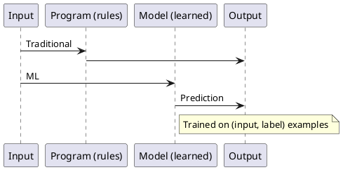

Machine learning — overview
**Machine learning (ML)** builds systems that **improve from data** instead of relying only on hand-written rules. You provide **examples**; an algorithm adjusts **parameters** so predictions get better on **new, unseen** inputs.

## Map of this submenu

| Part | Topic |
|------|--------|
| **I — Overview** | Vocabulary, paradigms, how this track fits AI101 |
| **II — Supervised learning** | Classification, regression, loss, common algorithms |
| **III — Unsupervised learning** | Clustering, dimensionality reduction, anomaly detection |
| **IV — Model evaluation** | Train/val/test, metrics, cross-validation |
| **V — Overfitting & regularization** | Bias-variance, L1/L2, tuning |
| **VI — Feature engineering** | Numeric, categorical, text features; leakage |
| **VII — ML workflow & deployment** | End-to-end pipeline, drift, MLOps touchpoints |

## Rules vs learning

| Traditional programming | Machine learning |
|-------------------------|------------------|
| Engineer writes `if` / `else` logic | Model learns patterns from data |
| Behavior changes when **code** changes | Behavior changes when **data** or **training** changes |
| Works when rules are simple and known | Works when rules are too complex to specify |



## Core vocabulary

| Term | Meaning |
|------|---------|
| **Feature (X)** | Measurable input — column, pixel, sensor reading |
| **Label / target (y)** | What you predict — class, price, rating |
| **Model** | Learned function **f(X) ≈ y** |
| **Training** | Fit parameters to minimise **loss** |
| **Inference** | Run trained model on new data |
| **Hyperparameter** | Chosen before training — learning rate, tree depth |

## Three paradigms

| Paradigm | Data | Goal |
|----------|------|------|
| **Supervised** | Labelled examples | Predict labels for new inputs |
| **Unsupervised** | Unlabelled | Find structure (clusters, components) |
| **Reinforcement** | Agent + environment | Maximise cumulative **reward** |

Most production tabular ML is **supervised**. Language and vision pre-training often use **self-supervised** objectives (labels derived from the data itself).

## Minimal supervised experiment

```python
from sklearn.model_selection import train_test_split
from sklearn.ensemble import RandomForestClassifier
from sklearn.metrics import classification_report

X_train, X_test, y_train, y_test = train_test_split(X, y, test_size=0.2, random_state=42)
model = RandomForestClassifier()
model.fit(X_train, y_train)
print(classification_report(y_test, model.predict(X_test)))
```

## What you need

| Piece | Role |
|-------|------|
| **Python** | pandas, scikit-learn |
| **Statistics** | Distributions, variance, metric confidence |
| **Domain knowledge** | Define the right label and features |
| **Evaluation discipline** | Hold-out test, no leakage |

## Next

Continue with [Supervised learning](ii-supervised-learning.md).

**Related:** [AI101 overview](../i-overview.md), [Deep learning overview](../deep-learning/i-overview.md).
