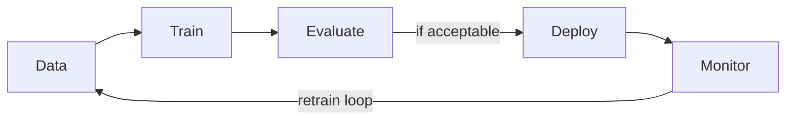

ML workflow and deployment
From problem definition to **production inference** — the loop engineers repeat for every ML product.

## 1. End-to-end workflow

| Step | Actions |
|------|---------|
| **1. Problem** | Define metric tied to business (revenue, safety, latency) |
| **2. Data** | Collect, label, document schema and biases |
| **3. EDA** | Distributions, missingness, outliers, leakage checks |
| **4. Features** | [Feature engineering](vi-feature-engineering.md), pipelines |
| **5. Baseline** | Simple model or heuristic |
| **6. Train & tune** | Validation-driven iteration |
| **7. Test** | Final hold-out evaluation — report this number |
| **8. Deploy** | Batch or online serving |
| **9. Monitor** | Drift, performance, data quality |
| **10. Retrain** | Scheduled or triggered by drift |

## 2. Batch vs online inference

| Mode | Pattern | Example |
|------|---------|---------|
| **Batch** | Score entire table nightly | Churn scores for CRM |
| **Online (real-time)** | API per request | Fraud check at checkout |
| **Streaming** | Score events from queue | Click ranking |

Online needs **latency SLA**, **versioned models**, and **fallback** if model fails.

## 3. Model versioning and reproducibility

| Artifact | Track |
|----------|-------|
| **Training data** snapshot or hash | Which rows trained this model |
| **Code** | Git commit |
| **Hyperparameters** | Config file |
| **Metrics** | Val/test scores on that run |
| **Model weights** | Registry (MLflow, W&B, S3) |

Same inputs + same artifacts → same predictions (within float tolerance).

## 4. Data drift and concept drift

| Drift type | Meaning | Signal |
|------------|---------|--------|
| **Data drift** | Input distribution changes | Feature stats shift |
| **Concept drift** | P(y\|x) changes | Accuracy drops with stable inputs |

Monitor **prediction distributions**, **feature means**, and **labelled slice metrics** when labels arrive late.

## 5. MLOps touchpoints (overview)

| Practice | Purpose |
|----------|---------|
| **CI for training pipelines** | Reproducible retrain |
| **Feature store** | Consistent train/serve features |
| **A/B test models** | Compare business metrics |
| **Shadow mode** | New model runs but does not affect users |

Full MLOps is its own discipline — this track focuses on **ML fundamentals**.

## 6. Fairness and governance (brief)

| Concern | Action |
|---------|--------|
| **Protected attributes** | Measure metrics by group; avoid proxy features |
| **Explainability** | SHAP, feature importance for regulated domains |
| **PII** | Minimise features; secure storage |

## 7. Rehearsal questions

- Difference between validation and test in production workflow?
- What triggers a retrain — calendar vs drift?
- Batch vs online — when is batch enough?

**Related:** [Model evaluation](iv-model-evaluation-and-metrics.md), [AI101 overview](../i-overview.md), [Observability at scale](../../swe101/sysdesign/scalable-patterns/viii-observability-at-scale.md).
