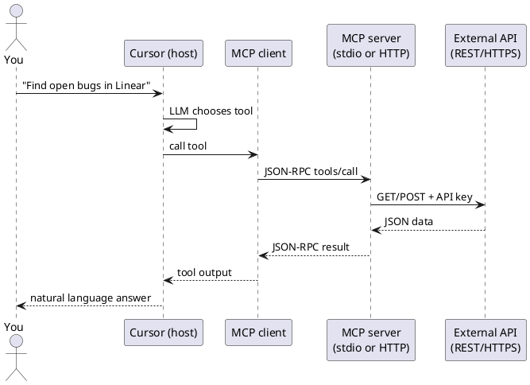
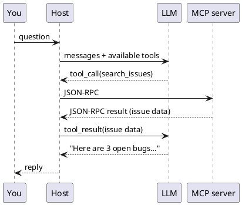
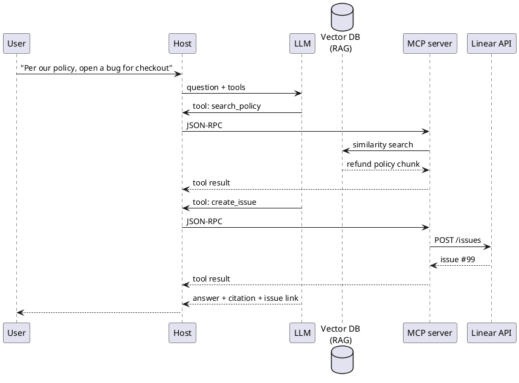

How MCP works
**MCP (Model Context Protocol)** is how tools like **Cursor**, **Claude Desktop**, and **Claude Code** plug into **external systems** — databases, GitHub, Linear, Sentry — through small **connector programs** called **MCP servers**.

You configure them once; the agent **calls tools** the server exposes. This note explains **how that connection works** — API, gRPC, or something else.

## 1. One-sentence model

**MCP is not gRPC.** Messages are **JSON-RPC 2.0** (structured JSON requests/responses) sent over **stdio** (local) or **HTTP** (remote). The MCP server then talks to the real system — often a normal **REST/HTTPS API**.

```text
You → AI host (Cursor) → MCP client → MCP server → Linear/Postgres/Slack API
                         JSON-RPC          HTTPS
```

## 2. Three roles

| Role | What it is | Example |
|------|------------|---------|
| **Host** | App you use | Cursor, Claude Desktop, VS Code + extension |
| **MCP client** | Built into the host; speaks MCP | Cursor’s MCP layer |
| **MCP server** | Connector you install/configure | `github`, `postgres`, `@modelcontextprotocol/server-*` |

You only configure **servers** in settings. The host runs the **client** for you.

## 3. Wire protocol: JSON-RPC, not gRPC

### What is JSON-RPC?

**JSON-RPC** is a small, standard way to say **“run this function remotely, here are the arguments, give me back a result”** — with everything encoded as **JSON text**.

| Word | Meaning |
|------|---------|
| **JSON** | The message body is plain JSON you can read in a log |
| **RPC** | **Remote procedure call** — caller invokes a **named method** on another process, like calling a function over a pipe or HTTP |

Think of it as a **thin envelope**, not a full REST API design:

```text
Request:  "Please run method X with params Y"  (one JSON object)
Response: "Here is result Z" or "Error: …"       (one JSON object)
```

It is **not** the same as:

| | JSON-RPC (MCP wire) | REST API (Linear, GitHub) |
|---|---------------------|---------------------------|
| **Style** | Named **methods** (`tools/call`) | **URLs** + HTTP verbs (`GET /issues`) |
| **Who uses it** | MCP **client ↔ MCP server** | MCP **server ↔ external SaaS** |
| **You configure** | Rarely — host handles it | Tokens, base URLs in server config |

MCP picked JSON-RPC because it is **simple**, **human-readable**, and works over **stdio pipes** (one JSON line in, one JSON line out) without inventing a custom binary protocol.

### Request and response shape

Every message is a JSON object with a few fixed fields:

**Request** (client → server):

```json
{
  "jsonrpc": "2.0",
  "id": 1,
  "method": "tools/call",
  "params": {
    "name": "search_issues",
    "arguments": { "query": "checkout bug" }
  }
}
```

| Field | Role |
|-------|------|
| `jsonrpc` | Always `"2.0"` — protocol version |
| `id` | Correlates request with response (like a request ID) |
| `method` | **Which remote function** to run (MCP defines names like `tools/call`, `tools/list`) |
| `params` | Arguments for that method |

**Response** (server → client) — success:

```json
{
  "jsonrpc": "2.0",
  "id": 1,
  "result": {
    "content": [
      { "type": "text", "text": "[{\"id\": 42, \"title\": \"Checkout timeout\"}]" }
    ]
  }
}
```

**Response** — failure:

```json
{
  "jsonrpc": "2.0",
  "id": 1,
  "error": {
    "code": -32603,
    "message": "Linear API rate limited"
  }
}
```

| Field | Role |
|-------|------|
| `result` | Payload on success — for MCP tools, often **text or structured content** |
| `error` | Payload on failure — code + message (no `result`) |

The **host** sends JSON-RPC to the MCP server; the **LLM never parses JSON-RPC**. It only sees the **tool result** the host extracts from `result` and drops into the chat.

### JSON-RPC vs gRPC (why MCP did not pick gRPC)

| | MCP (JSON-RPC) | gRPC (for comparison) |
|---|----------------|------------------------|
| **Message format** | **JSON text** | Protobuf (binary) |
| **Typical transport** | stdio pipes or **HTTP POST** | HTTP/2 |
| **Human readable** | Yes — easy to debug in logs | No — encoded binary |
| **Standard in MCP spec** | Yes | **Not used** by MCP |

The model does not send raw HTTP to Linear. It asks the **host** to run an MCP **tool**; the host sends **JSON-RPC** to the MCP server; the server implements that tool and may call Linear’s **HTTPS REST API** with your token.

## 4. Two standard transports

The [MCP specification](https://modelcontextprotocol.io/specification/2025-06-18/basic/transports) defines how JSON-RPC moves between client and server.

### stdio (local — most common in IDEs)

```text
Host spawns MCP server as subprocess
  Client writes JSON-RPC → server's stdin
  Server writes JSON-RPC → server's stdout
```

| Used when | Examples |
|-----------|----------|
| Server runs **on your machine** | Cursor, Claude Desktop local config |
| Server is a **script or binary** | `npx @modelcontextprotocol/server-filesystem` |

| Pros | Cons |
|------|------|
| Simple; no open ports | Server must be installed locally |
| Good for secrets on laptop | One server process per config entry |

**Cursor `mcp.json` (conceptual):**

```json
{
  "mcpServers": {
    "github": {
      "command": "npx",
      "args": ["-y", "@modelcontextprotocol/server-github"],
      "env": { "GITHUB_PERSONAL_ACCESS_TOKEN": "..." }
    }
  }
}
```

Host **starts** the process; communication is **pipes**, not you clicking a URL.

### Streamable HTTP (remote)

For servers running as a **web service** (team-hosted connector, SaaS MCP):

```text
Client → HTTP POST (JSON-RPC body) → https://your-company.com/mcp
Server → JSON response OR SSE stream (Server-Sent Events)
```

| Piece | Detail |
|-------|--------|
| **POST** | Each client message can be a POST to one **MCP endpoint** (e.g. `/mcp`) |
| **GET** | Optional — open **SSE** stream so server can push notifications |
| **Headers** | `Mcp-Protocol-Version`, `Mcp-Session-Id` for versioning/sessions |
| **Auth** | Usually Bearer token or OAuth on HTTPS — same as any API |

This is **plain HTTP(S)** — load balancers, API gateways, and corporate proxies often work without gRPC support.

**Older transport:** early MCP used **HTTP + SSE** (two endpoints). New implementations should use **Streamable HTTP**; some stacks support both for compatibility.

## 5. End-to-end flow



| Step | Protocol |
|------|----------|
| You ↔ Host | Chat UI |
| Host ↔ MCP server | **JSON-RPC** over stdio or HTTP |
| MCP server ↔ SaaS | **That product’s API** (REST, GraphQL, SDK) |

## 6. Does JSON go straight to the LLM?

**Almost — but not directly.** The MCP server sends JSON back to the **host’s MCP client**, not straight into the model API with no middle step. The **host** (Cursor, Claude Desktop) then **injects that result into the chat** as a **tool result**, and the **LLM reads it on the next turn**.

```text
1. You ask a question
2. LLM (in host) says: "call tool search_issues"
3. Host → MCP server (JSON-RPC request)
4. MCP server → Linear API → gets data
5. MCP server → Host (JSON-RPC response with tool output)
6. Host adds "tool result" to conversation context
7. LLM reads tool result → writes answer in plain English
8. You see the final reply
```

| Hop | What travels | Who sees it |
|-----|--------------|-------------|
| MCP client ↔ MCP server | **JSON-RPC** (wire protocol) | Host only — not shown in chat UI |
| Host ↔ LLM | **Tool call + tool result** (text/JSON in messages) | Model uses it as context |
| Host ↔ You | **Natural language** | What you read |

So yes: the **data** is usually JSON (issue list, query rows, file contents). The LLM **does** consume that content — but **via the host**, which wraps it in the standard **tool-calling** loop. The LLM does **not** open a socket to the MCP server itself.

The loop can repeat: LLM may call **several** MCP tools before answering you.



**What you see:** the final prose (and maybe tool-run indicators in the UI). **What you don’t see:** raw JSON-RPC between client and server — unless you debug logs.

## 7. What the MCP server exposes

After connect, the server advertises capabilities:

| Capability | Agent can… |
|------------|------------|
| **Tools** | Call functions (`create_issue`, `run_query`) |
| **Resources** | Read URIs (`file://`, `db://schema/users`) |
| **Prompts** | Use pre-built prompt templates (less common for users) |

The **LLM** sees tool **names and descriptions**; the host maps model intent to MCP **tool calls**.

## 8. MCP vs “built-in connector” vs REST

| Approach | Who builds it | Wire to AI host |
|----------|---------------|-----------------|
| **MCP server** | Community or vendor | JSON-RPC (stdio/HTTP) |
| **Native integration** | ChatGPT/Anthropic/Microsoft | Vendor-specific API |
| **Custom REST in your app** | Your backend | Your code — not MCP unless you wrap it |

MCP’s value is **one connector format** many hosts can reuse — same GitHub server for Cursor and Claude Desktop.

## 9. Security (user checklist)

| Risk | Mitigation |
|------|------------|
| MCP server has **API keys** | Env vars; never commit tokens; rotate |
| **Over-broad tools** | Enable only servers you need |
| **Remote MCP URL** | HTTPS only; trust the provider |
| **stdio server runs locally** | It can read files/shell per its design — read server docs |
| **Prompt injection → tool abuse** | Limit scopes; review agent actions ([Trust & verify](vii-trust-privacy-and-verify.md)) |

MCP does not replace **permission models** of underlying APIs — your GitHub token still only does what GitHub allows.

## 10. When you need MCP vs skills vs vector DB

These solve **different problems**. You often combine them.

| Need | Mechanism | Example |
|------|-----------|---------|
| **How to write a PR review** | [Skill](viii-skills-and-agent-instructions.md) | Static playbook in `SKILL.md` |
| **Repo layout and test command** | `AGENTS.md` / rules | Always-in-context project facts |
| **Search 10k support PDFs by meaning** | **Vector DB + RAG** | “What’s our refund policy for EU?” |
| **Fetch live Linear issue #42** | **MCP** tool | Exact, current ticket data |
| **Run `SELECT * FROM orders WHERE id = …`** | **MCP** → Postgres/SQL | Structured lookup, not similarity |

```text
Skills / AGENTS.md     →  always-on instructions (small, static)
Vector DB (RAG)        →  semantic search over large text corpus
MCP tools              →  live actions & exact queries (APIs, SQL, GitHub)
```

### What is a vector DB for here?

A **vector database** stores **embeddings** — numeric representations of text — so you can find **“chunks similar in meaning”** to the user’s question, not just keyword matches.

```text
Offline:  docs → chunk → embed → store vectors (+ metadata)
Online:   question → embed → nearest-neighbour search → top-k chunks → prompt → LLM
```

That pattern is **[RAG](../llms/v-rag-and-fine-tuning.md)**. The vector DB is the **retrieval engine**; the LLM still writes the answer using those chunks.

### When to use a vector DB

| Use vector DB when… | Why |
|---------------------|-----|
| **Large, changing document set** | Policies, manuals, wiki, past tickets — too big to paste into every prompt |
| **Questions are fuzzy / paraphrased** | User says “cancel subscription”; doc says “terminate plan” — similarity helps |
| **You need citations from prose** | Answer must quote handbook sections |
| **Keyword search fails** | Synonyms, typos, cross-language, conceptual questions |

### When you do **not** need a vector DB

| Skip vector DB when… | Use instead |
|----------------------|-------------|
| **Small, fixed context** | Skills, `AGENTS.md`, a few uploaded files (ChatGPT Project, Cursor rules) |
| **Exact ID or key lookup** | SQL, REST API via **MCP** (`get_order`, `fetch_issue`) |
| **Live operational state** | “Is deploy green?” → monitoring API, not doc search |
| **Structured filters** | `status=open AND team=billing` → database query, not k-NN |
| **Whole repo fits in agent context** | IDE indexes open files; `@docs` may be enough for one codebase |

### Where vector DBs sit relative to MCP

Vector DBs are **not** part of JSON-RPC or the MCP spec. They are **storage behind** retrieval — often reached in one of two ways:

**A) Product-built RAG (you don’t wire MCP)**

ChatGPT Projects, NotebookLM, Copilot — they chunk, embed, and search **inside the product**. You upload files; no vector MCP required.

**B) MCP exposes search as a tool**

Your app or a custom MCP server wraps the vector store:

```text
LLM → host → MCP tool "search_handbook" → vector DB (similarity) → chunks → tool result → LLM
```

Same JSON-RPC path as any other MCP tool; the server runs embed + k-NN, returns text chunks.

**C) Your backend does RAG before the agent**

```text
User question → your API retrieves from vector DB → builds prompt → LLM
Separate MCP tools for: create_ticket, run_sql, post_slack
```

Common in production: **RAG for knowledge**, **MCP for actions**.



### Quick decision tree

```text
Is it "find relevant paragraphs in lots of text"?
  Yes → vector DB (RAG), maybe via MCP search tool
  No ↓
Is it "get this exact record / call this API now"?
  Yes → MCP tool (SQL, REST, SDK)
  No ↓
Is it "how should the agent behave"?
  Yes → skill / AGENTS.md / custom GPT instructions
```

Skills = **playbook**. Vector DB = **semantic memory over documents**. MCP = **live hands** into systems.

**Deeper:** [RAG & fine-tuning](../llms/v-rag-and-fine-tuning.md), [Custom assistants & knowledge](v-custom-assistants-and-knowledge.md).

## 11. Quick reference

| Question | Answer |
|----------|--------|
| What is JSON-RPC? | **Remote procedure call** — invoke a named **method** with JSON **params**, get JSON **result** or **error** |
| Is MCP gRPC? | **No** — JSON-RPC 2.0 |
| Does MCP server reply to the LLM directly? | **No** — reply goes to **host**, host passes **tool result** to LLM |
| Local Cursor MCP? | Usually **stdio** (subprocess) |
| Hosted team MCP? | **Streamable HTTP** (POST + optional SSE) |
| How does server reach Linear? | **HTTPS REST** (or vendor SDK) |
| Do I write JSON-RPC? | **No** — host and server handle it |
| When do I need a vector DB? | **Large text corpus + fuzzy semantic search** (RAG) — not for exact API/SQL lookups |
| Vector DB part of MCP? | **No** — optional **backend** behind an MCP search tool or your own RAG app |

## 12. Rehearsal questions

- What does JSON-RPC stand for, and what three fields identify a request?
- MCP vs vector DB — which for “open Linear issue #42” vs “what does our handbook say about refunds”?
- What protocol carries messages between MCP client and server?
- Who sits between the MCP server and the LLM?
- stdio vs Streamable HTTP — when is each used?
- Who calls Linear’s API — the LLM or the MCP server?

**Related:** [Tools & orchestration](iv-tools-and-orchestration.md), [Agents & agentic workflows](iii-agents-and-agentic-workflows.md), [Skills & agent instructions](viii-skills-and-agent-instructions.md).
