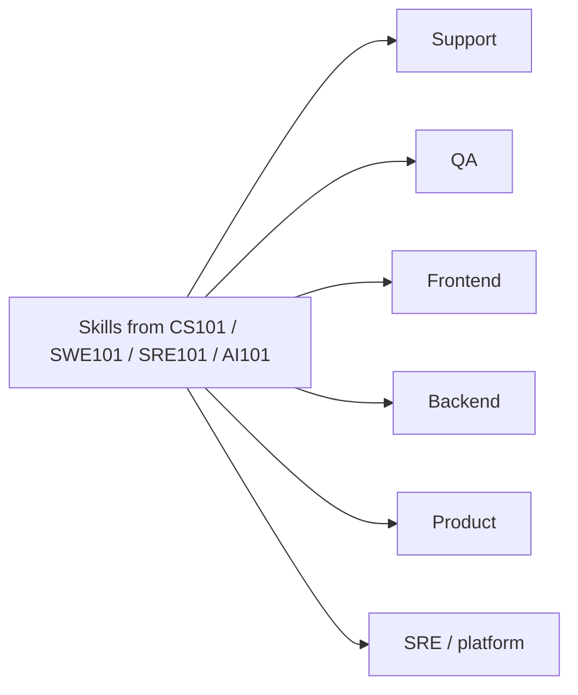

Careers — overview
Career notes for **tech roles in Japan**: what each path actually does, how to **study** for it (using this repo), and **compensation** ranges. Aimed at people building skills in CS/SWE/AI who want a realistic Japan-oriented map — not immigration or tax advice.

Figures are **illustrative bands** (mostly Tokyo, foreigner-friendly employers). Always verify with current offers, [TokyoDev](https://www.tokyodev.com/), Levels.fyi, and recruiters. Employer type often moves pay more than title alone.

## Map of this track

| Note | Focus |
|------|--------|
| [Japan tech market](ii-japan-tech-market.md) | Employer types, language, visas, culture signals |
| [Compensation](iii-compensation.md) | How 年収 works; bands; negotiation basics |
| [Study map](iv-study-map.md) | Which curriculum tracks feed which roles |
| [SDLC & roles](v-sdlc-and-roles.md) | Life-cycle phases; where each role fits; skills by phase |
| **[Paths](paths/i-overview.md)** | Support, QA, frontend, backend, PM, and more |

## Role cheat sheet

| Path | Day-to-day | Usually needs |
|------|------------|---------------|
| [Support engineer](paths/ii-support-engineer.md) | Tickets, repros, customer trust | Product knowledge, clear writing, some code |
| [QA / test](paths/iii-qa.md) | Quality strategy, automation, risk | Test design, tooling, collaboration with eng |
| [Frontend](paths/iv-frontend.md) | UI, UX engineering, web performance | JS/TS, React/etc., accessibility |
| [Backend](paths/v-backend.md) | APIs, data, reliability | One server language, SQL, systems basics |
| [Product manager](paths/vi-product-manager.md) | Roadmaps, discovery, trade-offs | Communication, metrics, technical literacy |
| [SRE / platform](paths/vii-sre-platform.md) | Uptime, delivery, infra | Linux, cloud, CI/CD, observability |



## Suggested reading order

```text
Overview → Japan tech market → Compensation → Study map → SDLC & roles → pick a Paths note
```

## Next

[Japan tech market](ii-japan-tech-market.md).
