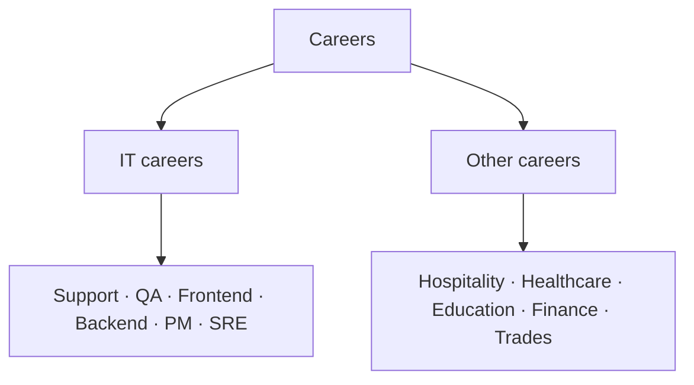

Careers — overview
Career notes with a **Japan-oriented** lens: what a role actually does, how people **get in and progress**, language and visa realities, and rough **compensation** bands. Not immigration, legal, or tax advice — always verify with current employers and recruiters.

This track is split into two branches so tech and non-tech paths stay easy to navigate.

## Branches

| Branch | For | Start |
|--------|-----|-------|
| **[IT careers](it/i-overview.md)** | Software, QA, SRE, product, and other tech roles | [IT careers overview](it/i-overview.md) |
| **[Other careers](other/i-overview.md)** | Hospitality, healthcare, education, finance, and skilled trades | [Other careers overview](other/i-overview.md) |

## How the notes are organized

Each branch has an overview plus role or field notes. Most notes follow the same shape:

- **Day-to-day** — what the work involves.
- **Skills that matter** — core vs stretch.
- **Japan notes** — language, employer type, visa, and market signals.
- **Compensation** — illustrative bands; verify against live offers.
- **How to get in / progress** — entry routes and next moves.

## Which branch?

| You are… | Go to |
|----------|-------|
| Building software, data, or infrastructure skills | [IT careers](it/i-overview.md) |
| Exploring service, care, teaching, business, or trade work | [Other careers](other/i-overview.md) |
| Unsure and comparing options | Skim both overviews, then pick a role note |

## Next

Pick a branch: [IT careers](it/i-overview.md) or [Other careers](other/i-overview.md).
