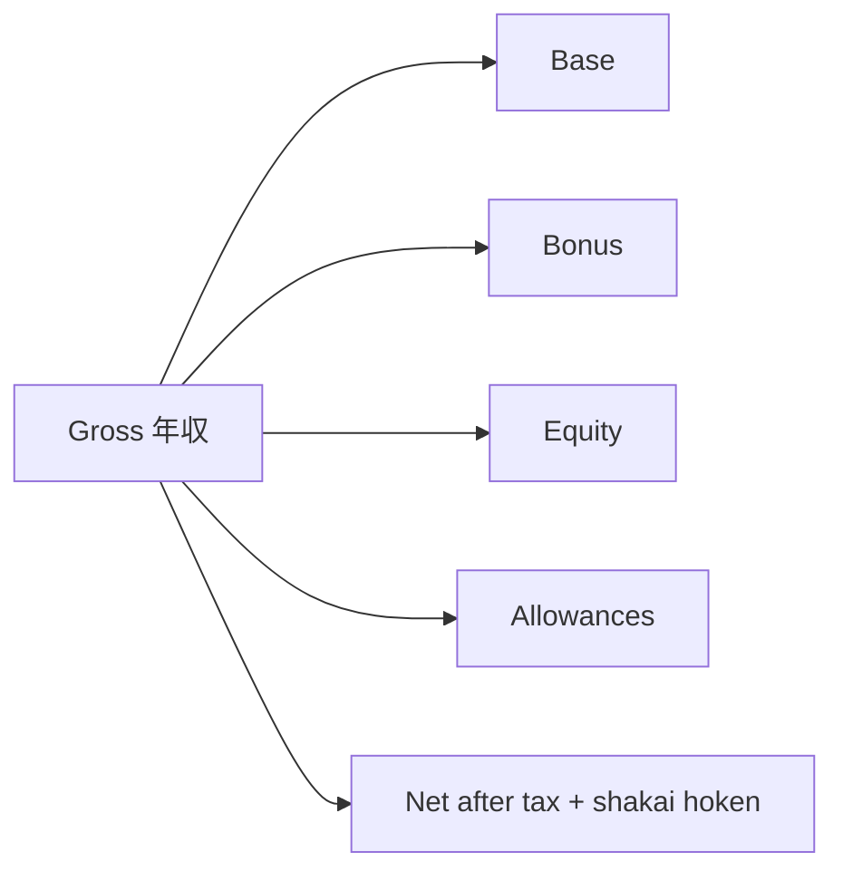

Compensation
How **年収 (nenshū)** is usually quoted in Japan, rough **Tokyo bands** by role, and what to clarify in an offer. Not tax, legal, or personalized financial advice. Bands are **approximate** (≈2025–2026 market chatter for foreigner-friendly employers) and move with yen, firm, and level.

Sources to cross-check: TokyoDev surveys, Levels.fyi (Big Tech), recruiter ranges, written offers.

## 1. How packages are structured

| Piece | Meaning |
|-------|---------|
| **Base (基本給)** | Monthly fixed × 12 |
| **Bonus (賞与)** | Often summer + winter; 0–6+ months of base depending on firm |
| **Allowances** | Commute almost always; housing/family at some firms |
| **Equity / RSU** | Common at global + some product cos; rare at traditional JP firms |
| **Deemed overtime** | Fixed OT baked into pay — ask how many hours it covers |

**Always ask:** “Is this figure base×12 only, or base + target bonus (+ equity)?”

Rough take-home is often ~**70–80%** of gross for mid earners (year-2 residence tax included) — run a calculator for your case.

## 2. Engineer bands (Tokyo, illustrative ¥M / year total)

Foreigner-friendly / product-leaning employers (not national MHLW averages):

| Level | Years (rough) | Total comp ¥M |
|-------|---------------|---------------|
| Junior | 0–2 | 4–7 |
| Mid | 2–5 | 7–11 |
| Senior | 5–9 | 10–16 |
| Staff / lead | 9+ | 14–22 |
| Principal+ / Big Tech senior | 12+ | 18–35+ (equity heavy) |

TokyoDev 2025-style medians often land near **~¥9–10M** overall for survey engineers, with **higher medians at foreign / remote-global** employers and **lower at Japanese-HQ** — employer type dominates.

## 3. By role family (mid-level, illustrative)

| Role | Mid band ¥M (rough) | Notes |
|------|---------------------|--------|
| Support / CSE | 5–9 | Bilingual premium; on-call rare vs SWE |
| QA / SDET | 5–10 | Automation skills raise ceiling |
| Frontend | 7–12 | Same ladder as SWE at product cos |
| Backend | 7–13 | Often the widest hiring volume |
| SRE / platform | 8–14 | Premium for cloud + reliability |
| Product manager | 8–13 | Senior PM 13–20+ at strong employers |

Big Tech Japan and top ML/PM seats can sit **well above** these mid bands.

## 4. Negotiation basics (Japan-friendly)

| Do | Don’t |
|----|-------|
| Wait for a written offer before hard numbers | Invent competing offers |
| Ask 10–15% with market comps | Demand 30% without leverage |
| Negotiate sign-on, equity, remote days | Ignore bonus guarantee vs “target” |
| Clarify overtime / 裁量労働制 | Assume US-style refreshers everywhere |

## 5. Cost of living context

Tokyo rents and international-school costs can erase a headline raise. Compare **net + commute + housing** across offers, not base alone.

## Next

[Study map](iv-study-map.md) — which notes in this repo feed each path. Role detail: [Paths overview](paths/i-overview.md).
