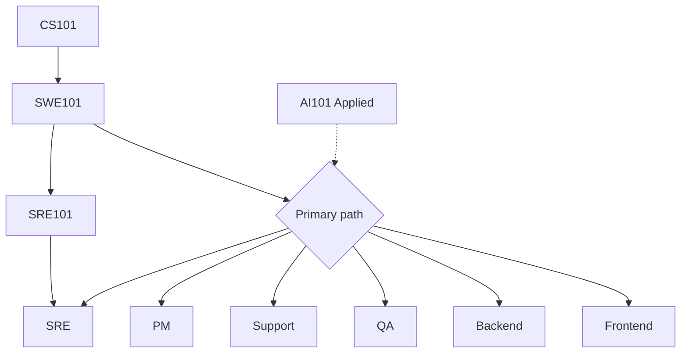

Study map
Map **this curriculum** to career paths. Depth beats random courses — pick a primary role, ship projects, then add adjacent skills.

Parent: [IT careers overview](i-overview.md). Roles: [Paths](paths/i-overview.md).

## 1. Shared foundation (almost everyone)

| Goal | Start here |
|------|------------|
| How computers + data + networks work | [CS101](../../cs101/i-overview.md) |
| Git, languages, APIs, design | [SWE101](../../swe101/i-overview.md) |
| Ship + operate | [SRE101](../../sre101/i-overview.md) (lighter for FE/PM) |
| Prompting / agents for productivity | [AI101 Applied](../../ai101/ai-engineering/i-overview.md) |
| Japanese language (if needed) | [Languages](../../languages/i-overview.md) |



## 2. Path → curriculum (primary → secondary)

| Path | Primary study | Secondary |
|------|---------------|-----------|
| [Support](paths/ii-support-engineer.md) | Product + networking basics; clear writing | SWE101 APIs; AI Applied for search/docs |
| [QA](paths/iii-qa.md) | SWE101 + test strategy; CI in SRE101 | One language deeply; API gateway / HTTP |
| [Frontend](paths/iv-frontend.md) | JS/TS + React (SWE101) | CSS, CDN, accessibility, design sense |
| [Backend](paths/v-backend.md) | Java/Python/Go + Postgres + APIs | Kafka, Redis, system design |
| [PM](paths/vi-product-manager.md) | Discovery + metrics literacy | Enough SWE101 to talk to eng; AI Applied |
| [SRE](paths/vii-sre-platform.md) | SRE101 full track | SWE101 + CS networking |

## 3. Portfolio that Japan recruiters understand

| Role | Evidence |
|------|----------|
| FE / BE | GitHub repos, deployed demos, PR history |
| QA | Test plans, automation repos, bug writeups |
| Support | Public troubleshooting posts, runbooks you wrote |
| PM | Case studies: problem → metrics → trade-offs → outcome |
| SRE | Homelab / cloud projects with monitoring + IaC |

## 4. Timeboxing

```text
Months 0–3   Foundation (CS + Git + one language)
Months 3–9   Path depth + 1–2 portfolio pieces
Months 9–12  Interview loops + Japanese if targeting domestic roles
```

## Next

See how roles sit in the life cycle: [SDLC & roles](v-sdlc-and-roles.md). Then pick a role under [Paths](paths/i-overview.md).
