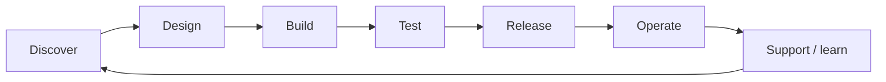
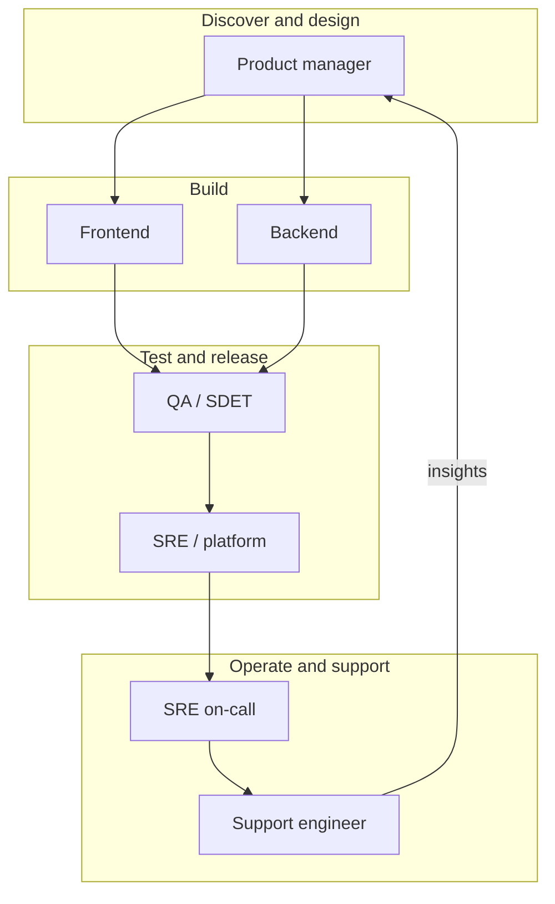
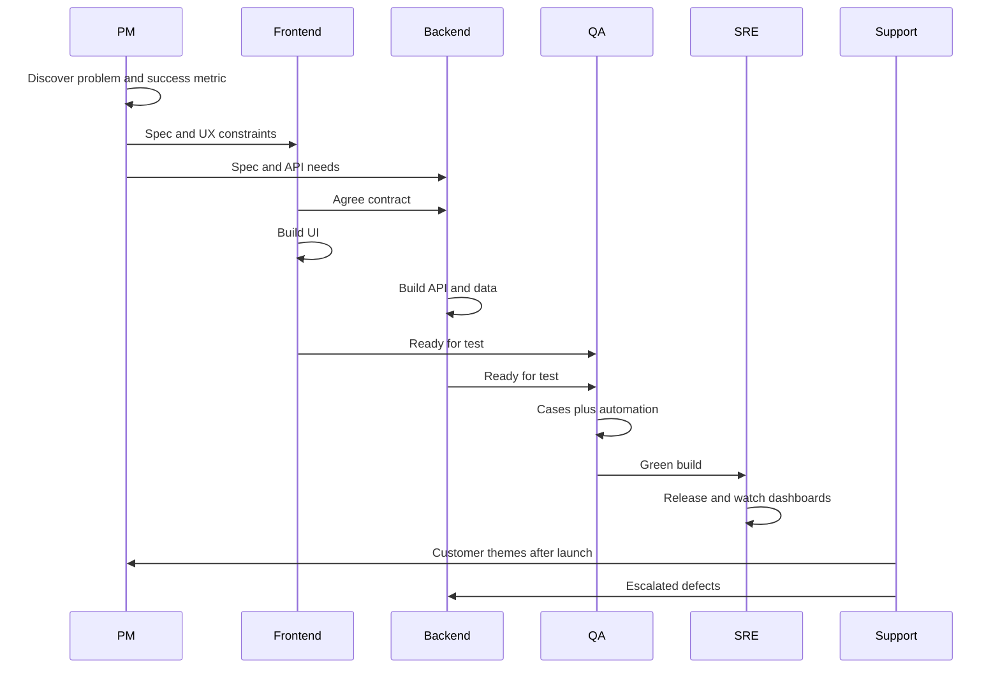

SDLC & roles
Where each career path sits in the **software development life cycle (SDLC)**, and which **skills** matter in each phase. Modern product teams use a **loop** (not a one-way waterfall), but the same role names still cluster around certain stages.

Parent: [IT careers overview](i-overview.md) · Role detail: [Paths](paths/i-overview.md).

## 1. SDLC as a loop

| Phase | Question | Typical owners |
|-------|----------|----------------|
| **Discover** | What problem / outcome? | PM (+ support insights, design) |
| **Design** | What to build, how it fits | PM, FE/BE leads, sometimes SRE |
| **Build** | Make it real | Frontend, backend |
| **Test** | Is it safe to ship? | QA (+ eng writing tests) |
| **Release** | Get it to users | SRE / platform, eng |
| **Operate** | Keep it healthy | SRE, backend on-call |
| **Support** | Help users; feed learning | Support → PM / eng |

## 2. Who shows up where

Heavy overlap is normal: backend writes unit tests; FE does a11y checks; PM joins launch reviews; support files bugs that become roadmap items.

## 3. RACI-style view (illustrative)

| Phase | PM | FE | BE | QA | SRE | Support |
|-------|----|----|----|----|-----|---------|
| Discover | **A/R** | C | C | C | I | **C** (themes) |
| Design | **A** | **R** | **R** | C | C | I |
| Build | C | **R** | **R** | C | C | I |
| Test | C | R | R | **A/R** | C | I |
| Release | C | C | C | C | **A/R** | I |
| Operate | I | C | **R** | I | **A/R** | C |
| Support | C | C | C | I | C | **A/R** |

**R** = does the work · **A** = accountable · **C** = consulted · **I** = informed.

## 4. Skills by position (SDLC lens)

### Product manager

| Skill | SDLC use |
|-------|----------|
| Discovery / interviews | Discover |
| Prioritization & roadmapping | Discover → Design |
| Writing specs / acceptance criteria | Design → Build |
| Metrics & experimentation | Release → Operate |
| Stakeholder communication (often Japanese in JP) | All phases |
| Technical literacy | Design reviews with eng |

### Frontend engineer

| Skill | SDLC use |
|-------|----------|
| TypeScript + UI framework (e.g. React) | Build |
| CSS / design systems / a11y | Design → Build |
| Client-server integration (HTTP, auth) | Build |
| Component & E2E testing | Test |
| Performance (CWV, bundles) | Build → Operate |
| i18n / JP UX details | Build → Support feedback |

### Backend engineer

| Skill | SDLC use |
|-------|----------|
| One server language deeply | Build |
| SQL / data modeling | Design → Build |
| API design (auth, idempotency, versioning) | Design → Build |
| Concurrency & failure modes | Build → Operate |
| System design | Design |
| Observability basics (logs/metrics) | Operate |

### QA / SDET

| Skill | SDLC use |
|-------|----------|
| Test design & risk analysis | Design → Test |
| Automation (API / UI / unit hooks) | Test |
| CI literacy & flake control | Test → Release |
| Exploratory testing | Test |
| Clear bug reports | Test → Build |
| Security / privacy smoke checks | Test |

### SRE / platform

| Skill | SDLC use |
|-------|----------|
| CI/CD & release engineering | Release |
| Cloud + containers / K8s | Release → Operate |
| IaC (Terraform) | Design → Release |
| Observability & alerting | Operate |
| Incident response / postmortems | Operate |
| Platform enablement for eng | Build → Release |

### Support engineer

| Skill | SDLC use |
|-------|----------|
| Product expertise | Support |
| Repro (logs, HTTP, basic SQL) | Support → Test/Build |
| Written communication | Support |
| Escalation & bug quality | Support → Build |
| Empathy / de-escalation | Support |
| Pattern spotting for PM | Support → Discover |

## 5. One feature, all roles

## 6. Waterfall vs continuous delivery (Japan context)

| Model | Where you still see it | Role impact |
|-------|------------------------|-------------|
| **Waterfall / SI** | Large enterprise, some SIers | Heavier PM/project mgmt; QA as late gate; less SRE |
| **Agile + CD** | Product cos, gaishikei | Roles overlap more; QA shifts left; SRE owns release |

Know which model the company uses — the same title can mean different SDLC placement.

## Next

Deepen a role under [Paths](paths/i-overview.md), or study links in [Study map](iv-study-map.md).
