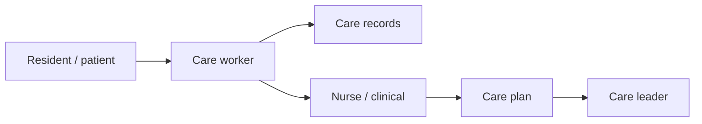

Healthcare & caregiving
Nursing, elderly and disability caregiving (介護, kaigo), and allied health support. Japan's aging population makes caregiving one of the highest-demand fields, with dedicated visa routes for foreign workers.

Not medical advice. Licensing rules are strict and change — verify with employers and the relevant Japanese authorities.

Parent: [Other careers](i-overview.md).

## Day-to-day

| Role | Examples |
|------|----------|
| Care worker (介護職) | Daily living support, mobility, meals, bathing, records |
| Nurse (看護師) | Clinical care under Japanese licensing |
| Care support / assistant | Facility support, activities, family communication |
| Home care (訪問介護) | In-home visits and personal care |
| Care leader / manager | Care planning, rotas, staff training, compliance |

## Skills that matter

| Skill | Level | Notes |
|-------|-------|-------|
| Japanese (communication + reading) | Core | Care records and safety require solid Japanese |
| Empathy & patience | Core | Dignity and trust with residents and families |
| Physical stamina & safe handling | Core | Transfers, mobility support |
| Care fundamentals | Core | Hygiene, nutrition, observation, reporting |
| Teamwork & handover | Core | Shift-based continuity of care |
| Emergency response | Stretch | Recognizing and escalating changes |
| Care planning / leadership | Stretch | Path to leader and manager roles |

## Japan notes

- **介護 (kaigo)** demand is high and growing due to demographics; foreign workers are actively recruited.
- Japanese ability is essential for safety, records, and family communication — often required for the visa.
- National qualifications (e.g. **介護福祉士 Certified Care Worker**) raise pay and stability.
- Nursing (看護師) requires Japanese licensing; foreign nurses usually need to qualify in Japan.

## Entry & qualifications

| Route | Notes |
|-------|-------|
| Specified Skilled Worker (SSW) — nursing care (介護) | Skills + Japanese test route |
| Nursing Care (介護) visa | For those who become Certified Care Workers |
| EPA program | Bilateral programs (e.g. Indonesia, Philippines, Vietnam) with training + exams |
| Technical training programs | Structured entry with employer support |

Japanese-language and skills tests are typically required; confirm the current pathway.

## Compensation (illustrative)

| Level | Rough ¥M / year |
|-------|-----------------|
| Entry care worker | 2.8–3.8 |
| Certified care worker (介護福祉士) | 3.5–5 |
| Care leader | 4.5–6 |
| Facility / care manager | 5.5–8+ |
| Licensed nurse (看護師) | 4.5–7+ |

Night-shift allowances and qualifications materially affect pay. Some employers provide housing or study support toward certification.

## How to get in / progress

1. Reach functional Japanese (aim for N3+ for care records and safety).
2. Enter via SSW, EPA, or a training program with a supporting employer.
3. Gain experience, then pursue **介護福祉士** certification.
4. Progress to care leader and facility management, or specialize.

## Related

- [Languages](../../languages/i-overview.md) for Japanese study.
- [Careers overview](../i-overview.md) · [Other careers](i-overview.md).

## Next

[Education & teaching](iv-education.md).
