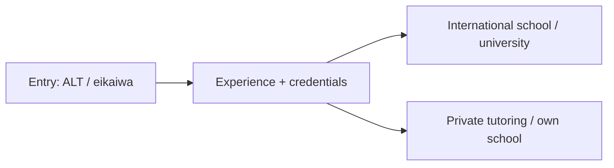

Education & teaching
Teaching in Japan spans English conversation (eikaiwa), assistant language teaching (ALT) in public schools, international schools, universities, and private tutoring (cram schools, 塾). It is one of the most common entry routes for foreigners.

Parent: [Other careers](i-overview.md).

## Day-to-day

| Role | Examples |
|------|----------|
| ALT (assistant language teacher) | Support Japanese teachers in public schools; lessons, pronunciation, culture |
| Eikaiwa instructor | Conversation classes for children and adults at private schools |
| International school teacher | Full curriculum teaching (often licensed) in English |
| University lecturer | English, subject teaching, research (higher requirements) |
| Cram school (塾) / tutor | Exam prep, subject support, private lessons |

## Skills that matter

| Skill | Level | Notes |
|-------|-------|-------|
| Clear communication & lesson delivery | Core | Engage varied ages and levels |
| Classroom management | Core | Especially with children |
| Patience & cultural sensitivity | Core | Adapting to Japanese school norms |
| Planning & assessment | Core | Curriculum, materials, feedback |
| Japanese (varies) | Market | Low for eikaiwa/ALT; higher for admin and coordination |
| Teaching license / degree | Stretch | Required for international schools and universities |
| Subject specialization | Stretch | Raises pay and options (IB, exam prep) |

## Japan notes

- **ALT and eikaiwa** are common first jobs; a bachelor's degree is typically required for the visa.
- **International schools and universities** expect a teaching license and/or higher degrees and pay significantly more.
- **JET Programme** is a well-known government-run ALT route.
- Being a **native or near-native English speaker** helps for language roles, but qualifications separate careers from short stints.

## Entry & qualifications

| Route | Notes |
|-------|-------|
| Instructor visa | Common for language teaching roles |
| Engineer/Specialist in Humanities | Some education-adjacent and corporate training roles |
| JET Programme | Government ALT placement, often outside big cities |
| Teaching license + experience | Required for international schools; strongly preferred at universities |

A bachelor's degree is generally needed for teaching visas; confirm the current requirements.

## Compensation (illustrative)

| Level | Rough ¥M / year |
|-------|-----------------|
| Eikaiwa / entry ALT | 2.5–3.6 |
| Experienced ALT / senior eikaiwa | 3–4.5 |
| International school teacher (licensed) | 5–9+ |
| University lecturer | 4–8+ (varies widely) |
| School coordinator / manager | 4.5–7 |

International schools and some universities pay well above entry eikaiwa/ALT; private tutoring income varies with hours and reputation.

## How to get in / progress

1. Enter via eikaiwa, ALT, or JET with a bachelor's degree.
2. Gain classroom experience and gather references.
3. Earn a teaching license or specialization (e.g. TEFL/CELTA, then formal licensure).
4. Move toward international schools, universities, or coordination roles.
5. Optionally build private tutoring or your own school (see [Business Manager route](v-finance-and-business.md)).

## Related

- [Languages](../../languages/i-overview.md) for your own Japanese study.
- [Careers overview](../i-overview.md) · [Other careers](i-overview.md).

## Next

[Finance & business](v-finance-and-business.md).
