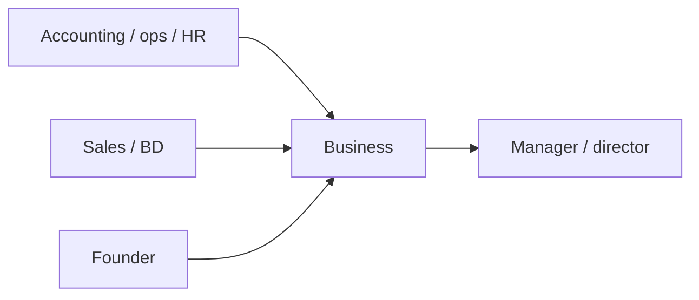

Finance & business
Accounting, banking, insurance, sales, marketing, operations, HR, and general back-office roles — plus founding a company. These roles range from English-friendly gaishikei seats to Japanese-heavy domestic positions.

Not financial or legal advice. Verify licensing and visa details with employers and licensed professionals.

Parent: [Other careers](i-overview.md).

## Day-to-day

| Role | Examples |
|------|----------|
| Accounting / finance | Bookkeeping, closing, reporting, tax coordination, FP&A |
| Banking / insurance | Client service, analysis, compliance, back office |
| Sales / business development | Pipeline, client meetings, proposals, account management |
| Marketing / operations | Campaigns, vendor coordination, process, logistics |
| HR / admin | Hiring, payroll coordination, employee support |
| Founder / business manager | Running a company, hiring, finances, strategy |

## Skills that matter

| Skill | Level | Notes |
|-------|-------|-------|
| Japanese (business) | Core–Market | High for domestic roles; lower at some gaishikei |
| Numeracy & attention to detail | Core | Finance, accounting, operations |
| Communication & relationship building | Core | Sales, client work, stakeholder management |
| Domain tools | Core | Excel, accounting software, CRM, ERP |
| Compliance awareness | Core | Regulated finance and cross-border rules |
| Certifications (簿記, CPA, CFA, etc.) | Stretch | Raise pay and open specialist roles |
| Bilingual reporting | Stretch | Bridge role between HQ and Japan |

## Japan notes

- **Gaishikei (foreign-capital) firms** offer more English-friendly finance, sales, and operations roles; domestic firms usually expect **business Japanese**.
- **Bookkeeping certification (簿記)** is widely recognized for accounting roles; global credentials (CPA/CFA) help in international finance.
- **Bilingual bridge roles** (connecting overseas HQ and Japan operations) are valued.
- Founding a company uses the **Business Manager** visa, with capital and substance requirements.

## Entry & qualifications

| Route | Notes |
|-------|-------|
| Engineer/Specialist in Humanities | Common for finance, sales, marketing, HR, operations |
| Intra-company transfer | Moving within a multinational |
| Business Manager visa | For founders/managers meeting investment and substance rules |
| Highly Skilled Professional | Points-based; can speed benefits for strong profiles |

Confirm current visa and any licensing requirements with the employer or counsel.

## Compensation (illustrative)

| Level | Rough ¥M / year |
|-------|-----------------|
| Entry back office / admin | 3–4.5 |
| Accountant / analyst (mid) | 4.5–8 |
| Sales / BD (with commission) | 4.5–10+ |
| Manager / controller | 8–15 |
| Gaishikei finance (senior) | 12–25+ |

Bilingual ability and certifications move pay significantly; gaishikei and global finance sit well above domestic averages.

## How to get in / progress

1. Build business Japanese (or target English-friendly gaishikei roles).
2. Add a recognized credential (簿記 for accounting; CPA/CFA for finance).
3. Gain experience in a specific function (finance, sales, operations).
4. Move into management, specialist, or bilingual bridge roles.
5. To start a company, plan for the **Business Manager** visa and see [Startups](../../startups/i-overview.md).

## Related

- [Startups](../../startups/i-overview.md) for founding on a budget.
- [Digital marketing](../../digital-marketing/i-overview.md) for marketing paths.
- [Careers overview](../i-overview.md) · [Other careers](i-overview.md).

## Next

[Skilled trades](vi-skilled-trades.md).
