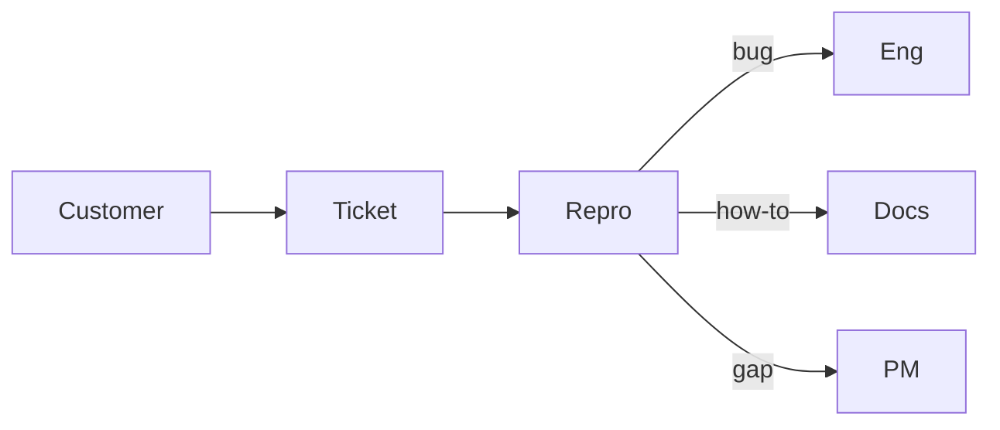

Support engineer
Also called **CSE**, **technical support**, or **customer engineer**. You keep customers unblocked: reproduce issues, explain product behavior, escalate bugs, and feed insights back to eng/PM.

## Day-to-day

| Activity | Examples |
|----------|----------|
| Triage | Prioritize tickets; spot outages vs user error |
| Reproduce | Local/staging repro; logs; HAR files |
| Communicate | Clear status in EN (and often JP) |
| Escalate | Write bug reports eng will actually use |
| Improve | Macros, runbooks, FAQ, better error messages |

## Skills that matter

| Skill | Why |
|-------|-----|
| Product depth | Faster answers than “checking with eng” |
| HTTP / logs / basic SQL | Real debugging |
| Writing | Trust; fewer back-and-forths |
| Empathy under pressure | Angry customers still need help |
| Japanese | Often required for domestic B2B |

## Japan notes

- Bilingual support is scarce → **pay and visa sponsorship** can be strong relative to skill bar.
- Expect **business Japanese** more often than for backend at English-first product cos.
- Shift / on-call depends on product; SaaS global support may follow follow-the-sun.

## Study path (this repo)

| Priority | Track |
|----------|-------|
| 1 | [SWE101](../../swe101/i-overview.md) — APIs, Git basics |
| 2 | [CS101 networking](../../cs101/networking/i-tcp-udp-and-transport-basics.md) — HTTP/TLS intuition |
| 3 | [AI Applied](../../ai101/ai-engineering/i-overview.md) — search docs / draft replies carefully |
| 4 | [Languages](../../languages/i-overview.md) if targeting JP customers |

Build: a personal **runbook** for a product you use (repro steps, common errors, escalation template).

## Compensation (illustrative Tokyo)

See [Compensation](../iii-compensation.md). Mid support / CSE often roughly **¥5–9M**; bilingual + technical depth can push higher at gaishikei. Usually below senior SWE at the same firm.

## Career moves

| From support | Toward |
|--------------|--------|
| Strong debugging | QA / SDET |
| Product sense | PM / solutions engineer |
| Deep systems | Backend / SRE (needs more coding signal) |

## Next

[QA](iii-qa.md) or [Study map](../iv-study-map.md).
