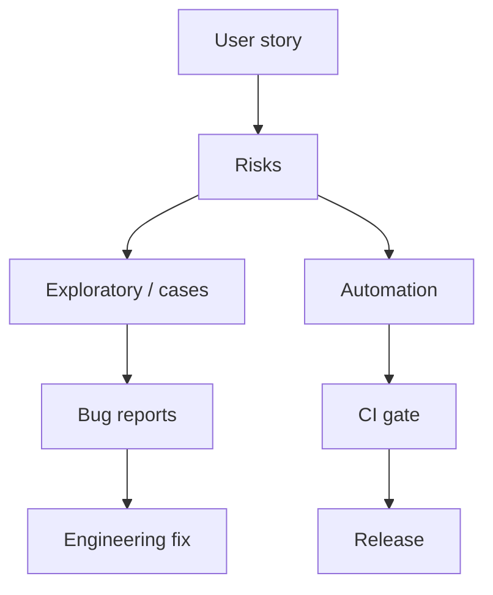

QA / test engineering
**QA** protects users from bad releases: risk-based testing, automation, and clear bug reports. Titles vary — QA engineer, SDET, quality engineer.

## Day-to-day

| Activity | Examples |
|----------|----------|
| Plan | Test strategy per feature / release |
| Explore | Edge cases, permissions, i18n (important in Japan) |
| Automate | E2E / API / unit where ROI is clear |
| Gate | CI red builds; release sign-off |
| Partner | Sit with FE/BE; shift-left reviews |

## Skills that matter

| Skill | Why |
|-------|-----|
| Test design | Coverage without infinite cases |
| One language + test frameworks | Playwright, JUnit, pytest, etc. |
| API + browser tooling | Modern products are API-heavy |
| CI/CD literacy | Quality is a pipeline property |
| Japanese (sometimes) | Domestic product UX/copy issues |

## Japan notes

- Domestic firms may still lean **manual QA**; product / gaishikei lean **SDET**.
- Strong automation + English can land foreigner-friendly roles even without N1.
- Gaming and embedded have specialized QA cultures.

## Study path (this repo)

| Priority | Track |
|----------|-------|
| 1 | [SWE101](../../swe101/i-overview.md) — language + Git |
| 2 | [SRE101 CI/CD](../../sre101/i-overview.md) — pipelines |
| 3 | Frontend or backend track matching the product |
| 4 | [Cybersecurity](../../cybersecurity/i-overview.md) — basic threat thinking |

Build: automate login + critical path for an open-source app; show flake handling.

## Compensation (illustrative Tokyo)

Mid QA / SDET roughly **¥5–10M**; senior automation at strong product cos can approach SWE bands. Manual-only tracks usually cap lower.

## Career moves

| From QA | Toward |
|---------|--------|
| Automation depth | SDET / toolsmith |
| Product risk sense | PM |
| Infra + flaky systems | SRE |
| Feature ownership | Backend / FE (needs portfolio) |

## Next

[Frontend](iv-frontend.md) · [Backend](v-backend.md).
