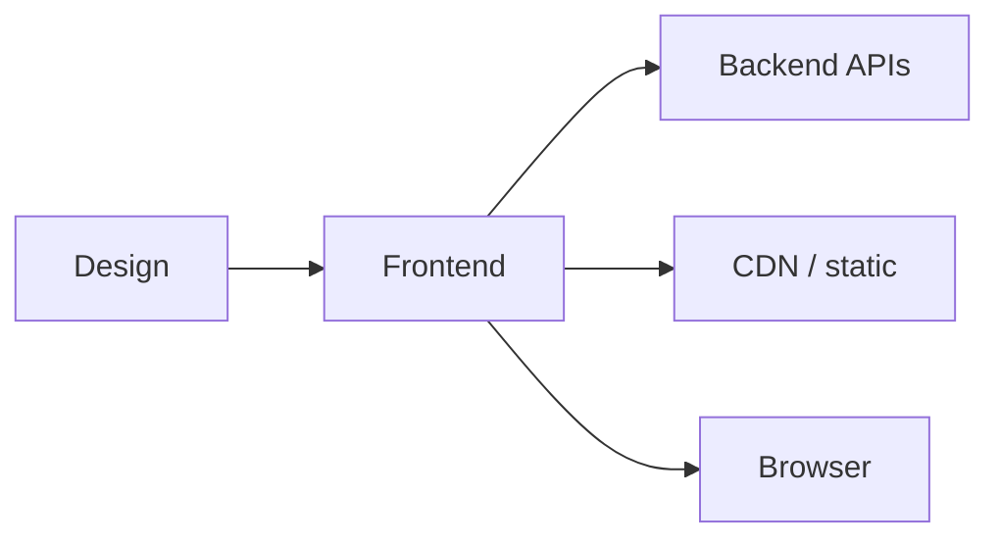

Frontend engineer
You build what users **see and touch**: web (and sometimes mobile) UI, performance, accessibility, and client-side architecture.

## Day-to-day

| Activity | Examples |
|----------|----------|
| Implement | Components, routing, forms, state |
| Integrate | Call backend APIs; handle errors |
| Polish | Loading states, a11y, i18n (JP date/currency) |
| Measure | Core Web Vitals, bundle size |
| Collaborate | Designers, PM, backend contracts |

## Skills that matter

| Skill | Why |
|-------|-----|
| TypeScript + modern framework | React/Next common in JP product cos |
| CSS / layout / design systems | Ships usable UI |
| HTTP + auth cookies/JWT | Real apps, not toy components |
| Testing | Component + E2E |
| Performance | Mobile networks still matter |

## Japan notes

- **TypeScript + React/Next** is a common stack at modern product companies.
- i18n and **Japanese typography / form UX** are differentiators.
- English-first FE roles exist; design collaboration may still be JP-heavy.

## Study path (this repo)

| Priority | Track |
|----------|-------|
| 1 | [JavaScript / React](../../swe101/languages&frameworks/javascript/i-overview.md) |
| 2 | [CSS](../../swe101/languages&frameworks/css/i-overview.md) |
| 3 | [CDN](../../swe101/cdn/i-overview.md) |
| 4 | [CS101](../../cs101/i-overview.md) basics + Git |

Build: a polished JP/EN bilingual UI with auth against a public API.

## Compensation (illustrative Tokyo)

Tracks overall SWE bands: mid roughly **¥7–12M** at foreigner-friendly product cos; senior higher. Same employer-type split as [Compensation](../iii-compensation.md).

## Career moves

| From FE | Toward |
|---------|--------|
| Full product ownership | Full-stack |
| Design systems | UX engineering |
| Performance / platform | Web platform / SRE-adjacent |
| User outcomes | PM |

## Next

[Backend](v-backend.md).
