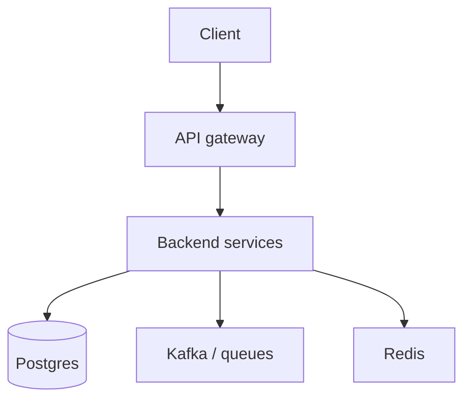

Backend engineer
You own **services and data**: APIs, business logic, databases, queues, and the reliability of everything behind the UI.

## Day-to-day

| Activity | Examples |
|----------|----------|
| Design | Endpoints, schemas, migrations |
| Implement | Services in Go / Java / Kotlin / Python / Ruby… |
| Operate | Logs, metrics, on-call for your services |
| Integrate | Kafka, Redis, third-party APIs |
| Review | Security, performance, correctness |

## Skills that matter

| Skill | Why |
|-------|-----|
| One language deeply | Interviews + daily work |
| SQL + data modeling | Most bugs are data bugs |
| HTTP / auth / idempotency | Correct APIs |
| Concurrency & failure modes | Production |
| System design | Mid → senior bar |

## Japan notes

- **Go, Kotlin/Java, TypeScript (Node), Python** appear often; Ruby remains at some product firms; Java strong at enterprise / SI.
- Domestic SI work can mean waterfall + older stacks — know it exists; target product cos if you want modern SWE practice.
- English-first backend roles are comparatively common at gaishikei.

## Study path (this repo)

| Priority | Track |
|----------|-------|
| 1 | Language track in [SWE101](../../swe101/i-overview.md) (Java/Python/…) |
| 2 | [Postgres](../../swe101/databases/postgres/i-overview.md) / databases |
| 3 | [Kafka](../../swe101/kafka/i-overview.md), [Redis](../../swe101/redis/i-overview.md) |
| 4 | [System design](../../swe101/sysdesign/scalable-patterns/i-overview.md) |
| 5 | [CS101](../../cs101/i-overview.md) |

Build: a small service with auth, Postgres, tests, and a deploy story.

## Compensation (illustrative Tokyo)

Core SWE ladder: mid **¥7–13M** at foreigner-friendly employers; senior **¥10–16M+**; staff/Big Tech higher. Employer type dominates — see [Compensation](../iii-compensation.md).

## Career moves

| From backend | Toward |
|--------------|--------|
| Infra passion | SRE / platform |
| Data / ML | [AI101](../../ai101/i-overview.md) / ML eng |
| Markets | [Quant SWE](../../quant-swe/i-overview.md) |
| People leadership | Eng manager |

## Next

[Product manager](vi-product-manager.md) · [SRE / platform](vii-sre-platform.md).
