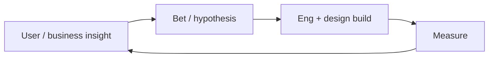

Product manager
PMs decide **what to build and why**: discovery, prioritization, specs, and outcomes — not (usually) writing production code.

## Day-to-day

| Activity | Examples |
|----------|----------|
| Discover | Interviews, data, support themes |
| Prioritize | Roadmaps, trade-offs, “not now” |
| Specify | PRDs, user stories, acceptance criteria |
| Align | Eng, design, sales, execs |
| Measure | Launch metrics; iterate or kill |

## Skills that matter

| Skill | Why |
|-------|-----|
| Communication | Your output is alignment |
| Technical literacy | Earn eng trust; scope realistically |
| Metrics | Separate vibes from outcomes |
| Writing | Specs people can build from |
| Japanese | Critical for domestic product / stakeholders |

## Japan notes

- Domestic PM often expects **strong Japanese** + stakeholder management.
- Gaishikei / global product may hire English-primary PMs with domain skill.
- “PM” at SI/agencies can mean project manager (schedule) — clarify **product** vs **project**.

## Study path (this repo)

| Priority | Track |
|----------|-------|
| 1 | Enough [SWE101](../../swe101/i-overview.md) to read an architecture diagram |
| 2 | [System design](../../swe101/sysdesign/scalable-patterns/i-overview.md) vocabulary |
| 3 | [AI Applied](../../ai101/ai-engineering/i-overview.md) — research & drafting |
| 4 | [Digital marketing](../../digital-marketing/i-overview.md) if growth-leaning |
| 5 | [Languages](../../languages/i-overview.md) if targeting domestic orgs |

Build: 2–3 **case writeups** (problem, options, metrics, decision, result).

## Compensation (illustrative Tokyo)

Associate ~**¥5–8M**; mid ~**¥8–13M**; senior/group often **¥13–20M+** at strong employers; directors higher. See [Compensation](../iii-compensation.md).

## Career moves

| From PM | Toward |
|---------|--------|
| Group / director | Product leadership |
| Founder skills | [Startups](../../startups/i-overview.md) |
| Deep tech | Technical PM / eng |

## Next

[SRE / platform](vii-sre-platform.md).
