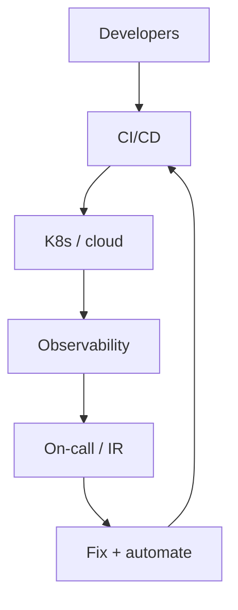

SRE / platform engineer
You make delivery **safe and boring**: CI/CD, cloud, Kubernetes, observability, incident response, and internal platforms that help product teams ship.

## Day-to-day

| Activity | Examples |
|----------|----------|
| Automate | Pipelines, IaC, golden paths |
| Observe | Metrics, logs, traces, alerts |
| Respond | Incidents, postmortems |
| Harden | Security baselines, least privilege |
| Enable | Self-serve platforms for eng |

## Skills that matter

| Skill | Level | Notes |
|-------|-------|-------|
| Linux + networking | Core | Debug hosts and traffic |
| Cloud (AWS or GCP) | Core | Default substrate |
| Containers / Kubernetes | Core | Common runtime |
| CI/CD | Core | Safe, repeatable releases |
| IaC (Terraform) | Core | Reproducible environments |
| Observability | Core | Metrics, logs, traces, alerts |
| Coding for automation | Core | Python/Go/etc. — platforms are software |
| Incident response | Stretch | Command, timelines, postmortems |
| Security baselines | Stretch | IAM, secrets, network policy |
| Developer experience | Stretch | Golden paths, self-serve platforms |

## Japan notes

- Hiring is strong where product cos run serious cloud estates.
- Traditional IT may label similar work “インフラ” with more ops / less coding — read the JD carefully.
- English docs (AWS/GCP) help; company chat may still be Japanese.

## Study path (this repo)

| Priority | Track |
|----------|-------|
| 1 | [SRE101](../../sre101/i-overview.md) — full track |
| 2 | [SWE101](../../swe101/i-overview.md) — enough to partner with backend |
| 3 | [CS101 networking](../../cs101/networking/i-tcp-udp-and-transport-basics.md) |
| 4 | [Cybersecurity](../../cybersecurity/i-overview.md) basics |

Build: Terraform + CI deploying a service with metrics and an alert.

## Compensation (illustrative Tokyo)

Often at or above backend mid bands: roughly **¥8–14M** mid; senior higher, especially with on-call + cloud depth. See [Compensation](../iii-compensation.md).

## Career moves

| From SRE | Toward |
|----------|--------|
| Product infra | Platform lead |
| Security focus | SecEng |
| Deep systems | Staff backend |

## Track complete

Return to [Paths overview](i-overview.md) or [Careers overview](../i-overview.md).
