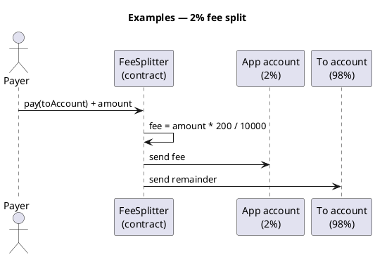

Cryptocurrency101 — Examples
End-to-end **deploy and pay** walkthroughs for the shared [fee split pattern](../v-fee-split-pattern.md): incoming payment → **2%** to the **app account** (treasury) → **remainder** to the **to** account (recipient).

Each example is a **copy-paste project layout** — not a bundled repo. Audit and test on **testnet** before mainnet.

## Map

| Example | Network | Language | Fee |
|---------|---------|----------|-----|
| [Tron — 2% fee split deploy](ii-tron-two-percent-fee-split.md) | Tron (TVM) | Solidity + TronBox | 200 bps (2%) |
| [TON — 2% fee split deploy](iii-ton-two-percent-fee-split.md) | TON | Tact + Blueprint | 200 bps (2%) |

## Shared rule (both examples)

```text
amount     = TRX or TON attached to pay()
fee        = amount × 200 / 10000    → appAccount (2%)
remainder  = amount - fee            → toAccount (recipient)
```



## Before you start

| Topic | Where |
|-------|--------|
| What crypto / txs are | [What is cryptocurrency?](../ii-what-is-cryptocurrency.md) |
| UTXO vs account | [How transactions are stored](../iii-how-transactions-are-stored.md) |
| Verify on testnet | [Verify before broadcast](../viii-verify-before-broadcast.md) |
| Failed txs / gas | [Failed transactions & funds](../vii-failed-transactions-and-funds.md) |

## Next

Start with [Tron](ii-tron-two-percent-fee-split.md) if you already know Solidity, or [TON](iii-ton-two-percent-fee-split.md) for Tact + Blueprint.
