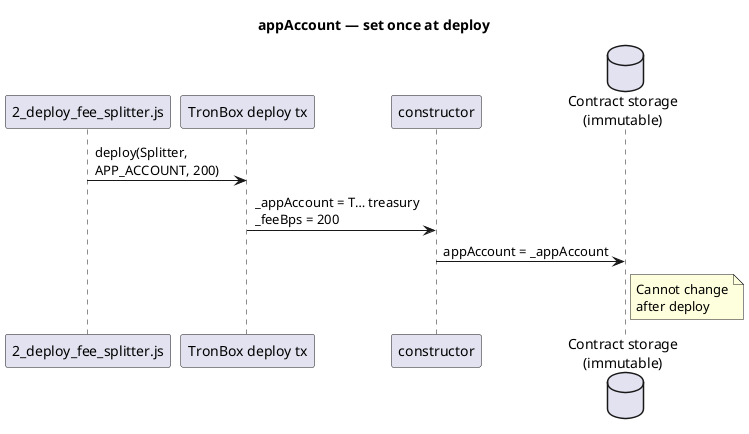
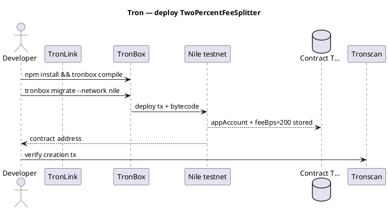

Example — Tron: 2% fee split (full deploy)
Deploy a **Solidity** contract on **Tron** (TVM) that accepts **TRX**, sends **2%** to your **app account**, and **98%** to a **to** account. Uses **TronBox** + **TronLink** on **Nile** testnet.

Parent: [Examples overview](i-overview.md) · Network: [Tron overview](../networks/tron/i-overview.md).

**Not financial advice.** Minimal contract for learning — audit before production.

## 1. What you are building

| Role | Address | Receives |
|------|---------|----------|
| **App account** | Your treasury wallet (`T…`) | **2%** of each payment (200 bps) |
| **To account** | Recipient per call (`T…`) | **98%** remainder |
| **Contract** | Deployed `T…` | Holds logic only — should not hoard TRX |

```text
User calls pay(toAccount) with 100 TRX attached:
  appAccount  ← 2 TRX
  toAccount   ← 98 TRX
```

## 2. Project layout

```text
tron-fee-split-2pct/
  package.json
  tronbox.js
  contracts/
    Migrations.sol                 # from `tronbox init`
    TwoPercentFeeSplitter.sol      # fee logic
  migrations/
    1_initial_migration.js
    2_deploy_fee_splitter.js     # deploy with app account + 200 bps
  scripts/
    call_pay.js                  # optional: test pay() from CLI
```

| File | Purpose |
|------|---------|
| **`TwoPercentFeeSplitter.sol`** | `pay(toAccount)` splits `msg.value` |
| **`tronbox.js`** | Nile/mainnet RPC + private key for deploy |
| **`2_deploy_fee_splitter.js`** | Passes **app account** address and `feeBps = 200` |
| **`call_pay.js`** | Sends test `pay()` after deploy |

## 3. Contract — full source

**`contracts/TwoPercentFeeSplitter.sol`**

```solidity
// SPDX-License-Identifier: MIT
pragma solidity ^0.8.20;

/// @title TwoPercentFeeSplitter — 2% to app account, rest to recipient (Tron TVM)
contract TwoPercentFeeSplitter {
    /// Treasury / app wallet — immutable after deploy
    address public immutable appAccount;
    /// Basis points: 200 = 2.00%
    uint256 public immutable feeBps;

    event Paid(
        address indexed payer,
        address indexed toAccount,
        uint256 amount,
        uint256 fee,
        uint256 remainder
    );

    constructor(address _appAccount, uint256 _feeBps) {
        require(_appAccount != address(0), "zero app account");
        require(_feeBps <= 10_000, "fee too high");
        appAccount = _appAccount;
        feeBps = _feeBps;
    }

    /// @notice Send TRX: 2% to appAccount, remainder to toAccount
    /// @param toAccount Recipient (must accept TRX)
    function pay(address payable toAccount) external payable {
        require(msg.value > 0, "no trx");
        require(toAccount != address(0), "zero to account");

        uint256 fee = (msg.value * feeBps) / 10_000;
        uint256 remainder = msg.value - fee;

        (bool okApp, ) = appAccount.call{value: fee}("");
        require(okApp, "app transfer failed");

        (bool okTo, ) = toAccount.call{value: remainder}("");
        require(okTo, "to transfer failed");

        emit Paid(msg.sender, toAccount, msg.value, fee, remainder);
    }
}
```

For a **fixed 2%** mainnet deploy, constructor uses `_feeBps = 200`.

### Where `appAccount` gets its value

`immutable` means: **assign exactly once in the constructor**, then it is baked into the contract bytecode forever. There is no later setter.

```text
1. You set env var     TRON_APP_ACCOUNT=TYourTreasuryWallet...
2. Migration runs      deployer.deploy(Splitter, APP_ACCOUNT, 200)
3. TronBox broadcasts  constructor(address _appAccount, uint256 _feeBps)
4. Constructor runs    appAccount = _appAccount;   ← ONLY assignment
5. On-chain forever    pay() reads appAccount for the 2% send
```



| Step | Code location | What happens |
|------|---------------|--------------|
| **Declare** | `address public immutable appAccount;` | Names the field — **no value yet** |
| **Pass in** | `constructor(address _appAccount, …)` | Deploy tx includes your treasury `T…` address |
| **Assign** | `appAccount = _appAccount;` (line in constructor) | **Value is set here** |
| **Use** | `appAccount.call{value: fee}("")` in `pay()` | Reads the address stored at deploy |
| **Verify** | Tronscan → Read contract → `appAccount()` | Public `immutable` auto-getter |

**`toAccount`** is different — it is **not** stored on the contract. Callers pass it on every `pay(toAccount)` as the recipient for that payment.

```javascript
// migrations/2_deploy_fee_splitter.js — this address becomes appAccount
const APP_ACCOUNT = process.env.TRON_APP_ACCOUNT;
deployer.deploy(Splitter, APP_ACCOUNT, FEE_BPS);
//                      ^^^^^^^^^^^^
//                      constructor 1st argument → appAccount
```

## 4. TronBox config

**`package.json`**

```json
{
  "name": "tron-fee-split-2pct",
  "version": "1.0.0",
  "devDependencies": {
    "tronbox": "^3.1.0"
  }
}
```

**`tronbox.js`**

```javascript
module.exports = {
  networks: {
    nile: {
      privateKey: process.env.TRON_PRIVATE_KEY,
      userFeePercentage: 100,
      feeLimit: 1_000_000_000,
      fullHost: "https://nile.trongrid.io",
      network_id: "*",
    },
    mainnet: {
      privateKey: process.env.TRON_PRIVATE_KEY,
      userFeePercentage: 100,
      feeLimit: 1_000_000_000,
      fullHost: "https://api.trongrid.io",
      network_id: "*",
    },
  },
  compilers: {
    solc: { version: "0.8.20" },
  },
};
```

| Setting | Meaning |
|---------|---------|
| **`feeLimit`** | Max TRX burned for energy on this tx (sun units context in TronBox) |
| **`TRON_PRIVATE_KEY`** | Deployer wallet — **never commit** to git |

## 5. Migrations

**`migrations/1_initial_migration.js`**

```javascript
const Migrations = artifacts.require("Migrations");
module.exports = function (deployer) {
  deployer.deploy(Migrations);
};
```

**`migrations/2_deploy_fee_splitter.js`**

```javascript
const Splitter = artifacts.require("TwoPercentFeeSplitter");

// Your treasury Tron address (T…)
const APP_ACCOUNT = process.env.TRON_APP_ACCOUNT;
const FEE_BPS = 200; // 2%

module.exports = function (deployer) {
  deployer.deploy(Splitter, APP_ACCOUNT, FEE_BPS);
};
```

## 6. Deploy flow



```text
# 0. Scaffold (adds Migrations.sol + migration 1)
npm install -g tronbox
mkdir tron-fee-split-2pct && cd tron-fee-split-2pct
tronbox init
# add TwoPercentFeeSplitter.sol, 2_deploy_fee_splitter.js, edit tronbox.js

# 1. Nile TRX from faucet (TronLink on Nile testnet)
# 2. Set env vars (PowerShell example)
$env:TRON_PRIVATE_KEY = "your-hex-private-key"
$env:TRON_APP_ACCOUNT = "TYourAppTreasuryAddress..."

npm install
npx tronbox compile
npx tronbox migrate --network nile
# Note contract address from output
```

| Step | Verify |
|------|--------|
| Compile | No Solidity errors |
| Migrate | Tronscan Nile shows **Contract Creation** |
| Read `appAccount()` | Matches your treasury `T…` |
| Read `feeBps()` | Returns `200` |

## 7. Call `pay()` — send a test payment

**TronLink / TronIDE**

1. Open contract on Nile Tronscan → **Write contract**.
2. `pay(toAccount)` — set **toAccount** = recipient `T…`.
3. Attach **Call value** = e.g. `10` TRX.
4. Confirm — wallet must hold **10 TRX + energy/bandwidth**.

**`scripts/call_pay.js`** (optional)

```javascript
const TronWeb = require("tronweb");
const CONTRACT = "TContractAddressFromDeploy...";
const TO_ACCOUNT = "TRecipientAddress...";
const PAY_SUN = 10_000_000; // 10 TRX = 10 * 1e6 sun

const tronWeb = new TronWeb({
  fullHost: "https://nile.trongrid.io",
  privateKey: process.env.TRON_PRIVATE_KEY,
});

async function main() {
  const abi = [/* paste ABI from build/contracts/TwoPercentFeeSplitter.json */];
  const contract = await tronWeb.contract(abi, CONTRACT);
  await contract.pay(TO_ACCOUNT).send({
    callValue: PAY_SUN,
    feeLimit: 100_000_000,
  });
  console.log("pay() sent");
}

main().catch(console.error);
```

## 8. Verify payment completed

| Check | Expected |
|-------|----------|
| Tronscan tx **Result** | `SUCCESS` |
| **Paid** event | `fee` = 2% of `amount`, `remainder` = 98% |
| App account balance | +2% |
| To account balance | +98% |
| Caller wallet | −amount − energy/bandwidth |

Example with **100 TRX** payment:

```text
fee       = 100 × 200 / 10000 = 2 TRX   → appAccount
remainder = 98 TRX                    → toAccount
```

See [Verify safe & completed](../ix-verify-safe-and-completed.md#4-tron-tvm).

## 9. Common failures

| Error | Cause | Fix |
|-------|-------|-----|
| `no trx` | `callValue` = 0 | Attach TRX |
| `to transfer failed` | Recipient contract rejects TRX | Use EOA or payable contract |
| `insufficient funds` | Not enough TRX for value + energy | Top up; see [Part VII](../vii-failed-transactions-and-funds.md) |
| Deploy energy high | Large bytecode | Optimize compiler; stake TRX on mainnet |

## 10. Mainnet checklist

| # | Item |
|---|------|
| 1 | Run full flow on **Nile** |
| 2 | `staticCall` / constant contract simulate `pay()` |
| 3 | Set `TRON_APP_ACCOUNT` to production treasury |
| 4 | `tronbox migrate --network mainnet` |
| 5 | Canary `pay()` with small TRX |
| 6 | Save contract address from **your** deploy tx |

## 11. Related

- [TON — 2% fee split deploy](iii-ton-two-percent-fee-split.md)
- [Tron network overview](../networks/tron/i-overview.md)
- [Fee split pattern](../v-fee-split-pattern.md)
