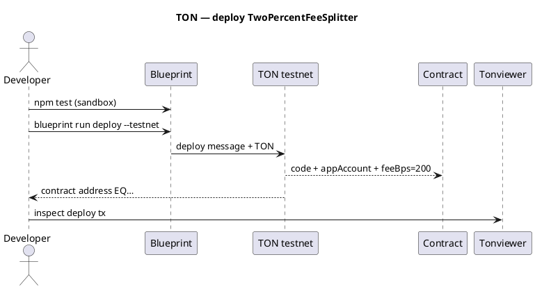

Example — TON: 2% fee split (full deploy)
Deploy a **Tact** contract on **TON** with **Blueprint** that accepts **TON**, sends **2%** to your **app account**, and **98%** to a **to** account passed in each **Pay** message.

Parent: [Examples overview](i-overview.md) · Network: [TON overview](../networks/ton/i-overview.md).

**Not financial advice.** Minimal contract for learning — audit before production.

## 1. What you are building

| Role | Address | Receives |
|------|---------|----------|
| **App account** | Treasury wallet (`EQ…` / `UQ…`) | **2%** per payment |
| **To account** | Recipient in each `Pay` message | **98%** remainder |
| **Contract** | Deployed workchain address | Runs split logic |

```text
User sends Pay{ toAccount } with 1 TON attached:
  appAccount  ← 0.02 TON
  toAccount   ← 0.98 TON
```

TON uses **messages**, not `msg.value` — value is **`context().value`** on the incoming message.

## 2. Project layout (Blueprint)

```text
ton-fee-split-2pct/
  package.json
  tsconfig.json
  blueprint.config.ts
  contracts/
    two_percent_fee_splitter.tact
  scripts/
    deployTwoPercentFeeSplitter.ts
  tests/
    TwoPercentFeeSplitter.spec.ts
  wrappers/
    TwoPercentFeeSplitter.ts          # generated after build
```

| Path | Purpose |
|------|---------|
| **`two_percent_fee_splitter.tact`** | Contract: 2% to `appAccount`, rest to `msg.toAccount` |
| **`deployTwoPercentFeeSplitter.ts`** | Deploy with app address + `feeBps = 200` |
| **`TwoPercentFeeSplitter.spec.ts`** | Sandbox test before testnet |
| **`wrappers/`** | TypeScript bindings (`blueprint build`) |

## 3. Contract — full Tact source

**`contracts/two_percent_fee_splitter.tact`**

```tact
import "@stdlib/deploy";

/// Incoming pay request — recipient is the "to" account
message Pay {
    toAccount: Address;
}

/// 2% (configurable bps) to app treasury, remainder to toAccount
contract TwoPercentFeeSplitter with Deployable {
    appAccount: Address;
    feeBps: Int as uint16; // 200 = 2%

    init(appAccount: Address, feeBps: Int) {
        require(feeBps >= 0 && feeBps <= 10_000, "fee too high");
        self.appAccount = appAccount;
        self.feeBps = feeBps;
    }

    receive(msg: Pay) {
        let amount: Int = context().value;
        require(amount > 0, "no value");

        let fee: Int = amount * self.feeBps / 10_000;
        let remainder: Int = amount - fee;

        // 2% → app account
        send(SendParameters{
            to: self.appAccount,
            value: fee,
            mode: SendPayGasSeparately,
            bounce: false,
            body: "fee".asComment(),
        });

        // 98% → to account
        send(SendParameters{
            to: msg.toAccount,
            value: remainder,
            mode: SendPayGasSeparately,
            bounce: false,
            body: "payout".asComment(),
        });
    }

    get fun app_account(): Address {
        return self.appAccount;
    }

    get fun fee_bps(): Int {
        return self.feeBps;
    }
}
```

| Constant | Value for 2% |
|----------|----------------|
| **`feeBps`** | `200` |
| **Fee on 1 TON** | `0.02 TON` nanotons internally |

## 4. Blueprint package setup

**`package.json`**

```json
{
  "name": "ton-fee-split-2pct",
  "version": "1.0.0",
  "scripts": {
    "build": "blueprint build",
    "test": "jest",
    "deploy:testnet": "blueprint run deployTwoPercentFeeSplitter --testnet"
  },
  "devDependencies": {
    "@ton/blueprint": "^0.22.0",
    "@ton/core": "^0.56.0",
    "@ton/crypto": "^3.3.0",
    "@ton/sandbox": "^0.20.0",
    "@ton/ton": "^14.0.0",
    "@types/jest": "^29.5.0",
    "jest": "^29.7.0",
    "ts-jest": "^29.1.0",
    "typescript": "^5.3.0"
  }
}
```

Scaffold faster with:

```text
npm create ton@latest ton-fee-split-2pct
# choose Blueprint + Tact, then replace contracts/ with the file above
```

## 5. Deploy script

**`scripts/deployTwoPercentFeeSplitter.ts`**

```typescript
import { toNano } from "@ton/core";
import { NetworkProvider } from "@ton/blueprint";
import { TwoPercentFeeSplitter } from "../wrappers/TwoPercentFeeSplitter";

// Treasury wallet — your app account (testnet or mainnet)
const APP_ACCOUNT = "EQAAAAAAAAAAAAAAAAAAAAAAAAAAAAAAAAAAAAAAAAAAAM9c"; // replace
const FEE_BPS = 200n; // 2%

export async function run(provider: NetworkProvider) {
  const splitter = provider.open(
    await TwoPercentFeeSplitter.fromInit(APP_ACCOUNT, FEE_BPS),
  );

  await splitter.send(
    provider.sender(),
    { value: toNano("0.05") }, // deploy + initial balance for sends
    { $$type: "Deploy", queryId: 0n },
  );

  await provider.waitForDeploy(splitter.address);
  console.log("TwoPercentFeeSplitter:", splitter.address.toString());
}
```

| Env | How |
|-----|-----|
| **Testnet** | `npx blueprint run deployTwoPercentFeeSplitter --testnet` |
| **Wallet** | Tonkeeper / TonConnect via Blueprint UI |
| **Mnemonic** | `.env` — never commit |

## 6. Test in sandbox (before testnet)

**`tests/TwoPercentFeeSplitter.spec.ts`**

```typescript
import { Blockchain } from "@ton/sandbox";
import { toNano } from "@ton/core";
import { TwoPercentFeeSplitter } from "../wrappers/TwoPercentFeeSplitter";

describe("TwoPercentFeeSplitter", () => {
  it("splits 2% to app and 98% to toAccount", async () => {
    const blockchain = await Blockchain.create();
    const app = await blockchain.treasury("app");
    const to = await blockchain.treasury("to");
    const payer = await blockchain.treasury("payer");

    const splitter = blockchain.openContract(
      await TwoPercentFeeSplitter.fromInit(app.address, 200n),
    );

    await splitter.send(
      payer.getSender(),
      { value: toNano("1") },
      { $$type: "Deploy", queryId: 0n },
    );

    await splitter.send(
      payer.getSender(),
      { value: toNano("1") },
      { $$type: "Pay", toAccount: to.address },
    );

    expect((await app.getBalance()) >= toNano("0.02")).toBe(true);
    expect((await to.getBalance()) >= toNano("0.98")).toBe(true);
  });
});
```

```text
npm install
npm test
```

## 7. Deploy flow



```text
npm install
npm run build
npm test
npx blueprint run deployTwoPercentFeeSplitter --testnet
# copy contract address from output
```

## 8. Send a payment (user flow)

User wallet sends an internal message to the contract:

| Field | Value |
|-------|-------|
| **To** | Contract address |
| **Amount** | Payment + gas buffer (e.g. 1.05 TON for 1 TON pay) |
| **Payload** | `Pay { toAccount: <recipient EQ…> }` |

**TypeScript client (after deploy)**

```typescript
import { Address, toNano } from "@ton/core";
import { TwoPercentFeeSplitter } from "./wrappers/TwoPercentFeeSplitter";

const contract = client.open(
  TwoPercentFeeSplitter.createFromAddress(Address.parse("EQContract...")),
);

await contract.send(
  sender,
  { value: toNano("1.05") },
  {
    $$type: "Pay",
    toAccount: Address.parse("EQToAccount..."),
  },
);
```

**Tonkeeper manual test:** use a dApp or Blueprint script — raw wallets need a small UI to encode `Pay`.

## 9. Verify on explorer

| Check | Expected |
|-------|----------|
| Tonviewer status | **Success** (not bounced) |
| Outgoing messages | One to **appAccount** (~2%), one to **toAccount** (~98%) |
| `get fee_bps` | `200` |
| Bounced message | **No** — otherwise payout failed |

```text
1 TON payment:
  fee       = 1 × 200 / 10000 = 0.02 TON → app
  remainder = 0.98 TON                 → to
```

Contract keeps little TON if **`SendPayGasSeparately`** — gas comes from attached value; fund contract with a small float for heavy traffic.

See [Verify safe & completed](../ix-verify-safe-and-completed.md#5-ton).

## 10. Common failures

| Symptom | Cause | Fix |
|---------|-------|-----|
| `no value` | Message sent with 0 TON | Attach amount |
| Bounced `Pay` | Bad `toAccount` or insufficient forward fee | More TON attached; valid address |
| Deploy costly | Large code cells | Optimize; test cost in Blueprint output |
| Wrong split | Wrong `feeBps` at deploy | Redeploy with `200` |

## 11. Mainnet checklist

| # | Item |
|---|------|
| 1 | `npm test` green |
| 2 | Deploy on **testnet**; send test `Pay` |
| 3 | Confirm splits on Tonviewer |
| 4 | Set production **app account** address |
| 5 | `blueprint run deploy --mainnet` |
| 6 | Canary with small TON amount |

## 12. Tron vs TON (this example)

| | **Tron example** | **TON example** |
|---|------------------|-----------------|
| Language | Solidity | Tact |
| Call | `pay(toAccount)` + TRX | `Pay { toAccount }` message + TON |
| Value | `msg.value` | `context().value` |
| Tooling | TronBox | Blueprint |
| Explorer | Tronscan | Tonviewer |

## 13. Related

- [Tron — 2% fee split deploy](ii-tron-two-percent-fee-split.md)
- [TON network overview](../networks/ton/i-overview.md)
- [Verify before broadcast](../viii-verify-before-broadcast.md)
