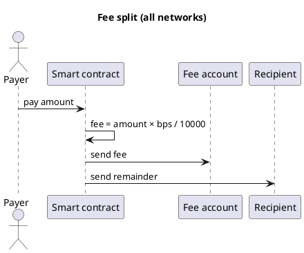
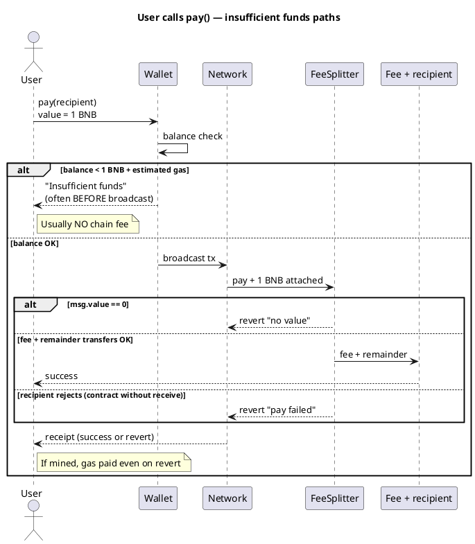
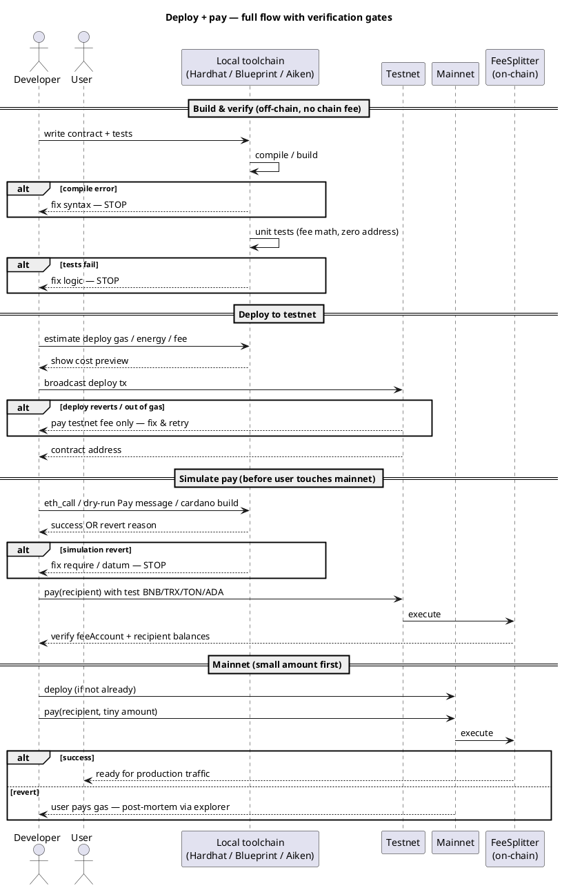
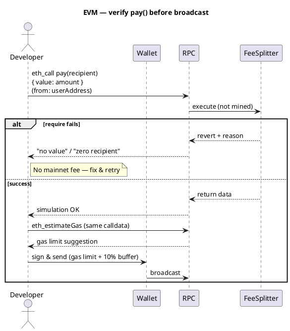
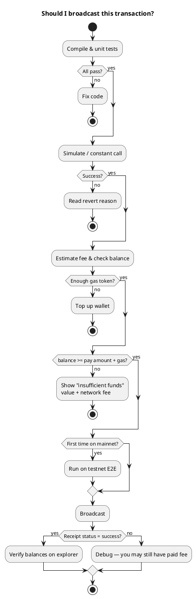
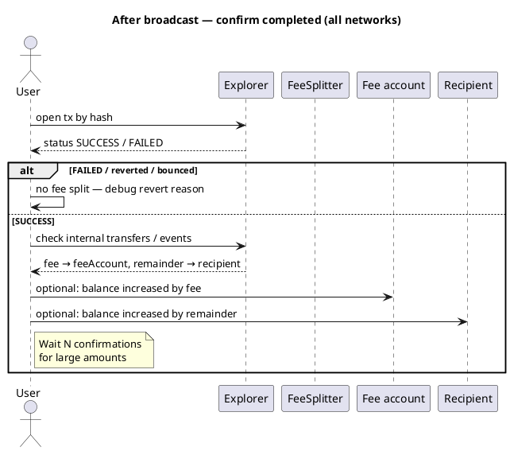

Cryptocurrency101 — overview
**Cryptocurrency101** introduces **blockchain networks**, **smart contract languages**, and a recurring pattern: **split incoming value** — deduct a **fee** to a treasury account and **forward the remainder** to the intended recipient.

This track is **conceptual and educational**, not financial advice. Contracts shown are **minimal sketches** — audit and test before mainnet use.

## Map of this track

| Submenu | Network | VM / model | Contract language |
|---------|---------|------------|-------------------|
| [BNB Chain](networks/bnb/i-overview.md) | BNB Smart Chain (BSC) | EVM | **Solidity** |
| [Tron](networks/tron/i-overview.md) | Tron | TVM (EVM-like) | **Solidity** |
| [TON](networks/ton/i-overview.md) | The Open Network | TON VM | **FunC** / **Tact** |
| [Cardano (ADA)](networks/ada/i-overview.md) | Cardano | eUTXO | **Aiken** / **Plutus** (Haskell) |

## Shared pattern — fee split

Every network page implements the same business rule:

```text
Incoming payment (amount)
  → fee       = amount × feeBps / 10000   → feeAccount
  → remainder = amount - fee              → recipient
```

| Term | Meaning |
|------|---------|
| **`feeBps`** | Fee in **basis points** (100 bps = 1%) |
| **`feeAccount`** | Treasury / protocol wallet |
| **`recipient`** | End payee |



## How networks differ

| | **BNB / Tron** | **TON** | **Cardano (ADA)** |
|---|----------------|---------|-------------------|
| **Model** | Account (like Ethereum) | Account + messages | **UTXO** — outputs, not one global balance |
| **Language** | Solidity | Tact (high level) | Aiken / Plutus |
| **Native coin** | BNB / TRX | TON | ADA |
| **Token standards** | BEP-20, TRC-20 | Jettons | Native assets on UTXO |

**EVM chains (BNB, Tron)** look almost the same in code — differences are RPC, gas token, and tooling.

**Cardano** validators **check** that a transaction’s **outputs** split value correctly — logic feels different from `msg.value` in Solidity.

## Where the contract lives (no server)

The contract **lives on the blockchain** — replicated on network nodes. You **do not** host it on a VPS. You pay **once to deploy**, then **gas per transaction**. A website or API is optional.

## Deploy pricing (approximate)

**USD ranges shift with coin price and network load** — treat as order-of-magnitude; always simulate on testnet first.

| Network | What you pay | Simple contract (e.g. FeeSplitter) | Testnet |
|---------|--------------|-------------------------------------|---------|
| [BNB Chain](networks/bnb/i-overview.md) | BNB gas | ~**$0.50 – $5** mainnet | Free BNB from faucet |
| [Tron](networks/tron/i-overview.md) | TRX (energy / bandwidth) | ~**$5 – $40** mainnet | Free TRX on Shasta/Nile |
| [TON](networks/ton/i-overview.md) | TON (storage + compute) | ~**$0.50 – $5** mainnet | Free TON from faucet |
| [Cardano (ADA)](networks/ada/i-overview.md) | ADA tx fee + min UTXO | ~**$2 – $15** mainnet | Free ADA from faucet |

| Ongoing cost | Server required? |
|--------------|------------------|
| **None** for “hosting” the contract | **No** — network runs bytecode |
| **Per call** — users or you pay gas when `pay()` runs | Optional server only for website / tx builder |

Details and estimation formulas: each [network page](networks/bnb/i-overview.md).

## Failed transactions — do you still pay?

**Usually yes** for anything that reached the network and consumed execution — but **how much** differs by chain and failure type.

| Outcome | BNB / Tron (EVM/TVM) | TON | Cardano |
|---------|----------------------|-----|---------|
| **Rejected before broadcast** (simulation / wallet error) | **No** on-chain fee | **No** | **No** |
| **Reverted on-chain** (`require` failed, out of gas mid-run) | **Yes** — gas used up to revert | **Yes** — compute for work done | **Yes** — tx fee if included in block |
| **Invalid tx** (bad signature, nonce) | **No** — not included | **No** | **No** |

```text
EVM rule of thumb:
  fee = gas_used × gas_price
  gas_used includes work done BEFORE revert
  "Out of gas" → still pay for all gas limit attempted (capped)
```

| Example | Who pays | Why |
|---------|----------|-----|
| User calls `pay()` but `require(msg.value > 0)` fails | **Caller** | Tx mined, reverted — validators executed bytecode |
| Deploy tx runs out of gas | **Deployer** | Partial deploy may still cost; contract may be broken |
| Your tx never leaves mempool (too low fee) | **Nobody** | Not included in a block |
| Cardano tx fails phase-2 validation | **Submitter** | Fee often still charged once tx is in block |

**Design implication:** failed `pay()` attempts on your FeeSplitter still cost the user gas — keep checks cheap and test on testnet. Use **simulation** (`eth_call`, wallet preview, `cardano-cli build`) before mainnet send.

**Not the same as:** credit-card auth holds — on-chain fees are generally **not refunded** on revert.

## Insufficient funds — what happens

Users need **two** kinds of money on most chains: **(1) amount** sent to the contract (`msg.value` / message value) and **(2) network fee** (gas / energy / tx fee) paid **from the same wallet** on top. Confusing them is the most common “not enough funds” mistake.

### Two buckets (EVM / BNB / Tron)

```text
wallet balance = BNB or TRX

To call pay(recipient) { value: 1 BNB }:
  need  1 BNB     → forwarded via contract to feeAccount + recipient
  plus  ~0.0001+ BNB → gas / energy (never reaches recipient)
```

| Situation | What happens | On-chain fee charged? |
|-----------|--------------|------------------------|
| **Balance < msg.value** | Wallet **blocks** send or RPC rejects | **No** — tx not broadcast |
| **Balance = msg.value exactly** (nothing left for gas) | Tx may broadcast then **fail** (out of gas / insufficient fee) | **Often yes** if included |
| **Balance covers gas only, `msg.value = 0`** | `require(msg.value > 0)` **revert** | **Yes** if mined |
| **Balance covers gas + value, recipient rejects transfer** | Revert at `payOk` | **Yes** |
| **Deployer balance < deploy gas** | Deploy fails / not sent | Usually **no** if wallet simulates first |



### FeeSplitter-specific math

For payment amount **A** and fee rate **bps**:

```text
fee       = A × bps / 10000
remainder = A - fee

User must attach msg.value = A (or token amount pulled via transferFrom)
Contract sends fee and remainder — user wallet must still hold gas token separately.
```

| User sends | Contract behavior |
|------------|-------------------|
| **Too little** (`msg.value < intended A`) | May still run — fee/remainder split on **actual** `msg.value`, not your UI label |
| **Zero** | Revert — `require(msg.value > 0)` |
| **Enough value, empty wallet for gas** | Tx fails — **no** successful pay |

**UX tip:** Show **“You pay: A + estimated network fee ~X”** in the dApp before confirm.

### By network

| Network | “Not enough funds” usually means | Typical user message |
|---------|----------------------------------|----------------------|
| **BNB / Tron** | BNB/TRX < `value` + gas/energy | MetaMask / TronLink “insufficient funds” |
| **TON** | Wallet TON < message value + forward + gas | Tonkeeper insufficient balance |
| **Cardano** | ADA < sum(outputs) + tx fee + **min-ADA** per output | Build fails in wallet or “UTxO Balance insufficient” |

**Tron:** Low **energy** or **bandwidth** — may burn more TRX than expected; stake TRX or keep extra TRX buffer.

**Cardano:** Builder fails **before** submit if inputs cannot cover outputs + fee — often **no** on-chain fee (tx never submitted).

### Developer / deployer (not enough for deploy)

| Role | Shortfall | Result |
|------|-----------|--------|
| **Deployer** | Not enough BNB/TRX/TON/ADA for deploy tx | Deploy cancelled in wallet; fix balance, retry |
| **User** | Not enough for `pay()` | See table above |
| **Contract** | Cannot pull tokens — user didn’t `approve` | Revert on `transferFrom`; user pays gas if mined |

### How to prevent (checklist)

| Check | Where |
|-------|--------|
| `balance >= amount + estimateGas(...)` | dApp before Sign |
| `staticCall` / simulate with same `value` | Catches revert, not always gas math |
| Show fee breakdown (protocol fee + network fee) | UI copy |
| Test with **balance = amount + 1 wei** on testnet | Reproduces “exactly no gas left” |
| Token pays: `approve` + balance ≥ amount | ERC-20 / TRC-20 path |

## Full flow — verify before you broadcast

You cannot guarantee **zero** failures (network congestion, wallet bugs, MEV), but you **can** catch most logic and config errors **before** paying mainnet fees. Flow below: **compile → test → simulate → testnet → mainnet**.

### End-to-end sequence



### Pre-flight checklist (what to verify)

| Step | What you verify | Tool / how | Fails before chain? |
|------|-----------------|------------|---------------------|
| **1. Compile** | Syntax, types, bytecode size | `hardhat compile`, `blueprint build`, `aiken build` | **Yes** — no broadcast |
| **2. Unit tests** | `fee = amount × bps / 10000`, zero address rejected | Hardhat, Foundry, Aiken tests | **Yes** |
| **3. Static analysis** | Reentrancy, overflow (Solidity 0.8+) | Slither, Mythril (optional) | **Yes** |
| **4. Config review** | `feeAccount`, `feeBps ≤ 10000`, recipient not zero | Code review checklist | **Yes** |
| **5. Simulate call** | Tx would succeed **without** sending | `eth_call`, Tron `triggerConstantContract`, TON getter, `cardano-cli build` | **Yes** — no fee if not broadcast |
| **6. Estimate cost** | Enough BNB/TRX/TON/ADA + gas limit headroom | `estimateGas`, Tron energy estimate, Blueprint cost | **Yes** |
| **7. Wallet / nonce** | Correct network, sufficient balance, right address | MetaMask, TronLink, Tonkeeper | **Yes** if wallet blocks send |
| **8. Testnet E2E** | Full deploy + `pay()` + balance check | BSC testnet, Shasta, TON testnet, Preprod | Cheap/free failures |
| **9. Mainnet canary** | One small real `pay()` before marketing | Mainnet explorer | Costs real fee — last gate |

### Simulation flow (EVM — BNB / Tron)



```javascript
// Hardhat / ethers — dry-run before send
await contract.pay.staticCall(recipient, { value: amount });
const gas = await contract.pay.estimateGas(recipient, { value: amount });
await contract.pay(recipient, { value: amount, gasLimit: gas * 110n / 100n });
```

### What each network uses to “verify first”

| Network | Simulate / dry-run | Testnet | Explorer to confirm |
|---------|-------------------|---------|---------------------|
| [BNB](networks/bnb/i-overview.md) | `eth_call`, `staticCall`, Foundry `forge test` | BSC testnet | BscScan |
| [Tron](networks/tron/i-overview.md) | `triggerConstantContract` in TronWeb | Shasta / Nile | Tronscan |
| [TON](networks/ton/i-overview.md) | Blueprint sandbox, `@ton/sandbox` tests | TON testnet | Tonviewer |
| [ADA](networks/ada/i-overview.md) | `cardano-cli transaction build`, Lucid `complete()` | Preprod / Preview | Cardanoscan |

### Common revert reasons (FeeSplitter)

| Check in contract | User mistake | Caught by simulation? |
|-------------------|--------------|------------------------|
| `msg.value > 0` | Sends 0 BNB/TRX/TON | **Yes** |
| `recipient != address(0)` | Zero address | **Yes** |
| `feeOk` / `payOk` from `call` | Recipient is contract that rejects ETH | **Yes** on testnet |
| Out of gas | Gas limit too low | **estimateGas** helps |
| Wrong network | Mainnet contract, testnet wallet | Wallet UI — **before** send |
| **Insufficient balance** (value + gas) | Wallet rejects or out-of-gas | **Often before** broadcast — see [Insufficient funds](#insufficient-funds--what-happens) |

### Activity — decision gates



**Rule:** Anything left of **Broadcast** in the diagrams is **free or testnet-cheap**. Mainnet broadcast is the point where failed execution still costs gas.

## Verify safe and completed — by network

**Safe** = you are signing the right thing (correct contract, amount, recipient, no obvious scam).  
**Completed** = the transaction was **included in a block** and **succeeded** (not reverted / not bounced / valid on Cardano).

```text
BEFORE sign     →  safe to send?   (simulation, address check, UI review)
AFTER included  →  completed?      (explorer status, receipt, balances, events)
```

### Two phases

| Phase | Question | Who checks | Cost if wrong |
|-------|----------|------------|---------------|
| **Pre-sign (safe)** | Is this tx what I intend? | Wallet, dApp, `staticCall` | Usually **no** fee if wallet blocks |
| **Post-mine (completed)** | Did it actually succeed on-chain? | Block explorer, RPC receipt, balance diff | Gas **already paid** if reverted |



### Shared checks (FeeSplitter `pay()`)

| Check | Safe (before) | Completed (after) |
|-------|---------------|-------------------|
| Contract address | Matches **your** deployed address (not a phishing copy) | Same address in tx “To” field |
| Function | `pay(recipient)` — not unknown selector | Input data decodes to `pay` |
| Amount | UI shows `msg.value` = intended payment | Tx value field = that amount |
| Recipient | Address pasted correctly | Event / transfer log shows same recipient |
| Fee math | `fee = value × bps / 10000` (off-chain calc) | Fee account received **fee**; recipient **remainder** |
| Outcome | `staticCall` succeeds | Explorer **Success** + balances or **Paid** event |

---

### BNB Chain (BSC) — EVM

| | Detail |
|---|--------|
| **Explorer** | [BscScan](https://bscscan.com) (mainnet), testnet.bscscan.com |
| **Safe before sign** | Confirm **chain ID 56** (mainnet); **To** = verified FeeSplitter; simulate with `eth_call` / `staticCall` |
| **Completed = ** | Receipt **`status: 1`** (success). **`status: 0`** = reverted (failed) |
| **Confirmations** | 1 block ≈ included; **12–15+ blocks** for large sums (exchange deposit rules vary) |
| **Extra proof** | **Logs** tab — `Paid(payer, recipient, fee, remainder)` event; **Internal Txns** if using `call` |

```javascript
// After tx hash known — ethers v6
const receipt = await provider.waitForTransaction(txHash, 1); // 1 confirmation
if (receipt.status !== 1) throw new Error('reverted');
// optional: parse Paid event from receipt.logs
```

| Explorer field | Success | Failed |
|----------------|---------|--------|
| **Status** | Success ✓ | Fail / Reverted |
| **Value** | Amount user sent | May show value even if reverted |
| **Gas used** | Charged | **Still charged** on revert |

Details: [BNB Chain](networks/bnb/i-overview.md).

---

### Tron (TVM)

| | Detail |
|---|--------|
| **Explorer** | [Tronscan](https://tronscan.org) |
| **Safe before sign** | **Mainnet** vs Shasta; contract address `T…` matches deploy; `triggerConstantContract` dry-run |
| **Completed = ** | Tx **Result: SUCCESS** (not REVERT / OUT_OF_ENERGY) |
| **Confirmations** | **19+ blocks** often cited for Tron “solid” finality; exchanges may require more |
| **Extra proof** | **Contract parameters** decoded; **TRX transfer** list shows fee + recipient amounts |

```javascript
// TronWeb — after send
const info = await tronWeb.trx.getTransactionInfo(txId);
if (info.receipt.result !== 'SUCCESS') throw new Error('failed');
```

| Tronscan | Success | Failed |
|----------|---------|--------|
| **Result** | SUCCESS | REVERT, OUT_OF_TIME, OUT_OF_ENERGY |
| **Energy usage** | Shown | Still consumed on fail |

Details: [Tron](networks/tron/i-overview.md).

---

### TON

| | Detail |
|---|--------|
| **Explorer** | [Tonviewer](https://tonviewer.com), [Tonscan](https://tonscan.org) |
| **Safe before sign** | **Mainnet** `-239` vs testnet; contract address matches; simulate in `@ton/sandbox` or testnet first |
| **Completed = ** | Transaction **success**; destination messages **delivered** (not **bounced**) |
| **Confirmations** | TON is fast; wait for **masterchain seqno** advance or wallet “confirmed” (often 1–2 blocks for UX) |
| **Extra proof** | Trace **outgoing messages** — fee TON to `feeAccount`, remainder to `recipient`; check **bounce** flag |

```text
Bounced message  →  NOT completed (funds return minus fees)
Exit code 0      →  compute succeeded
```

| Tonviewer | Success | Failed |
|-----------|---------|--------|
| **Status** | Success | Failed / Bounced |
| **Compute phase** | exit code 0 | non-zero exit code |

Details: [TON](networks/ton/i-overview.md).

---

### Cardano (ADA) — eUTXO

| | Detail |
|---|--------|
| **Explorer** | [Cardanoscan](https://cardanoscan.io), [Cexplorer](https://cexplorer.io) |
| **Safe before sign** | **Preprod vs mainnet**; script hash / address matches; `transaction build` succeeds locally |
| **Completed = ** | Tx appears **Valid** / not **Phase-2 failure**; expected **outputs** exist (fee + recipient UTXOs) |
| **Confirmations** | Wait **`minConfirmations`** (dApps often **3–10+**); settlement after **k** blocks (protocol parameter) |
| **Extra proof** | **Outputs** tab — lovelace to fee stake address and recipient; **no** failed script in details |

Cardano differs: you verify **outputs in the transaction**, not `msg.value` on one contract call.

```text
Build tx locally  →  fee + remainder outputs match math
Submit            →  explorer shows UTXOs at recipient + fee account
```

| Cardanoscan | Success | Failed |
|-------------|---------|--------|
| **Validity** | Transaction confirmed, valid | Failed validation (rare if build was correct) |
| **Outputs** | Two payees + change | Missing expected output |

Details: [Cardano (ADA)](networks/ada/i-overview.md).

---

### Comparison table

| Network | “Completed” signal | Primary explorer | Typical wait (UX) |
|---------|-------------------|------------------|-------------------|
| **BNB** | Receipt `status: 1` | BscScan | 1 conf quick; 12+ for large |
| **Tron** | `receipt.result === SUCCESS` | Tronscan | ~19 blocks cautious |
| **TON** | Success, no bounce | Tonviewer | 1–2 blocks |
| **Cardano** | Valid tx + correct outputs | Cardanoscan | 3–10+ confirmations |

### “Safe” beyond status — scam checks

| Risk | Mitigation |
|------|------------|
| **Wrong contract address** | Save official address from **your** deploy tx; block explorer “verify contract” |
| **Unlimited token approve** | Separate from native `pay()` — review token approvals |
| **Phishing dApp** | Compare URL; use hardware wallet; read decoded tx in wallet |
| **Premature “success” UI** | dApp should wait for receipt / confirmation, not just “submitted” |

### dApp pattern (wait until completed)

```text
1. user signs
2. show "Pending…" with tx hash link to explorer
3. poll receipt / transaction info until confirmed
4. if success → show "Paid" + fee/remainder breakdown
5. if reverted → show failure + link to explorer (gas still spent)
```

## Prerequisites

| Topic | Where |
|-------|--------|
| Hashing, signatures (intuition) | [Cybersecurity](../cybersecurity/i-overview.md) |
| General programming | [SWE101](../swe101/i-overview.md) |

## Safety notes

| Risk | Mitigation |
|------|------------|
| **Reentrancy** (EVM) | Checks-effects-interactions; careful use of `call` |
| **Integer rounding** | Basis points; document rounding toward zero |
| **Admin keys** | Separate from fee recipient; multisig in production |
| **Regulation** | Fees and custody may be regulated — legal review |

**Verify tx safe & completed:** [Verify safe and completed — by network](#verify-safe-and-completed--by-network) (above).

## Next

Pick a network: [BNB Chain](networks/bnb/i-overview.md) (Solidity, EVM) is the closest to Ethereum tutorials.
