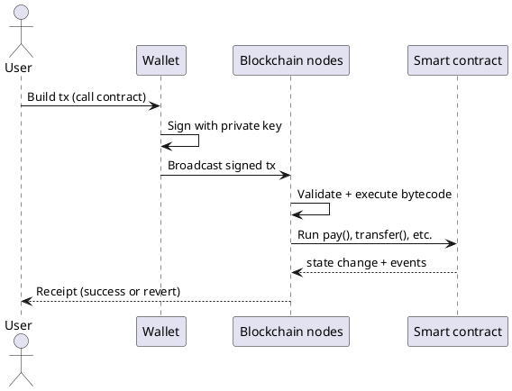

Cryptocurrency101 — Part II: What is cryptocurrency?
**Cryptocurrency** is digital value tracked on a **shared ledger** (usually a **blockchain**) where ownership is enforced by **cryptography**, not by a single company database. **Part III** covers [how transactions are stored](iii-how-transactions-are-stored.md); **Part IV** covers [types of blockchains](iv-types-of-blockchains.md).

This track is **conceptual and educational**, not financial advice.

## 1. Core idea

| Term | Plain meaning |
|------|----------------|
| **Cryptocurrency** | Digital asset whose transfers are recorded on a network many parties can verify |
| **Blockchain** | A chain of blocks — each block batches recent transactions and links to the previous block |
| **Ledger** | The record of who holds what (or which outputs are unspent) |
| **Node** | Software that stores a copy of (or subset of) the ledger and follows network rules |
| **Wallet** | Keys + software that **signs** transactions — does not “hold coins” inside the app; the chain does |

```text
Traditional bank app          Cryptocurrency network
────────────────────          ────────────────────────
Bank's private database       Thousands of nodes share rules + ledger
You trust the bank            You verify rules via open protocol + crypto
Chargeback / reversal         Finality rules differ — often irreversible
```

You are not buying “a file on your USB stick.” You control **keys** that authorize moves on a **network-wide** record.

## 2. Keys, addresses, and signatures

Ownership is **public-key cryptography**:

```text
Private key  →  kept secret  →  signs transactions (proves authorization)
Public key   →  derived      →  often hashed into an "address"
Address      →  shared       →  where others send value
```

| Piece | Role |
|-------|------|
| **Private key** | Like a password you must never share — anyone with it can spend |
| **Signature** | Math proof that the holder of the private key approved **this exact** transaction |
| **Address** | Destination label (0x… on EVM, `T…` on Tron, `addr1…` on Cardano, etc.) |

**Lost keys = lost access** for most networks — there is usually no “reset password” at a central authority.

## 3. Native coin vs token

| | **Native coin** | **Token** |
|---|-----------------|-----------|
| **Examples** | BTC, ETH, BNB, TRX, TON, ADA | USDT on BSC, BEP-20, TRC-20, Jettons |
| **Pays network fees?** | **Yes** — gas / energy / tx fee | Usually **no** — you still need native coin for fees |
| **Defined by** | Protocol rules of the chain | Smart contract or ledger rules on top of the chain |

```text
User wallet
  ├── BNB (native)     → pays gas on BNB Chain
  └── USDT (token)     → contract balance; transfer needs BNB for gas
```

Network-specific pages ([BNB](networks/bnb/i-overview.md), [Tron](networks/tron/i-overview.md), [TON](networks/ton/i-overview.md), [Cardano](networks/ada/i-overview.md)) spell out native coins and token standards.

## 4. Smart contracts (high level)

A **smart contract** is **program code deployed on the blockchain** that runs when users send transactions to it. It can:

- Hold value and release it when rules are met
- Split payments (see [Fee split pattern](v-fee-split-pattern.md))
- Implement tokens, swaps, voting, escrow



The contract **lives on the chain** — you do not host it on a VPS. You pay **once to deploy**, then **fees per transaction**. See [Deploy & hosting](vi-deploy-pricing-and-hosting.md).

## 5. Decentralization is a spectrum

| Style | Who runs nodes | Examples |
|-------|----------------|----------|
| **Public permissionless** | Anyone | Bitcoin, Ethereum, BNB Chain, Cardano |
| **Consortium / permissioned** | Approved operators | Some enterprise chains |
| **Centralized ledger** | One company | Not classic “crypto” — more like internal DB |

“Decentralized” does **not** mean “no humans” — it means **no single party** must be trusted for the **rules** of the ledger, within the limits of the protocol and client software you use.

## 6. What cryptocurrency is not

| Misconception | Reality |
|---------------|---------|
| **Anonymous by default** | Most chains are **pseudonymous** — addresses are public on explorers |
| **Instant free money** | Fees, volatility, scams, and failed txs are common |
| **Backed by all governments** | Varies — many assets are not legal tender |
| **Reversible like PayPal** | On-chain transfers are often **final** once confirmed |
| **Stored inside the wallet app** | Wallet holds **keys**; balances live on the **ledger** |

## 7. How this track uses these ideas

Later parts and **network** pages assume you know:

| Concept | Used for |
|---------|----------|
| **Signed transactions** | Every `pay()` or transfer |
| **Native coin for fees** | [Insufficient funds](vii-failed-transactions-and-funds.md) |
| **Smart contracts** | FeeSplitter examples on each chain |
| **Account vs UTXO** | [Types of blockchains](iv-types-of-blockchains.md) — Solidity vs Aiken feel different |

## 8. Related

- **Part I** — [Overview](i-overview.md) — track map
- **Part III** — [How transactions are stored](iii-how-transactions-are-stored.md)
- **Part IV** — [Types of blockchains](iv-types-of-blockchains.md)
- [Cybersecurity — hashing & signatures](../cybersecurity/i-overview.md) (intuition)
- **Part V** — [Fee split pattern](v-fee-split-pattern.md)
