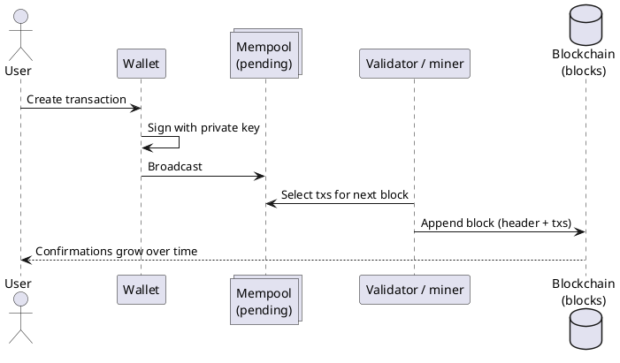
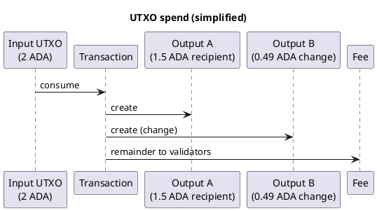
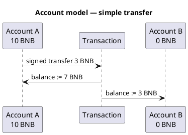

Cryptocurrency101 — Part III: How transactions are stored
Transactions are not rows in one company’s SQL database. They are **signed messages** grouped into **blocks**, linked into a **chain**, and copied across **nodes**. **How** balances are represented differs: **UTXO** (outputs) vs **account** (global balances).

Assumes **Part II** [What is cryptocurrency?](ii-what-is-cryptocurrency.md).

## 1. Lifecycle — from wallet to chain



| Stage | What is stored | Where |
|-------|----------------|-------|
| **Created** | Unsigned or signed tx in wallet memory | Your device |
| **Broadcast** | Signed tx bytes | **Mempool** on nodes (pending) |
| **Included** | Tx inside a **block** | On-chain — permanent for practical purposes |
| **Confirmed** | Block buried under newer blocks | Deeper = harder to reverse |

## 2. What a transaction contains

Every chain packages slightly different fields, but the pattern is:

| Field (conceptual) | Purpose |
|--------------------|---------|
| **Inputs / from** | What you spend or which account sends |
| **Outputs / to** | Recipients and amounts |
| **Amount / value** | Native coin or token quantity |
| **Fee** | Payment to validators for inclusion |
| **Nonce / sequence** | Prevents replay and double-spend ordering (account chains) |
| **Signature** | Proves authorization |

```text
Signed transaction
  ├── "I authorize moving X from me to Y"
  ├── fee to validators
  └── signature = proof from private key
```

If the signature is invalid or rules are broken, nodes **reject** the tx (mempool) or mark it **failed** when executed in a block.

## 3. Blocks and the chain

A **block** is a batch of transactions plus metadata:

```text
Block N
  ├── header
  │     ├── hash of previous block  ← links the chain
  │     ├── timestamp
  │     ├── merkle root of txs
  │     └── (consensus fields — PoS vote, etc.)
  └── body: list of transactions
```

```text
Genesis → Block 1 → Block 2 → Block 3 → …
            ↑         ↑
         prev hash  prev hash
```

| Property | Meaning |
|----------|---------|
| **Immutability (practical)** | Changing an old block breaks the hash chain — nodes reject it |
| **Transparency** | Explorers (BscScan, Tronscan, …) index blocks for humans |
| **Replication** | Many nodes store full or partial copies |

**Confirmations** = number of blocks added after the block that included your tx. More confirmations → more expensive to rewrite history.

## 4. Where data lives — nodes

| Node type | Stores | Role |
|-----------|--------|------|
| **Full node** | Full blocks + (usually) current state | Validates everything |
| **Archive node** | Full history + old state | Analytics, indexers |
| **Light client** | Headers + proofs | Wallet-style verification with less disk |

Your **wallet** talks to an RPC provider or your own node — it does not need to store the entire chain locally unless you run a node.

## 5. Two storage models — UTXO vs account

This is the most important split for reading contracts and explorers.

### UTXO (Unspent Transaction Output)

Used by **Bitcoin** and **Cardano (eUTXO)**.

```text
No single "balance" field per address on-chain.

Ledger = set of outputs:
  Output 1: 0.5 BTC to address A
  Output 2: 1.2 ADA to address B
  ...

Spend = consume whole outputs, create new outputs (change back to self)
```

| Idea | Detail |
|------|--------|
| **UTXO** | A discrete chunk of value with a locking condition |
| **Transaction** | Consumes one or more UTXOs as **inputs**, creates new **outputs** |
| **Balance** | Sum of UTXOs you can unlock — wallet software computes this |



**Cardano** extends this with **eUTXO** — outputs carry **datum** (data) and validators check that the **next** transaction’s outputs are legal. See [Cardano](networks/ada/i-overview.md).

### Account model

Used by **Ethereum**, **BNB Chain**, **Tron**, **TON** (account-based messaging).

```text
Global state:
  address 0xABC…  →  balance: 10 BNB
  address 0xDEF…  →  balance: 0 TRX
  contract 0x123… →  bytecode + storage slots
```

| Idea | Detail |
|------|--------|
| **Account** | One row-like record per address |
| **Transaction** | Updates balances and/or runs contract code |
| **`msg.value`** | Native coin sent with the call (EVM) |



**EVM chains (BNB, Tron)** look almost the same in code — RPC, gas token, and tooling differ. See [BNB](networks/bnb/i-overview.md), [Tron](networks/tron/i-overview.md).

### Side-by-side

| | **UTXO / eUTXO** | **Account** |
|---|------------------|-------------|
| **State unit** | Outputs to spend | Per-address balance + contract storage |
| **“Balance”** | Derived from outputs | Stored directly |
| **Smart contracts** | Validators on outputs | Bytecode at address |
| **Fee math** | Inputs − outputs = fee | `gas_used × gas_price` |
| **This track** | Cardano | BNB, Tron, TON |

## 6. Contract storage (account chains)

On EVM-style chains, a deployed contract has:

| Store | Holds |
|-------|--------|
| **Bytecode** | Immutable program (unless proxy patterns) |
| **Storage slots** | Mutable key/value (balances mapping, `feeBps`, `owner`, …) |
| **Balance** | Native coin held by the contract address |

Transactions that **call** the contract read/write storage according to the code. Events (`Paid`, `Transfer`) are **logs** — indexed by explorers but not “storage” in the same sense.

## 7. Mempool and ordering

Before inclusion, signed txs wait in the **mempool**:

| Behavior | Effect |
|----------|--------|
| **Higher fee** | Often picked first under congestion |
| **Invalid tx** | Dropped — never stored on-chain |
| **Replaced** | Some chains support fee-bump replacement |

If your tx never leaves the mempool (fee too low), **no on-chain record** — you pay nothing on-chain.

## 8. Finality and reversions

| Outcome | Stored on-chain? | Fee charged? |
|---------|------------------|------------|
| **Rejected at mempool** | No | No |
| **Included, execution failed (revert)** | Yes — failed execution record | Usually **yes** (work was done) |
| **Included, success** | Yes — state updated | Yes |

Details by network: [Failed transactions & funds](vii-failed-transactions-and-funds.md).

## 9. How to read an explorer

| Explorer column | UTXO chain (Cardano) | Account chain (BNB) |
|-----------------|----------------------|---------------------|
| **Inputs / outputs** | UTXO list | Often “From / To” |
| **Value** | Sum of outputs | `Value` field + internal txs |
| **Status** | Valid / phase-2 fail | Success / Fail (revert) |
| **Logs** | Less common | Events from contracts |

After broadcast: [Verify safe & completed](ix-verify-safe-and-completed.md).

## 10. Related

- **Part II** — [What is cryptocurrency?](ii-what-is-cryptocurrency.md)
- **Part IV** — [Types of blockchains](iv-types-of-blockchains.md)
- **Part VII** — [Failed transactions & funds](vii-failed-transactions-and-funds.md)
- **Part IX** — [Verify safe & completed](ix-verify-safe-and-completed.md)
