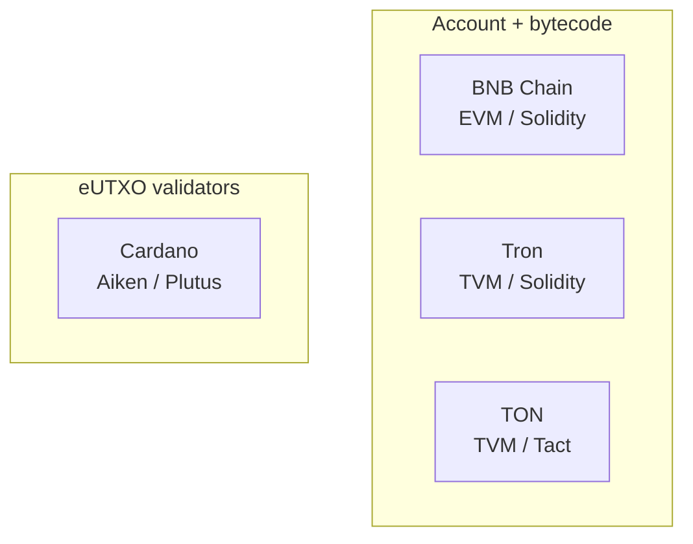

Cryptocurrency101 — Part IV: Types of blockchains
Blockchains differ by **who can join**, **how agreement is reached**, **what layer** they sit on, and **how state is modeled**. This page classifies the landscape and maps **this track’s networks** to each type.

Builds on **Part III** [How transactions are stored](iii-how-transactions-are-stored.md) (UTXO vs account).

## 1. Permission — who can read and write

| Type | Read | Write (submit txs) | Run validator | Examples |
|------|------|--------------------|---------------|----------|
| **Public permissionless** | Anyone | Anyone (pay fee) | Open or stake-based | Bitcoin, Ethereum, BNB Chain, Cardano, TON, Tron |
| **Public permissioned** | Anyone | Approved identities | Approved set | Some “enterprise” pilots |
| **Private / consortium** | Members | Members | Known operators | Hyperledger-style networks |

This track focuses on **public** chains where you deploy **FeeSplitter**-style contracts and use public explorers.

## 2. Layer — L1, L2, sidechains

```text
                    ┌─────────────────┐
  User / dApp  ────►│  L2 (rollup)    │───┐
                    │  cheaper txs    │   │ settles to
                    └─────────────────┘   ▼
                    ┌─────────────────┐
                    │  L1 (base chain) │  security + final settlement
                    │  Ethereum, BNB…  │
                    └─────────────────┘
```

| Layer | Role | Trade-off |
|-------|------|-----------|
| **L1 (base layer)** | Consensus, security, native asset | Higher fees, highest trust anchor |
| **L2** | Batches many txs, posts proof/state to L1 | Cheaper; extra bridge / operator assumptions |
| **Sidechain** | Separate chain with own validators | Often faster; security not identical to L1 |

| Network in this track | Layer | Notes |
|-----------------------|-------|-------|
| [BNB Chain](networks/bnb/i-overview.md) | **L1** (EVM) | Own validators; EVM-compatible |
| [Tron](networks/tron/i-overview.md) | **L1** (TVM) | EVM-like Solidity; energy/bandwidth model |
| [TON](networks/ton/i-overview.md) | **L1** | Sharded design; message-based contracts |
| [Cardano](networks/ada/i-overview.md) | **L1** | eUTXO; PoS (Ouroboros) |

## 3. Consensus — how the next block is chosen

You do not need to implement consensus to write contracts — but it explains **finality** and **fees**.

| Family | Idea | Used by (examples) |
|--------|------|-------------------|
| **Proof of Work (PoW)** | Miners spend compute to find valid block | Bitcoin (historically many chains) |
| **Proof of Stake (PoS)** | Staked validators propose/vote on blocks | Ethereum post-merge, Cardano, BNB (PoSA) |
| **Delegated PoS (DPoS)** | Token holders vote for limited validator set | Tron (SR model) |
| **Other / hybrid** | Combinations, BFT committees | Various L1s |

| Question | Why you care |
|----------|--------------|
| **Block time** | How fast “1 confirmation” appears |
| **Finality** | When reversal becomes impractical |
| **Validator set** | Centralization vs decentralization trade-off |

## 4. Execution model — how smart contracts run

| Model | Chains | Developer experience |
|-------|--------|----------------------|
| **EVM** (stack VM) | Ethereum, **BNB**, many L2s | **Solidity**, Hardhat, Foundry |
| **EVM-like TVM** | **Tron** | Solidity + TronWeb; energy/bandwidth |
| **TON VM** | **TON** | **FunC**, **Tact**; messages between contracts |
| **eUTXO** | **Cardano** | **Aiken**, Plutus — validators on outputs |



### EVM family (BNB, Tron)

- One **contract address** with **storage** and **payable** functions
- **`msg.value`** carries native coin
- **`call` / `transfer`** send to other accounts
- Same **fee-split** Solidity pattern with small deployment differences

### TON

- **Accounts** and **messages** between contracts
- Contracts can reject or bounce messages
- Jettons = token standard (analogous to ERC-20)

### Cardano eUTXO

- Logic validates **that outputs** of a transaction are correct
- No global `msg.value` — you build **outputs** with correct amounts
- **Datum** carries state; **redeemer** carries call args

See comparison in [Fee split pattern](v-fee-split-pattern.md).

## 5. Token standards by chain type

| Chain | Native coin | Fungible token standard |
|-------|-------------|-------------------------|
| BNB Chain | BNB | BEP-20 (ERC-20 compatible) |
| Tron | TRX | TRC-20 |
| TON | TON | Jettons |
| Cardano | ADA | Native assets on UTXO |

Native coin always pays **network fees**; tokens move via contract or ledger rules.

## 6. Comparison — networks in this track

| | **BNB / Tron** | **TON** | **Cardano (ADA)** |
|---|----------------|---------|-------------------|
| **Ledger model** | Account | Account + async messages | **eUTXO** |
| **Language** | Solidity | Tact (high level) | Aiken / Plutus |
| **Gas / fees** | BNB gas / TRX energy | TON compute + storage | ADA tx fee + min-ADA per output |
| **Tooling** | Hardhat, MetaMask / TronLink | Blueprint, Tonkeeper | Aiken, Lucid |
| **Best tutorial path** | Closest to Ethereum docs | Different message model | Different mental model |

**Pick one network** to learn deployment first — [BNB Chain](networks/bnb/i-overview.md) is the closest to mainstream Ethereum tutorials.

## 7. Choosing a chain (engineering lens)

| Need | Often lean toward |
|------|-------------------|
| **Solidity + EVM tooling** | BNB Chain, Tron |
| **Low fees, Telegram ecosystem** | TON |
| **Formal methods / UTXO audit story** | Cardano |
| **Maximum DeFi liquidity** | Ethereum L1 or large L2 (not a separate page in this track) |
| **Regulated enterprise private ledger** | Permissioned chain — out of scope here |

None of these choices remove **audit**, **testnet**, or **legal** review — see [Overview — safety](i-overview.md).

## 8. Related

- **Part III** — [How transactions are stored](iii-how-transactions-are-stored.md)
- **Part V** — [Fee split pattern](v-fee-split-pattern.md)
- **Part VI** — [Deploy & hosting](vi-deploy-pricing-and-hosting.md)
- Network deep dives: [BNB](networks/bnb/i-overview.md) · [Tron](networks/tron/i-overview.md) · [TON](networks/ton/i-overview.md) · [Cardano](networks/ada/i-overview.md)
