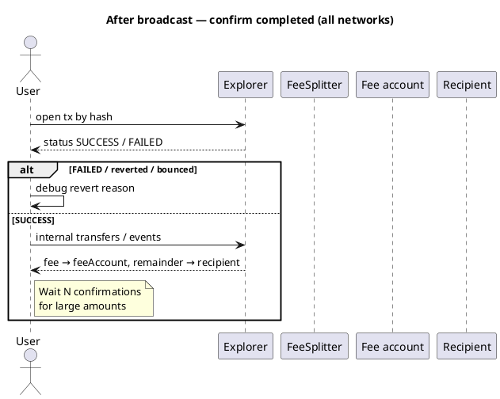

Cryptocurrency101 — Part IX: Verify safe & completed
**Safe** = you are signing the right thing (correct contract, amount, recipient, no obvious scam).  
**Completed** = the transaction was **included in a block** and **succeeded** (not reverted / not bounced / valid on Cardano).

```text
BEFORE sign     →  safe to send?   (simulation, address check, UI review)
AFTER included  →  completed?      (explorer status, receipt, balances, events)
```

Pre-broadcast checks: [Verify before broadcast](viii-verify-before-broadcast.md).

## 1. Two phases

| Phase | Question | Who checks | Cost if wrong |
|-------|----------|------------|---------------|
| **Pre-sign (safe)** | Is this tx what I intend? | Wallet, dApp, `staticCall` | Usually **no** fee if wallet blocks |
| **Post-mine (completed)** | Did it succeed on-chain? | Explorer, RPC receipt, balances | Gas **paid** if reverted |



## 2. Shared checks (FeeSplitter `pay()`)

| Check | Safe (before) | Completed (after) |
|-------|---------------|-------------------|
| Contract address | Your deployed address (not phishing) | Same “To” in tx |
| Function | `pay(recipient)` | Input decodes to `pay` |
| Amount | UI `msg.value` = intended | Tx value field matches |
| Recipient | Address correct | Logs show same recipient |
| Fee math | `fee = value × bps / 10000` | Fee account + recipient balances |
| Outcome | `staticCall` succeeds | Explorer Success + **Paid** event |

## 3. BNB Chain (BSC) — EVM

| | Detail |
|---|--------|
| **Explorer** | [BscScan](https://bscscan.com) |
| **Safe before sign** | **Chain ID 56**; **To** = FeeSplitter; `staticCall` |
| **Completed** | Receipt **`status: 1`**; **`0`** = reverted |
| **Confirmations** | 1 = included; **12–15+** for large sums |
| **Extra proof** | **Logs** — `Paid` event; **Internal Txns** |

```javascript
const receipt = await provider.waitForTransaction(txHash, 1);
if (receipt.status !== 1) throw new Error('reverted');
```

Details: [BNB Chain](networks/bnb/i-overview.md).

## 4. Tron (TVM)

| | Detail |
|---|--------|
| **Explorer** | [Tronscan](https://tronscan.org) |
| **Safe before sign** | Mainnet vs Shasta; `T…` address; dry-run |
| **Completed** | **Result: SUCCESS** (not REVERT / OUT_OF_ENERGY) |
| **Confirmations** | **19+ blocks** for cautious finality |

```javascript
const info = await tronWeb.trx.getTransactionInfo(txId);
if (info.receipt.result !== 'SUCCESS') throw new Error('failed');
```

Details: [Tron](networks/tron/i-overview.md).

## 5. TON

| | Detail |
|---|--------|
| **Explorer** | [Tonviewer](https://tonviewer.com) |
| **Safe before sign** | Mainnet `-239`; simulate first |
| **Completed** | Success; messages **not bounced** |
| **Confirmations** | Often 1–2 blocks for UX |

```text
Bounced message  →  NOT completed
Exit code 0      →  compute succeeded
```

Details: [TON](networks/ton/i-overview.md).

## 6. Cardano (ADA) — eUTXO

| | Detail |
|---|--------|
| **Explorer** | [Cardanoscan](https://cardanoscan.io) |
| **Safe before sign** | Preprod vs mainnet; `transaction build` OK |
| **Completed** | **Valid** tx; expected **outputs** (fee + recipient) |
| **Confirmations** | Often **3–10+** in dApps |

Verify **outputs in the transaction**, not `msg.value`.

Details: [Cardano](networks/ada/i-overview.md).

## 7. Comparison table

| Network | “Completed” signal | Explorer | Typical wait |
|---------|-------------------|----------|--------------|
| **BNB** | Receipt `status: 1` | BscScan | 1 quick; 12+ large |
| **Tron** | `SUCCESS` | Tronscan | ~19 blocks |
| **TON** | Success, no bounce | Tonviewer | 1–2 blocks |
| **Cardano** | Valid + outputs | Cardanoscan | 3–10+ |

## 8. Scam checks

| Risk | Mitigation |
|------|------------|
| **Wrong contract address** | Save address from **your** deploy tx |
| **Unlimited token approve** | Review approvals separately from `pay()` |
| **Phishing dApp** | Hardware wallet; read decoded tx |
| **Premature “success” UI** | Wait for receipt, not just “submitted” |

## 9. dApp pattern

```text
1. user signs
2. show "Pending…" + explorer link
3. poll receipt until confirmed
4. success → show fee/remainder breakdown
5. reverted → failure + explorer link (gas spent)
```

## 10. Related

- **Part VIII** — [Verify before broadcast](viii-verify-before-broadcast.md)
- **Part VII** — [Failed transactions & funds](vii-failed-transactions-and-funds.md)
