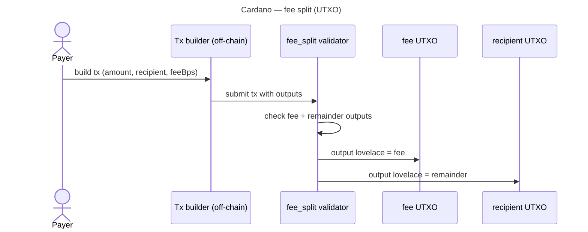

Cardano (ADA) — overview
**Cardano** uses the **eUTXO** model — value lives in **outputs**, not a single contract balance. Validators (on-chain scripts) **check** that a transaction is allowed; **Aiken** is a modern language for writing them. **Plutus** (Haskell) is the original platform language.

Parent track: [Cryptocurrency101 overview](../../i-overview.md).

## Network profile

| | **Cardano** |
|---|-------------|
| **Type** | Layer-1, eUTXO |
| **Languages** | **Aiken** (recommended), **Plutus Tx** (Haskell) |
| **Tooling** | cardano-cli, Mesh SDK, Blockfrost |
| **Native coin** | ADA (lovelace: 1 ADA = 1_000_000 lovelace) |
| **Tokens** | Native assets on UTXO (policy ID + asset name) |

## How eUTXO differs from EVM

```text
EVM (BNB/Tron):  contract holds balance → pay() splits inside contract

Cardano:         transaction has INPUTS and OUTPUTS
                 validator ensures: sum(in) = sum(out) + fee
                 one output → feeAddress (fee)
                 one output → recipient (remainder)
```

You often **build the transaction off-chain** (dApp or wallet); the **validator** proves the split is correct.

## Fee split pattern



## Example — Aiken validator (sketch)

Validator checks that spending from the contract input splits value correctly. **Datum** holds config; **redeemer** carries recipient intent.

```aiken
use aiken/crypto.{VerificationKeyHash}
use cardano/transaction.{OutputReference, Transaction, InlineDatum}
use cardano/assets

pub type Config {
  fee_account: VerificationKeyHash,
  fee_bps: Int,
}

pub type Redeemer {
  recipient: VerificationKeyHash,
}

/// Simplified: ensure two outputs pay fee_account and recipient with correct lovelace split.
validator fee_split(config: Config) {
  spend(
    _datum: Option<Data>,
    redeemer: Redeemer,
    self: Transaction,
  ) {
    let Transaction { outputs, .. } = self

    // In production: locate script input value, sum outputs to fee + recipient,
    // assert fee == input * config.fee_bps / 10_000

    let expected_fee = /* computed from input lovelace */
    let expected_remainder = /* input - expected_fee */

    let fee_ok =
      outputs
        |> list.any(fn(out) {
          assets.lovelace_of(out.value) == expected_fee
            && out.address.payment_credential == config.fee_account
        })

    let pay_ok =
      outputs
        |> list.any(fn(out) {
          assets.lovelace_of(out.value) == expected_remainder
            && out.address.payment_credential == redeemer.recipient
        })

    fee_ok && pay_ok
  }
}
```

| Piece | Role |
|-------|------|
| **`Config`** | On-chain datum — fee account pubkey hash, `fee_bps` |
| **`Redeemer`** | Who receives remainder this spend |
| **`spend` validator** | Returns `True` only if outputs match fee math |

Full production validators also handle **minimum ADA** per output, **native tokens**, and **reference inputs** — see [Aiken docs](https://aiken-lang.org).

## Off-chain transaction build (concept)

```text
1. Payer selects UTXO with amount lovelace
2. fee = amount * feeBps / 10000
3. remainder = amount - fee - tx_fee
4. Outputs:
     - fee_account:     fee lovelace
     - recipient:       remainder lovelace
     - change (payer):  optional
5. Attach datum + redeemer; sign; submit
```

Libraries (**Mesh**, **Lucid**) automate UTXO selection and balancing.

## Plutus (Haskell) — same logic

Plutus Tx compiles to the same on-chain script; syntax is heavier:

```haskell
-- Plutus: validator checks output values — same fee/remainder rules as Aiken
```

New projects often choose **Aiken** for clarity and faster compile times.

## Deploy pricing

On Cardano you pay **ADA transaction fees** to include the **validator script** in a transaction (mint / publish). There is **no EVM-style single deploy gas meter** — cost scales with **transaction size** and **script bytes**. Still **no server** to host the script.

| Item | Typical range (2026) | Notes |
|------|----------------------|-------|
| **Publish simple Aiken validator** | **~$2 – $15** USD | Script size + min ADA in script UTXO |
| **Large Plutus script** | **$15 – $100+** | Heavy bytecode |
| **Each spend (use validator)** | **~$0.15 – $0.50** | Tx fee + min-ADA outputs |
| **Preprod / preview testnet** | **$0** | Faucet ADA |

### What drives cost

```text
tx_fee_lovelace ≈ a + b × tx_size_bytes
min_ada         ≈  per output (script UTXO needs deposit)
```

| Factor | Effect |
|--------|--------|
| **Script size** | Larger Aiken/Plutus → bigger tx → higher fee |
| **Min ADA** | Outputs with tokens/scripts lock ~1–3+ ADA until spent |
| **Reference scripts** | Reuse script on-chain — pay once, reference later (CIP-33) |

| FeeSplitter validator | Order of magnitude |
|-----------------------|--------------------|
| Publish script + mint address | ~1 – 5 ADA total (fee + deposit) |
| One validated spend tx | ~0.2 – 0.5 ADA |

**Estimate:**

```text
cardano-cli transaction build … --testnet-magic 1
# inspect "fee" in build output before sign
```

Or use **Mesh** / **Lucid** `complete()` — returns fee before submit.

### Deploy vs use

| Step | On-chain action | Paid once per… |
|------|-----------------|----------------|
| **Compile Aiken** | Off-chain — free | — |
| **Publish validator** | Transaction includes script | Deploy |
| **User pays via split** | Tx spending script UTXO | Each payment |

Off-chain **tx builder** can run on serverless (no 24/7 host) — validator bytecode remains on-chain.

## Compare

| | **Cardano** | **BNB / Tron** |
|---|-------------|----------------|
| Model | UTXO | Account |
| Split execution | Validator + tx builder | `pay()` in contract |
| Language | Aiken / Plutus | Solidity |

## Next

Return to [Cryptocurrency101 overview](../../i-overview.md) or compare [BNB Chain](../bnb/i-overview.md) (simplest Solidity example).
