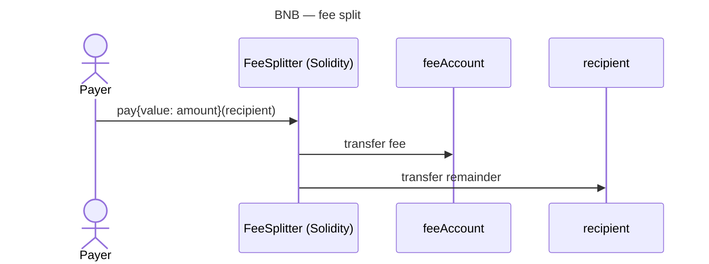

BNB Chain — overview
**BNB Smart Chain (BSC)** is an **EVM-compatible** network — same account model and **Solidity** as Ethereum, but native gas is **BNB**. DeFi and token projects often deploy here for lower fees than Ethereum mainnet.

Parent track: [Cryptocurrency101 overview](../../i-overview.md).

## Network profile

| | **BNB Smart Chain** |
|---|----------------------|
| **Type** | Layer-1, EVM |
| **Language** | **Solidity** (primary) |
| **Tooling** | Hardhat, Foundry, Remix, MetaMask |
| **Native coin** | BNB |
| **Tokens** | BEP-20 (ERC-20 compatible) |
| **RPC example** | `https://bsc-dataseed.binance.org` |

## Fee split pattern

Payer sends **BNB** to the contract; contract sends **fee** to treasury and **remainder** to recipient.



## Example — Solidity

```solidity
// SPDX-License-Identifier: MIT
pragma solidity ^0.8.20;

/// @notice Deduct feeBps from msg.value, send fee to feeAccount, rest to recipient.
contract FeeSplitter {
    address public immutable feeAccount;
    uint256 public immutable feeBps; // 100 = 1%

    event Paid(address indexed payer, address indexed recipient, uint256 fee, uint256 remainder);

    constructor(address _feeAccount, uint256 _feeBps) {
        require(_feeAccount != address(0), "zero fee account");
        require(_feeBps <= 10_000, "fee > 100%");
        feeAccount = _feeAccount;
        feeBps = _feeBps;
    }

    function pay(address payable recipient) external payable {
        require(msg.value > 0, "no value");
        require(recipient != address(0), "zero recipient");

        uint256 fee = (msg.value * feeBps) / 10_000;
        uint256 remainder = msg.value - fee;

        (bool feeOk, ) = feeAccount.call{value: fee}("");
        require(feeOk, "fee transfer failed");

        (bool payOk, ) = recipient.call{value: remainder}("");
        require(payOk, "recipient transfer failed");

        emit Paid(msg.sender, recipient, fee, remainder);
    }
}
```

| Line | Role |
|------|------|
| **`feeBps / 10_000`** | Basis points — 250 bps = 2.5% |
| **`call{value:}`** | Forward native BNB |
| **`immutable`** | Fee config fixed at deploy — use proxy pattern if you need upgrades |

### BEP-20 variant (sketch)

For **tokens**, use `IERC20.transferFrom` from payer, then split `amount` (no `msg.value`):

```solidity
function payToken(IERC20 token, address recipient, uint256 amount) external {
    require(token.transferFrom(msg.sender, address(this), amount), "pull failed");
    uint256 fee = (amount * feeBps) / 10_000;
    require(token.transfer(feeAccount, fee), "fee failed");
    require(token.transfer(recipient, amount - fee), "pay failed");
}
```

## Deploy and call (Hardhat sketch)

```text
npx hardhat compile
npx hardhat run scripts/deploy.js --network bscTestnet
```

```javascript
// pay 1 BNB with 1% fee (100 bps)
await feeSplitter.pay(recipientAddress, { value: ethers.parseEther("1.0") });
```

## Deploy pricing

You pay **BNB gas once** to publish bytecode — no monthly hosting fee. The contract then lives at a fixed **address** on BSC.

| Item | Typical range (2026) | Notes |
|------|----------------------|-------|
| **Simple contract** (FeeSplitter ~1–3 KB bytecode) | **~$0.50 – $5** USD | BSC gas floor ~**0.05 gwei**; very cheap vs Ethereum |
| **Complex DeFi / proxy + logic** | **$5 – $50+** | More bytecode + constructor args |
| **Each `pay()` call** | **~$0.001 – $0.05** | Simple transfer logic, low gas |
| **BSC testnet** | **$0** | Faucet BNB — always test here first |

### How cost is calculated

```text
deploy_cost_BNB = gas_used × gas_price_gwei × 1e-9
USD             ≈ deploy_cost_BNB × BNB_price
```

| FeeSplitter sketch | Ballpark gas |
|--------------------|--------------|
| Deploy | ~300,000 – 800,000 gas |
| `pay()` | ~50,000 – 80,000 gas |

**Estimate before mainnet:**

```javascript
const gas = await ethers.provider.estimateGas({
  from: deployer.address,
  data: deployTx.data,
});
const fee = gas * gasPrice; // compare to wallet BNB balance
```

Or in Hardhat: deploy script prints gas used. Use [BscScan gas tracker](https://bscscan.com/gastracker) for current gwei.

### What is not a deploy fee

| Cost | Part of deploy? |
|------|-----------------|
| Contract audit | No — professional services, $thousands |
| Domain / website | No — optional off-chain |
| RPC node (Alchemy, etc.) | No — free tier usually enough to deploy |

## Compare

| Network | Same Solidity? |
|---------|----------------|
| [Tron](../tron/i-overview.md) | Very similar (TVM) |
| [TON](../ton/i-overview.md) | No — Tact |
| [Cardano (ADA)](../ada/i-overview.md) | No — Aiken / UTXO |

## Next

[Tron](../tron/i-overview.md) — Solidity on TVM, or return to [Cryptocurrency101 overview](../../i-overview.md).
