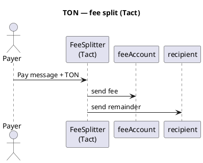

TON — overview
**The Open Network (TON)** uses the **TON VM**. High-level contracts are usually written in **Tact** (recommended) or lower-level **FunC**. Native coin is **TON**; fungible tokens are **Jettons**.

Parent track: [Cryptocurrency101 overview](../../i-overview.md).

## Network profile

| | **TON** |
|---|---------|
| **Type** | Layer-1, sharded (workchains) |
| **Languages** | **Tact** (primary for apps), **FunC** (lower level) |
| **Tooling** | Blueprint, TON SDK, Tonkeeper |
| **Native coin** | TON (nanotons internally) |
| **Tokens** | Jettons |

## Account + message model

Contracts communicate via **messages** (not only external calls). Incoming value arrives in **`context().value`**; you **send** outputs with `send()`.

## Fee split pattern



## Example — Tact

```tact
import "@stdlib/deploy";

message Pay {
    recipient: Address;
}

/// Deduct feeBps from incoming TON, forward remainder to recipient.
contract FeeSplitter with Deployable {
    feeAccount: Address;
    feeBps: Int as uint16; // 100 = 1%

    init(feeAccount: Address, feeBps: Int) {
        self.feeAccount = feeAccount;
        self.feeBps = feeBps;
    }

    receive(msg: Pay) {
        let amount: Int = context().value;
        require(amount > 0, "no value");

        let fee: Int = amount * self.feeBps / 10_000;
        let remainder: Int = amount - fee;

        send(SendParameters{
            to: self.feeAccount,
            value: fee,
            mode: SendPayGasSeparately,
            bounce: false,
            body: empty()
        });

        send(SendParameters{
            to: msg.recipient,
            value: remainder,
            mode: SendPayGasSeparately,
            bounce: false,
            body: empty()
        });
    }

    // Optional: accept plain TON with default recipient in storage
    receive() {}
}
```

| Concept | TON |
|---------|-----|
| **`context().value`** | TON attached to this message |
| **`SendPayGasSeparately`** | Gas paid from contract balance — common pattern |
| **Deploy** | Blueprint: `npx blueprint run deployFeeSplitter` |

### FunC (lower level — sketch)

FunC uses **cell** messages and explicit **send_raw_message** — more boilerplate. Prefer **Tact** unless you maintain legacy contracts.

```text
;; FunC: same math — fee = amount * feeBps / 10000
;; two outbound messages with split values
```

## Jetton fee split (idea)

1. User sends Jetton transfer to contract wallet.  
2. Contract Jetton wallet receives notification.  
3. Contract sends fee Jettons to treasury and remainder to recipient (two `transfer` messages).

Jetton flows add wallet contracts — start with native TON split first.

## Deploy pricing

TON charges **gas** (computation) plus **storage** rent for contract code and data on-chain. Paid in **TON** — no separate server.

| Item | Typical range (2026) | Notes |
|------|----------------------|-------|
| **Simple Tact contract deploy** | **~$0.50 – $5** USD | Small FeeSplitter-style |
| **Complex Jetton + wallets** | **$5 – $30+** | Multiple contracts |
| **Each incoming `Pay` message** | **~$0.01 – $0.10** | Forward fees + storage refresh |
| **TON testnet** | **$0** | Faucet TON |

### Cost components

```text
deploy  ≈  forward_fee + storage_fee (code cells) + execution
message ≈  gas for send() + value forwarded
```

| Component | Meaning |
|-----------|---------|
| **Storage fee** | One-time-ish cost to store bytecode on-chain |
| **Compute fee** | VM steps during deploy and each message |
| **Forward fee** | Paid for outbound internal messages |

Blueprint deploy output shows **estimated TON** before broadcast:

```text
npx blueprint run deployFeeSplitter --testnet
# review "Total cost" in terminal
```

| FeeSplitter (Tact) | Order of magnitude |
|--------------------|--------------------|
| Deploy | ~0.05 – 0.5 TON |
| One `Pay` handling | ~0.005 – 0.05 TON (excluding forwarded value) |

Use [TON viewer](https://tonviewer.com/) on testnet to inspect deploy transaction fees.

## Compare

| | **TON** | **BNB / Tron** |
|---|---------|----------------|
| Language | Tact / FunC | Solidity |
| Model | Messages + async | Synchronous call |

## Next

[Cardano (ADA)](../ada/i-overview.md) — UTXO / Aiken, or [overview](../../i-overview.md).
