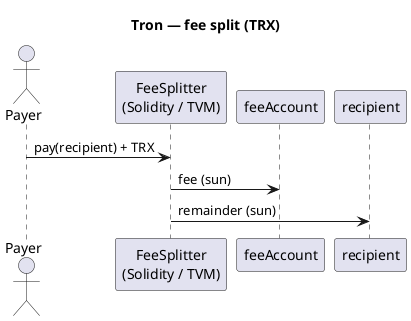

Tron — overview
**Tron** is a **TVM** (Tron Virtual Machine) network — **Solidity**-compatible for most contracts, with native coin **TRX** and tokens **TRC-20**. Account model and fee-split logic mirror [BNB Chain (EVM)](../bnb/i-overview.md).

Parent track: [Cryptocurrency101 overview](../../i-overview.md).

## Network profile

| | **Tron** |
|---|----------|
| **Type** | Layer-1, TVM (EVM-like) |
| **Language** | **Solidity** (0.5.x–0.8.x with Tron adjustments) |
| **Tooling** | TronBox, TronIDE, TronLink wallet |
| **Native coin** | TRX |
| **Tokens** | TRC-20 |
| **Energy / bandwidth** | Staked TRX or burned TRX for execution (not identical to ETH gas) |

## Differences from BNB / Ethereum

| Topic | Tron note |
|-------|-----------|
| **Address format** | Base58 `T…` addresses (not `0x` in wallets) |
| **`address payable`** | Same Solidity patterns for TRX transfer |
| **Units** | 1 TRX = 1_000_000 sun |
| **Solidity** | Avoid unsupported opcodes; test on Nile/Shasta testnet |

## Fee split pattern

Same rule as BNB: **fee** → treasury, **remainder** → recipient.



## Example — Solidity (TVM)

```solidity
// SPDX-License-Identifier: MIT
pragma solidity ^0.8.20;

contract TronFeeSplitter {
    address public immutable feeAccount;
    uint256 public immutable feeBps;

    constructor(address _feeAccount, uint256 _feeBps) {
        require(_feeAccount != address(0), "zero fee");
        require(_feeBps <= 10_000, "fee too high");
        feeAccount = _feeAccount;
        feeBps = _feeBps;
    }

    function pay(address payable recipient) external payable {
        require(msg.value > 0, "no trx");
        require(recipient != address(0), "zero recipient");

        uint256 fee = (msg.value * feeBps) / 10_000;
        uint256 remainder = msg.value - fee;

        (bool okFee, ) = feeAccount.call{value: fee}("");
        require(okFee, "fee failed");

        (bool okPay, ) = recipient.call{value: remainder}("");
        require(okPay, "pay failed");
    }
}
```

Deploy with **TronBox** or compile in **TronIDE**, then call `pay` with TRX attached.

### TRC-20 fee split (sketch)

```solidity
function payTrc20(ITRC20 token, address recipient, uint256 amount) external {
    require(token.transferFrom(msg.sender, address(this), amount), "pull");
    uint256 fee = (amount * feeBps) / 10_000;
    require(token.transfer(feeAccount, fee), "fee");
    require(token.transfer(recipient, amount - fee), "pay");
}
```

## Testnet flow

```text
1. TronLink wallet on Shasta / Nile testnet
2. Deploy FeeSplitter with feeAccount + feeBps (e.g. 100 = 1%)
3. pay(recipient) sending TRX — verify balances on Tronscan
```

## Deploy pricing

Tron uses **Energy** and **Bandwidth**, not ETH-style gas. Deploying a contract **burns TRX** or consumes **staked energy** — you still **do not** run a server for the contract.

| Item | Typical range (2026) | Notes |
|------|----------------------|-------|
| **Simple Solidity deploy** | **~$5 – $40** USD | Depends on bytecode size and energy price |
| **With staked TRX for energy** | Lower TRX burn | Stake TRX → daily energy quota |
| **Each `pay()` call** | **~$0.01 – $0.30** | If caller has no free bandwidth |
| **Shasta / Nile testnet** | **$0** | Faucet TRX |

### Energy model (sketch)

```text
deploy_cost ≈ energy_used × energy_price (in TRX)
```

| Action | Resource |
|--------|----------|
| **Deploy contract** | High **energy** (one-time) |
| **TRC-20 transfer** | Energy + bandwidth |
| **TRX `call{value}`** | Energy for TVM execution |

TronIDE / TronBox often show **estimated energy** before confirm. Check [Tronscan](https://tronscan.org/) for account energy and bandwidth.

| FeeSplitter sketch | Order of magnitude |
|--------------------|------------------|
| Deploy | ~50M – 150M energy (varies by optimization) |
| `pay()` | ~30k – 100k energy |

**Tip:** On testnet, request faucet TRX and deploy twice — compare energy on Tronscan contract creation tx.

### vs BNB

| | **Tron** | **BSC** |
|---|----------|---------|
| Fee token | TRX / energy | BNB gas |
| Simple deploy | Often **higher** than BSC | Usually **cheapest** EVM-like |
| UX | TronLink energy bar | MetaMask gwei |

## Compare

| | **Tron** | **BNB** |
|---|----------|---------|
| Language | Solidity | Solidity |
| Gas | Energy / bandwidth | BNB gas |
| Wallet UX | TronLink | MetaMask |

## Next

[TON](../ton/i-overview.md) — Tact, [Examples — Tron 2% deploy](../../examples/ii-tron-two-percent-fee-split.md), or [Cryptocurrency101 overview](../../i-overview.md).
