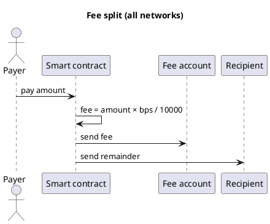

Cryptocurrency101 — Part V: Fee split pattern
Every **network** page in this track implements the same business rule: split an incoming payment into a **protocol fee** and a **recipient remainder**.

## 1. The rule

```text
Incoming payment (amount)
  → fee       = amount × feeBps / 10000   → feeAccount
  → remainder = amount - fee              → recipient
```

| Term | Meaning |
|------|---------|
| **`feeBps`** | Fee in **basis points** (100 bps = 1%) |
| **`feeAccount`** | Treasury / protocol wallet |
| **`recipient`** | End payee |



## 2. How networks implement it

| | **BNB / Tron (EVM/TVM)** | **TON** | **Cardano (eUTXO)** |
|---|--------------------------|---------|---------------------|
| **Model** | Account — `msg.value` | Message value + sends | **Outputs** must split value |
| **Language** | Solidity | Tact | Aiken / Plutus |
| **Failure mode** | `require` / revert | Bounce / exit code | Phase-2 validation fail |

**EVM chains (BNB, Tron)** look almost the same in code — differences are RPC, gas token, and tooling.

**Cardano** validators **check** that a transaction’s **outputs** split value correctly — logic feels different from `msg.value` in Solidity.

See [Types of blockchains](iv-types-of-blockchains.md) for the account vs UTXO mental model.

## 3. Fee math for users

For payment amount **A** and fee rate **bps**:

```text
fee       = A × bps / 10000
remainder = A - fee
```

| User sends | Contract behavior |
|------------|-------------------|
| **Too little** (`msg.value < intended A`) | May still run — split on **actual** `msg.value` |
| **Zero** | Revert — `require(msg.value > 0)` on EVM |
| **Enough value, no gas token** | Tx fails — see [Failed transactions & funds](vii-failed-transactions-and-funds.md) |

**UX tip:** Show **“You pay: A + estimated network fee ~X”** in the dApp before confirm.

## 4. Network pages

| Network | Page |
|---------|------|
| BNB Chain | [BNB — overview](networks/bnb/i-overview.md) |
| Tron | [Tron — overview](networks/tron/i-overview.md) |
| TON | [TON — overview](networks/ton/i-overview.md) |
| Cardano | [Cardano — overview](networks/ada/i-overview.md) |

## 5. Full deploy examples (2% app / 98% to)

| Example | Stack |
|---------|--------|
| [Tron — 2% fee split](examples/ii-tron-two-percent-fee-split.md) | Solidity, TronBox, `pay(toAccount)` |
| [TON — 2% fee split](examples/iii-ton-two-percent-fee-split.md) | Tact, Blueprint, `Pay{ toAccount }` |

## 6. Related

- **Part IV** — [Types of blockchains](iv-types-of-blockchains.md)
- **Part VI** — [Deploy & hosting](vi-deploy-pricing-and-hosting.md)
- **Part VII** — [Failed transactions & funds](vii-failed-transactions-and-funds.md)
