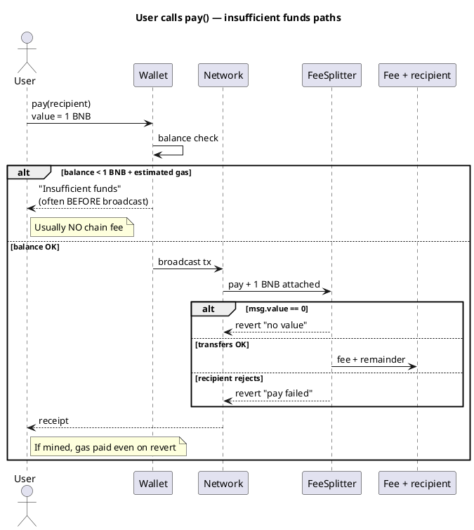

Cryptocurrency101 — Part VII: Failed transactions & insufficient funds
On-chain failures often **still cost fees**. Users need **two** buckets of money on most chains: **payment amount** and **network fee** — confusing them is the most common “insufficient funds” mistake.

See **Part III** [How transactions are stored](iii-how-transactions-are-stored.md) for mempool vs on-chain.

## 1. Failed transactions — do you still pay?

**Usually yes** for anything that reached the network and consumed execution — but **how much** differs by chain and failure type.

| Outcome | BNB / Tron (EVM/TVM) | TON | Cardano |
|---------|----------------------|-----|---------|
| **Rejected before broadcast** | **No** on-chain fee | **No** | **No** |
| **Reverted on-chain** (`require` failed) | **Yes** — gas used up to revert | **Yes** — compute for work done | **Yes** — tx fee if included in block |
| **Invalid tx** (bad signature, nonce) | **No** — not included | **No** | **No** |

```text
EVM rule of thumb:
  fee = gas_used × gas_price
  gas_used includes work done BEFORE revert
  "Out of gas" → still pay for gas attempted (capped)
```

| Example | Who pays | Why |
|---------|----------|-----|
| User calls `pay()` but `require(msg.value > 0)` fails | **Caller** | Tx mined, reverted |
| Deploy tx runs out of gas | **Deployer** | Partial deploy may still cost |
| Tx never leaves mempool (low fee) | **Nobody** | Not included in block |
| Cardano phase-2 validation fail | **Submitter** | Fee often charged once in block |

**Design implication:** failed `pay()` attempts still cost gas — keep checks cheap and test on testnet.

**Not the same as:** credit-card auth holds — on-chain fees are generally **not refunded** on revert.

## 2. Insufficient funds — two buckets (EVM / BNB / Tron)

```text
wallet balance = BNB or TRX

To call pay(recipient) { value: 1 BNB }:
  need  1 BNB     → forwarded via contract to feeAccount + recipient
  plus  ~0.0001+ BNB → gas / energy (never reaches recipient)
```

| Situation | What happens | On-chain fee charged? |
|-----------|--------------|------------------------|
| **Balance < msg.value** | Wallet **blocks** send | **No** |
| **Balance = msg.value exactly** | May **fail** (out of gas) | **Often yes** if included |
| **Balance covers gas only, value = 0** | `require` **revert** | **Yes** if mined |
| **Deployer balance < deploy gas** | Deploy fails | Usually **no** if wallet simulates |



## 3. By network

| Network | “Not enough funds” usually means | Typical message |
|---------|----------------------------------|-----------------|
| **BNB / Tron** | BNB/TRX < `value` + gas/energy | MetaMask / TronLink |
| **TON** | TON < message value + forward + gas | Tonkeeper |
| **Cardano** | ADA < outputs + fee + **min-ADA** | Build fails in wallet |

**Tron:** Low **energy** — may burn more TRX; keep buffer.

**Cardano:** Builder fails **before** submit if inputs cannot cover outputs — often **no** on-chain fee.

## 4. Developer / deployer shortfalls

| Role | Shortfall | Result |
|------|-----------|--------|
| **Deployer** | Not enough for deploy tx | Cancelled in wallet |
| **User** | Not enough for `pay()` | See tables above |
| **Token path** | No `approve` | Revert on `transferFrom` |

## 5. Prevention checklist

| Check | Where |
|-------|--------|
| `balance >= amount + estimateGas(...)` | dApp before Sign |
| `staticCall` / simulate with same `value` | Catches revert |
| Show fee breakdown (protocol + network) | UI copy |
| Test `balance = amount + 1 wei` on testnet | Reproduces no-gas-left |
| Token: `approve` + balance ≥ amount | ERC-20 / TRC-20 |

## 6. Related

- **Part V** — [Fee split pattern](v-fee-split-pattern.md)
- **Part VIII** — [Verify before broadcast](viii-verify-before-broadcast.md)
- **Part IX** — [Verify safe & completed](ix-verify-safe-and-completed.md)
