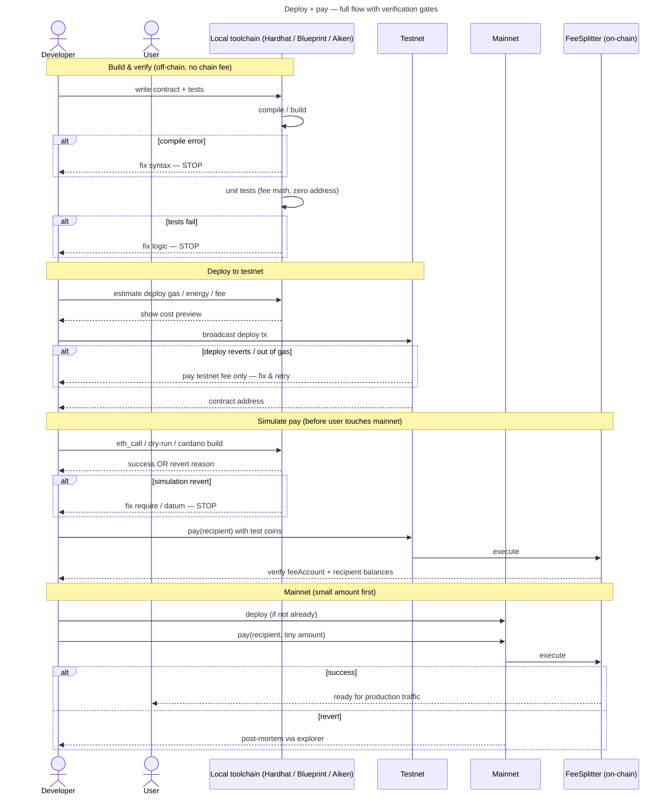
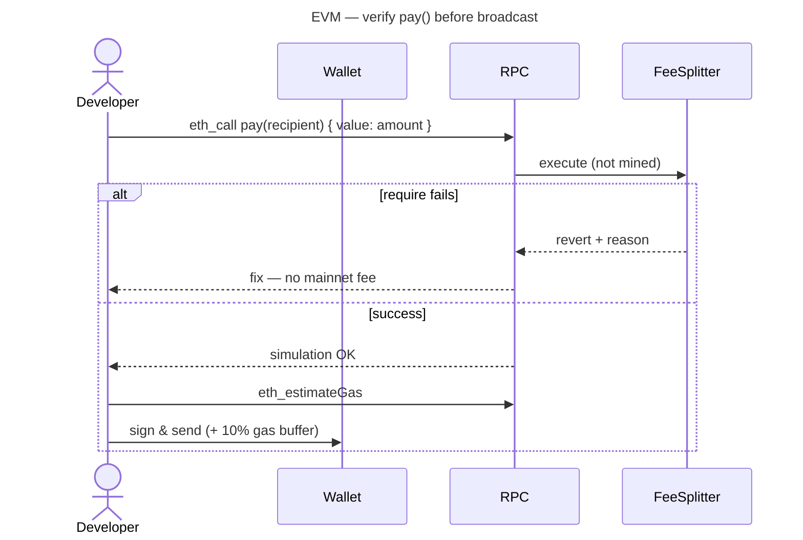
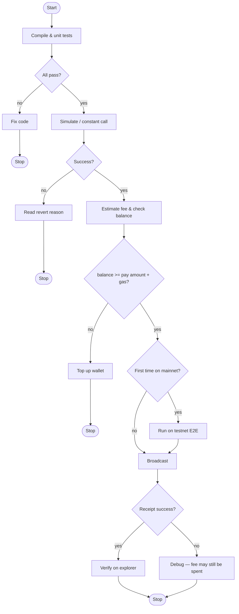

Cryptocurrency101 — Part VIII: Verify before broadcast
Catch most logic and config errors **before** paying mainnet fees: **compile → test → simulate → testnet → mainnet**.

You cannot guarantee **zero** failures (congestion, wallet bugs, MEV), but everything left of **Broadcast** in the diagrams below is **free or testnet-cheap**.

## 1. End-to-end sequence



## 2. Pre-flight checklist

| Step | What you verify | Tool / how | Fails before chain? |
|------|-----------------|------------|---------------------|
| **1. Compile** | Syntax, types, bytecode size | `hardhat compile`, `blueprint build`, `aiken build` | **Yes** |
| **2. Unit tests** | Fee math, zero address rejected | Hardhat, Foundry, Aiken | **Yes** |
| **3. Static analysis** | Reentrancy, overflow | Slither, Mythril (optional) | **Yes** |
| **4. Config review** | `feeAccount`, `feeBps ≤ 10000` | Code review | **Yes** |
| **5. Simulate call** | Tx would succeed without sending | `eth_call`, `triggerConstantContract`, `cardano-cli build` | **Yes** |
| **6. Estimate cost** | Enough native coin + gas headroom | `estimateGas`, energy estimate | **Yes** |
| **7. Wallet / nonce** | Correct network, balance | MetaMask, TronLink, Tonkeeper | **Yes** if blocked |
| **8. Testnet E2E** | Deploy + `pay()` + balances | BSC testnet, Shasta, Preprod | Cheap |
| **9. Mainnet canary** | One small real `pay()` | Mainnet explorer | Costs real fee |

## 3. EVM simulation (BNB / Tron)



```javascript
// Hardhat / ethers — dry-run before send
await contract.pay.staticCall(recipient, { value: amount });
const gas = await contract.pay.estimateGas(recipient, { value: amount });
await contract.pay(recipient, { value: amount, gasLimit: gas * 110n / 100n });
```

## 4. Tools by network

| Network | Simulate / dry-run | Testnet | Explorer |
|---------|-------------------|---------|----------|
| [BNB](networks/bnb/i-overview.md) | `eth_call`, `staticCall`, Foundry | BSC testnet | BscScan |
| [Tron](networks/tron/i-overview.md) | `triggerConstantContract` | Shasta / Nile | Tronscan |
| [TON](networks/ton/i-overview.md) | Blueprint, `@ton/sandbox` | TON testnet | Tonviewer |
| [ADA](networks/ada/i-overview.md) | `cardano-cli transaction build`, Lucid | Preprod / Preview | Cardanoscan |

## 5. Common revert reasons (FeeSplitter)

| Contract check | User mistake | Simulation catches? |
|----------------|--------------|---------------------|
| `msg.value > 0` | Sends 0 native coin | **Yes** |
| `recipient != address(0)` | Zero address | **Yes** |
| `payOk` / transfer fail | Recipient rejects | **Yes** on testnet |
| Out of gas | Gas limit too low | **estimateGas** helps |
| Wrong network | Mainnet vs testnet | Wallet UI |
| Insufficient balance | Value + gas | **Often before** broadcast — [Part VII](vii-failed-transactions-and-funds.md) |

## 6. Decision gates



## 7. Related

- **Part VII** — [Failed transactions & funds](vii-failed-transactions-and-funds.md)
- **Part IX** — [Verify safe & completed](ix-verify-safe-and-completed.md)
- **Part VI** — [Deploy & hosting](vi-deploy-pricing-and-hosting.md)
