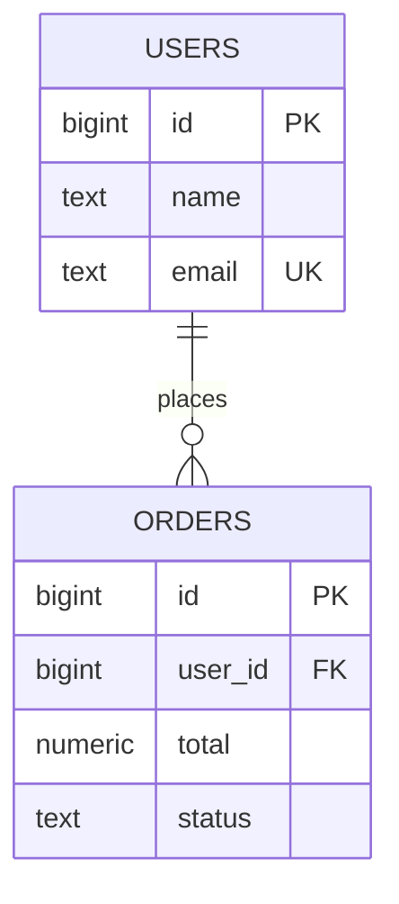

Relational databases (SQL)
**Relational** databases store data in **tables** (relations): rows with typed **columns**, linked by **keys**. You query with **SQL** — declarative **SELECT**, **JOIN**, **GROUP BY** — and rely on **ACID transactions** when several rows or tables must change together.

## 1. Data model



| Concept | Role |
|---------|------|
| **Primary key (PK)** | Unique row id (`id`) |
| **Foreign key (FK)** | References another table’s PK (`orders.user_id → users.id`) |
| **Constraint** | `NOT NULL`, `UNIQUE`, `CHECK`, `REFERENCES` — enforced by the DB |
| **Schema** | Table definitions fixed at DDL time (migrations in apps) |

## 2. SQL in one pass

**DDL** — define structure:

```sql
CREATE TABLE users (
  id         BIGSERIAL PRIMARY KEY,
  name       TEXT NOT NULL,
  email      TEXT UNIQUE NOT NULL
);

CREATE TABLE orders (
  id         BIGSERIAL PRIMARY KEY,
  user_id    BIGINT NOT NULL REFERENCES users(id),
  total      NUMERIC(10, 2) NOT NULL,
  status     TEXT NOT NULL DEFAULT 'open'
);
```

**DML** — read/write:

```sql
INSERT INTO users (name, email) VALUES ('Ada', 'ada@example.com');

SELECT u.name, o.total
FROM users u
JOIN orders o ON o.user_id = u.id
WHERE o.status = 'paid';

UPDATE orders SET status = 'shipped' WHERE id = 10;

DELETE FROM orders WHERE status = 'cancelled' AND created_at < NOW() - INTERVAL '90 days';
```

**JOIN** combines tables on a key — the main reason to pick SQL when entities relate many-to-many.

## 3. ACID transactions

| Property | Meaning |
|----------|---------|
| **Atomicity** | All statements in a transaction commit or all roll back |
| **Consistency** | Constraints hold after commit |
| **Isolation** | Concurrent transactions don’t corrupt each other’s view (levels: Read Committed, Repeatable Read, Serializable) |
| **Durability** | Committed data survives crash (WAL + fsync) |

```sql
BEGIN;
  UPDATE accounts SET balance = balance - 100 WHERE id = 1;
  UPDATE accounts SET balance = balance + 100 WHERE id = 2;
COMMIT;
-- ROLLBACK; if anything fails
```

Application code (JDBC / Spring) wraps the same boundary:

```java
// Compile: javac --release 22 …
// Spring @Transactional on a service method achieves the same boundary
connection.setAutoCommit(false);
try {
  debit(stmt, from, amount);
  credit(stmt, to, amount);
  connection.commit();
} catch (SQLException e) {
  connection.rollback();
  throw e;
}
```

## 4. Indexes and query plans

Without an index, **`WHERE email = ?`** scans every row (**O(n)**). A **B-tree** index on `email` makes point lookups roughly **O(log n)**.

```sql
CREATE INDEX idx_users_email ON users (email);
EXPLAIN ANALYZE SELECT * FROM users WHERE email = 'ada@example.com';
```

Rules of thumb:

- Index columns in **WHERE**, **JOIN**, **ORDER BY** predicates you use often.
- Too many indexes slow **INSERT/UPDATE** (each index must update).
- **Composite index** `(user_id, status)` helps `WHERE user_id = ? AND status = ?`.

## 5. Normalization (why multiple tables)

| Normal form | Idea |
|-------------|------|
| **1NF** | Atomic columns (no repeating groups) |
| **2NF** | No partial dependency on composite PK |
| **3NF** | No non-key column depends on another non-key column |

**Denormalization** — duplicate data on purpose — trades storage and update complexity for read speed (common in analytics, rare in OLTP until measured need).

## 6. Strengths and limits

**Strengths**

- Flexible **ad-hoc queries** and **JOINs**
- Strong **integrity** (FK, constraints)
- Mature **transactions**, backups, tooling

**Limits**

- **Scale-out writes** on one giant table is hard (sharding is manual or via NewSQL)
- **Schema migrations** slow very rapid shape churn (document DBs compete here)
- **Graph traversal** many hops — possible in SQL with recursive CTEs but awkward at huge scale

## 7. When to choose relational

- Orders, billing, inventory, accounts — money and invariants matter
- Many entity types with **many-to-many** relationships
- Reporting needs unpredictable **JOIN** / **GROUP BY**
- Team already standardizes on **PostgreSQL** / **MySQL**

## 8. Examples

| Engine | Typical use |
|--------|-------------|
| **PostgreSQL** | General-purpose, JSON columns, extensions |
| **MySQL / MariaDB** | Web apps, LAMP stacks |
| **SQLite** | Embedded, mobile, tests, single-file |
| **SQL Server** | Enterprise Windows/.NET stacks |

## 9. Related

- **Overview** — [Databases overview](i-overview.md)
- **Document** — when nested JSON beats wide normalization [Document](iv-document.md)
- **Hash table** — hash indexes vs B-trees (Data structures submenu)
