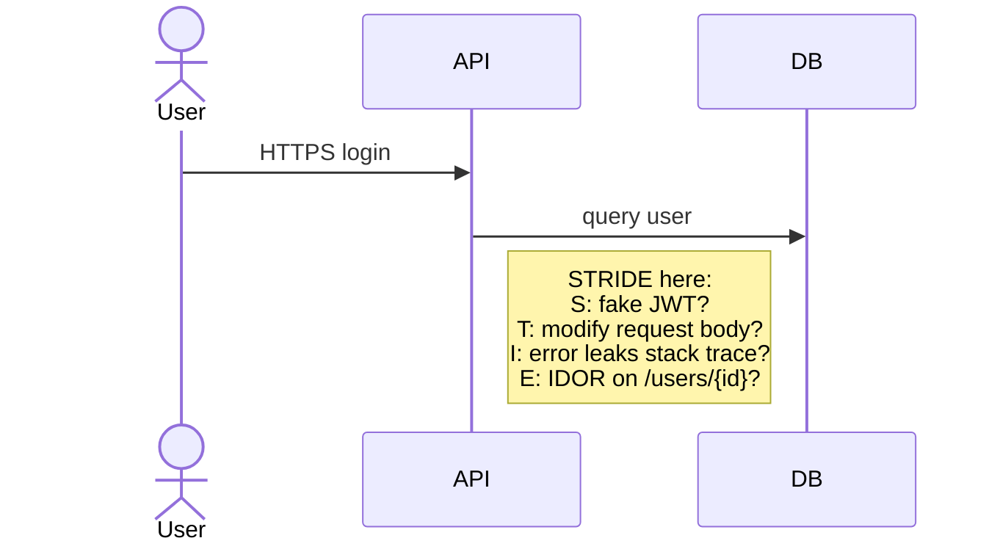

Threat modeling & risk
Before buying every security tool, answer: **what are we protecting**, **from whom**, and **what happens if we fail**? Threat modeling makes that explicit.

## 1. Start with assets

| Asset type | Examples | Usually highest impact |
|------------|----------|------------------------|
| **Data** | PII, payment cards, credentials, source code | Regulated or monetizable data |
| **Systems** | Prod API, admin console, CI runners | Path to data or deploy |
| **Identity** | Admin accounts, API keys, OAuth clients | Keys to the kingdom |
| **Reputation** | Brand, customer trust | After public breach |

**Crown jewels:** the small set where breach = company-ending or legally catastrophic. Map controls there first.

## 2. Attack surface

Everything an attacker can **reach** without already being inside:

```text
Internet-facing API
  → admin UI on same domain?
  → debug endpoint in prod?
  → S3 bucket with list permission?
  → Jenkins with old plugin?
  → employee laptop with VPN + prod DB creds?
```

| Surface | Shrink it by… |
|---------|----------------|
| Open ports | Close unused; security groups / NSGs |
| Public repos | No secrets; private for internal code |
| Third-party SaaS | SSO, SCIM, audit logs |
| Supply chain | Pin deps, SBOM, signed images ([SRE supply chain](../sre101/cicd/security-and-best-practices/ii-supply-chain-and-slsa.md)) |

## 3. STRIDE (per component)

Classic mnemonic for threat categories — walk each **data flow** or **component**:

| Letter | Threat | Question |
|--------|--------|----------|
| **S** | Spoofing | Can someone pretend to be another user or service? |
| **T** | Tampering | Can data or code be changed in transit or at rest? |
| **R** | Repudiation | Can actions happen without a reliable audit trail? |
| **I** | Information disclosure | Can secrets or PII leak? |
| **D** | Denial of service | Can availability be killed cheaply? |
| **E** | Elevation of privilege | Can a low-priv user become admin? |



## 4. Lightweight threat-model workshop (60 minutes)

| Step | Activity |
|------|----------|
| 1 | Draw **system diagram** (boxes + arrows, trust boundaries) |
| 2 | List **assets** and **entry points** |
| 3 | STRIDE each boundary crossing | 
| 4 | Rate **likelihood × impact** (simple 1–3 scale) |
| 5 | Pick top 5 mitigations; assign owners |

Output is a living doc — revisit on major architecture changes (new region, new auth provider, AI features with tool access).

## 5. Risk = likelihood × impact

| | Low impact | High impact |
|---|------------|-------------|
| **Likely** | Fix soon | **Stop-ship** |
| **Unlikely** | Backlog | Plan mitigation |

**Impact** examples:

| Event | Impact |
|-------|--------|
| Public read of marketing site | Low |
| Encrypt-and-extort prod DB | Critical |
| Leak of 10k user emails | High (legal + trust) |

**Likelihood** drivers: exposure (internet-facing), attacker interest, control maturity.

Formal frameworks (ISO 27005, NIST RMF) add rigor; startups often start with a **simple matrix** and improve over time.

## 6. Trust boundaries

A **trust boundary** is where data or control crosses from a **less trusted** zone to a **more trusted** one.

| Boundary | Validate at crossing |
|----------|----------------------|
| Browser → API | Auth, input validation, rate limits |
| API → internal service | mTLS or signed service identity |
| CI runner → cloud | OIDC, scoped IAM ([secrets & OIDC](../sre101/cicd/security-and-best-practices/iii-secrets-and-oidc.md)) |
| Vendor SaaS → your data | DPA, encryption, access reviews |

## 7. Common mistakes

| Mistake | Better approach |
|---------|-----------------|
| Threat model only after launch | Sketch at design; update per epic |
| “We use HTTPS, we’re fine” | App-layer bugs (IDOR, injection) remain |
| Treating all users as trusted on VPN | Zero trust — verify every request ([next notes](iv-application-and-network-security.md)) |
| Ignoring insiders | Least privilege, logging, separation of duties |
| Checkbox compliance only | Tie controls to actual threats for *your* system |

## 8. Rehearsal questions

- What is an asset vs an attack surface? Give one example each.
- Name all six STRIDE categories.
- Why draw trust boundaries on a diagram?
- When is a “unlikely but catastrophic” risk still worth mitigating early?

**Related:** [Overview](i-overview.md), [Identity & secrets](iii-identity-access-and-secrets.md), [Application & network security](iv-application-and-network-security.md).
