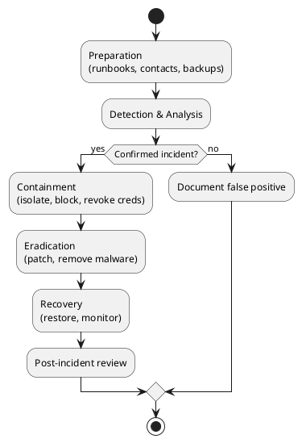

Incident response & operations
Prevention fails eventually. **Detection**, **prepared response**, and **learning from incidents** limit damage and recovery time.

## 1. Security operations loop

```text
Prevent → Detect → Respond → Recover → Learn → (improve Prevent)
```

| Phase | Owner | Output |
|-------|-------|--------|
| **Prevent** | Eng + security | Hardening, training, patching |
| **Detect** | SRE + security | Alerts, SIEM rules, anomaly reports |
| **Respond** | IR team + on-call | Containment, eradication |
| **Recover** | Eng + SRE | Restore service, validate integrity |
| **Learn** | Everyone | Post-incident review, ticketed fixes |

Observability stack: [Prometheus](../sre101/tooling/prometheus/i-intro-and-architecture.md) — security uses the same logs and metrics with different queries and runbooks.

## 2. What to log (security-relevant)

| Event | Fields to capture |
|-------|-------------------|
| **Auth** | user/service id, success/fail, IP, user-agent (careful with PII) |
| **Authz denial** | resource, action, principal |
| **Admin actions** | who changed IAM, firewall, billing |
| **Data export** | large downloads, bulk API reads |
| **Deploy / config** | image digest, who approved prod |

| Good | Bad |
|------|-----|
| Structured JSON logs | Unsearchable printf strings |
| Centralized retention (90d–1y+) | Logs only on one pod |
| Correlation id across services | No clock sync (use NTP) |

**Never log:** passwords, full payment PAN, raw session tokens.

## 3. Detection sources

| Source | Catches |
|--------|---------|
| **SIEM / log alerts** | Brute force, impossible travel login |
| **IDS/IPS / WAF** | Known attack signatures |
| **EDR on endpoints** | Malware, credential dumping |
| **Cloud trail / audit logs** | IAM changes, public bucket ACL |
| **Dependency / secret scanners** | CVE introduced in PR |
| **User report** | Phishing, account takeover |

Tune alerts to **actionable** — alert fatigue means real incidents get missed.

## 4. Incident response phases (NIST-style)



| Phase | Actions |
|-------|---------|
| **Preparation** | IR roster, comms template, legal/contact list, tested backups |
| **Detection** | Triage severity (P1 data breach vs P3 scan noise) |
| **Containment** | Disable compromised accounts, block IP, snapshot disks **before** wipe |
| **Eradication** | Patch vuln, rotate **all** secrets that might be exposed |
| **Recovery** | Gradual restore; watch for re-entry |
| **Lessons learned** | Blameless review within 5 business days |

## 5. Severity guide (example)

| Sev | Criteria | Example |
|-----|----------|---------|
| **P1** | Active exfiltration, prod crypto-ransomware, full outage | Customer DB dumped |
| **P2** | Confirmed compromise limited scope, major vuln exploited | Single admin account hijacked |
| **P3** | Suspicious activity, contained attempt | Blocked brute force spike |
| **P4** | Policy violation, low risk | Employee shared doc externally |

Define **who gets paged** per severity before the incident, not during.

## 6. Communication

| Audience | When | Message style |
|----------|------|----------------|
| **Internal war room** | Immediately | Facts, timeline, owners |
| **Leadership** | P1/P2 | Impact, ETA, regulatory exposure |
| **Customers** | Confirmed data impact | Clear, no jargon, what to do |
| **Regulators** | If legally required | Per counsel (GDPR 72h, etc.) |

**Do not** announce root cause before investigation ends. **Do** document decisions in a shared channel with timestamp.

## 7. Tabletop exercise (90 minutes)

Walk a **fictional scenario** without production changes:

```text
Scenario: GitHub token leaked in public gist at 09:00 UTC.
          Attacker cloned private repo; prod k8s creds in old .env.example.
```

| Minute | Activity |
|--------|----------|
| 0–15 | Present scenario; assign roles (IC, comms, eng, legal) |
| 15–45 | What do you do in hour 1? hour 24? |
| 45–60 | Gap list: missing runbook, no secret rotation list |
| 60–90 | Prioritize 3 improvements with owners |

Run **quarterly**; rotate scenarios (ransomware, insider, supplier breach, DDoS).

## 8. Patch and vulnerability management

| Cadence | Scope |
|---------|-------|
| **Critical CVE** | Hours–days for internet-facing exploit active in wild |
| **High** | This sprint |
| **Medium/Low** | Backlog + risk acceptance for edge cases |

| Process | Detail |
|---------|--------|
| **Inventory** | Know what you run (SBOM helps) |
| **Scan** | OS, containers, dependencies |
| **Test** | Staging before prod reboot |
| **Emergency** | Pre-approved break-glass deploy path |

## 9. Backup and recovery (security angle)

Backups are a **ransomware** recovery path — if attackers encrypt prod, you restore from **immutable** backups.

| Requirement | Why |
|-------------|-----|
| **Offline or immutable copies** | Attacker can’t encrypt backups too |
| **Tested restore** | Backup that never restored = unknown |
| **RPO/RTO** | How much data loss and downtime is acceptable |

## 10. After the incident

| Artifact | Content |
|----------|---------|
| **Timeline** | UTC timestamps, evidence links |
| **Root cause** | Technical + process failure |
| **What worked** | Detection, comms, rollback |
| **Action items** | Owned tickets with due dates |
| **No blame** | Focus on systems and incentives |

Feed actions back into [threat model](ii-threat-modeling-and-risk.md) and [CI/CD gates](../sre101/cicd/security-and-best-practices/vii-release-gates-and-rollbacks.md).

## 11. Rehearsal questions

- Name the five IR phases after detection?  
  **Answer:** Containment, Eradication, Recovery, Lessons Learned, and Preparation (note: Preparation generally comes first in the IR lifecycle, but after detection the typical steps are Containment, Eradication, Recovery, and Lessons Learned).

- Why snapshot disks before eradication?  
  **Answer:** To preserve forensic evidence that can be analyzed later; taking a snapshot ensures you retain a record of the compromised system before any changes are made during incident response.

- What belongs in a security log line for a failed login?  
  **Answer:** Include timestamp (in UTC), username attempted, source IP address, reason for failure, user agent, request ID or session ID, and possibly geographic location. Avoid logging sensitive data like passwords.

- Why run tabletop exercises if you already have monitoring?  
  **Answer:** Tabletop exercises test the human and process aspects of incident response—roles, communications, decision making, runbook clarity—not just whether monitoring detects problems. They help identify process gaps before a real incident occurs.

**Related:** [Overview](i-overview.md), [Application & network security](iv-application-and-network-security.md), [Pipeline observability](../sre101/cicd/security-and-best-practices/vi-pipeline-observability-and-dora.md).
