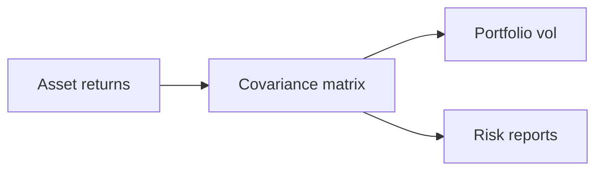

Returns, risk & statistics
Quants talk in **returns**, not only prices. Risk work starts with **dispersion**, **correlation**, and knowing which summary statistic lies in which regime.

## 1. Prices → returns

| Measure | Formula (intuition) | Use |
|---------|---------------------|-----|
| **Simple return** | `(P_t - P_{t-1}) / P_{t-1}` | Easy PnL % over one period |
| **Log return** | `ln(P_t / P_{t-1})` | Additive over time; common in research |
| **Excess return** | Return − funding / risk-free proxy | Compare strategies |

```text
Price series  →  returns  →  mean / vol / skew / drawdown
```

Never mix **adjusted** and **unadjusted** prices in one return series without documenting corporate-action handling.

## 2. Volatility (engineer definition)

**Volatility** ≈ how much returns move — usually a **standard deviation** scaled to a horizon (daily, annualized).

| Gotcha | Detail |
|--------|--------|
| **Annualization** | Common rule-of-thumb: multiply daily σ by √252 for equities — markets aren’t always like that |
| **Non-stationarity** | Vol clusters; yesterday’s σ ≠ tomorrow’s |
| **Jump risk** | Stdev understates crash days |

In systems: store **which vol estimator** (close-to-close, Parkinson, EWMA, GARCH) next to the number.

## 3. Risk vs uncertainty in trading code

| Term | Practical meaning |
|------|-------------------|
| **Risk** | Measurable dispersion under a model |
| **Uncertainty** | Model wrong, data wrong, regime change |
| **Drawdown** | Peak-to-trough equity curve loss — felt by PMs |
| **VaR / ES** | Tail loss summaries — need assumptions + monitoring |

Limits in production are often **notional**, **Greeks**, **loss**, or **message rate** — not only “σ of returns.”

## 4. Correlation and covariance

Strategies that look diversifying can move together in stress.



| Pitfall | Fix |
|---------|-----|
| Pairwise corr on short windows | Unstable — shrink / factor models |
| Ignoring missing bars | Alignment and timestamps matter |
| Looking only at levels | Use returns for corr of P&L drivers |

## 5. Distributions you will meet

| Model | When people use it | Failure mode |
|-------|--------------------|--------------|
| **Normal / lognormal** | Teaching, Black–Scholes baseline | Thin tails |
| **Empirical / historical** | Stress and VaR variants | Past ≠ future |
| **Heavy-tailed** | Real markets | Harder calibration |

## 6. PnL vocabulary

| Term | Meaning |
|------|---------|
| **Mark-to-market (MTM)** | Value positions at current marks |
| **Realized PnL** | From closed trades |
| **Unrealized PnL** | Open positions vs marks |
| **Fees / rebates / borrow** | Often larger than “alpha” on the edge |

Engineers should treat **fees and corporate actions** as first-class series, not afterthoughts in a CSV.

## 7. Checklist before trusting a metric

| Question | Why |
|----------|-----|
| What timezone and session filter? | Overnight gaps |
| Adjusted for splits/dividends? | Equity backtests |
| Survivorship bias? | Index membership |
| In-sample vs out-of-sample? | Overfitting |

## Next

[Market data & time series](iv-market-data-and-time-series.md) — how those returns are actually stored and aligned.
