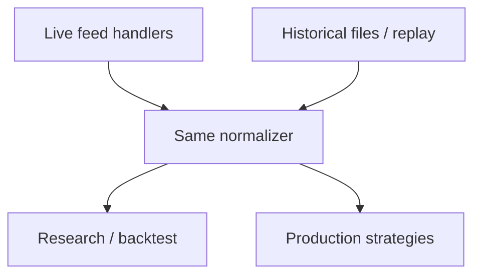

Market data & time series
Trading systems are **time-series systems** with strict clocks, late data, and multiple “truths” (exchange vs vendor vs your capture).

## 1. Granularity ladder

| Level | Contents | Typical use |
|-------|----------|-------------|
| **Tick / trade** | Time, price, size, conditions | Microstructure, TCA |
| **Quote / BBO** | Best bid/offer | Spreads, signaling |
| **Depth (L2/L3)** | Book levels / orders | Queue models, sim |
| **Bar / OHLCV** | Open, high, low, close, volume | Research, dashboards |
| **Reference** | Static instrument attrs | Tick size, multipliers |

```text
Capture → normalize → store → serve (live) / replay (sim)
```

## 2. Clocks

| Clock | Meaning |
|-------|---------|
| **Exchange timestamp** | Venue’s event time (when available) |
| **Matching engine time** | Authoritative for order events on that venue |
| **Capture / receive time** | When *your* process saw it — includes network delay |
| **Wall clock (UTC)** | Logs, alerts, ops |

For research, prefer **event time**. For latency SLOs, measure **receive − exchange** and wire delays separately.

## 3. Alignment problems

| Problem | Symptom | Mitigation |
|---------|---------|------------|
| **Irregular ticks** | Empty minutes | Forward-fill carefully; mark missing |
| **Multiple venues** | Same symbol, different clocks | Per-venue series + symbology map |
| **Revisions** | Vendor corrects history | Versioned datasets; as-of joins |
| **Late packets** | Out-of-order events | Sequence numbers; reorder buffers |

**As-of join:** for each decision time `t`, use only data with event time ≤ `t` — the root of backtest honesty.

## 4. Storage shapes

| Store | Fits |
|-------|------|
| **Columnar files** (Parquet) | Research batches, partitions by date/symbol |
| **Time-series DB** | Ops metrics, some market series |
| **Object store + catalog** | Cheap history; Spark/Polars jobs |
| **In-memory / shared mem** | Hot path in trading processes |

Partition by **date** and **instrument** early — backfills and deletes become tractable.

## 5. Normalization checklist

| Field | Normalize to |
|-------|--------------|
| Symbol | Canonical instrument id |
| Price | Native + optional decimal/scaled integer |
| Size | Lots vs shares vs contracts — document units |
| Side | Buy/sell enums, not strings everywhere |
| Currency | ISO code; FX convert explicitly |

Prefer **integer ticks** (price × multiplier) on hot paths to avoid binary float surprises.

## 6. Live vs historical parity



If live and hist parsers diverge, “works in backtest” is meaningless.

## 7. Quality monitors

| Check | Example alert |
|-------|----------------|
| **Gap detection** | No trades for N seconds in open session |
| **Stale BBO** | Quote age > threshold |
| **Crossed book** | Bid ≥ ask (may be valid briefly — know venue rules) |
| **Schema drift** | New condition codes |

## Next

[Order books & microstructure](v-order-books-and-microstructure.md) — what BBO and depth actually mean for orders.
