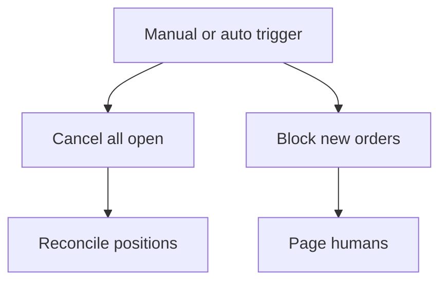

Risk, PnL & controls
Fast order entry without **risk and PnL** is how firms blow up. Controls must be **correct under stress**, not only in the happy path.

## 1. Layers of control

| Layer | When | Examples |
|-------|------|----------|
| **Pre-trade** | Before send | Max order size, price collars, symbol allowlist |
| **In-flight** | Working orders | Max open orders, kill switch |
| **Post-trade** | After fills | Position limits, loss limits |
| **Firm** | Portfolio | Gross/net exposure, concentration |

Fail **closed** when marks or feeds are stale — not “best effort allow.”

## 2. Limit types engineers implement

| Limit | Typical unit |
|-------|--------------|
| **Order size / notional** | Shares, contracts, currency |
| **Position** | Net per symbol / book |
| **Loss** | Intraday / daily PnL floor |
| **Message rate** | Orders/sec (venue + self) |
| **Greek / factor** | Delta, beta to index |
| **Fat-finger** | Price vs last / ref within N ticks |

Limits need **owners**, **override audit**, and **who can raise them**.

## 3. PnL explain

```text
Trades + marks + fees + financing + corporate actions = PnL
```

| Bucket | Source |
|--------|--------|
| **Trading PnL** | Fills vs marks |
| **Fee PnL** | Commissions, rebates |
| **Financing** | Borrow, funding rates |
| **FX translation** | Multi-currency books |

Store marks with **source + timestamp + quality**. Unexplained PnL is a bug, not a footnote.

## 4. Kill switches



| Trigger | Example |
|---------|---------|
| **Human** | Desk panic button |
| **Loss breach** | Daily stop |
| **Data stale** | Mark age / feed gap |
| **Reject storm** | Venue rejects spike |

Test kill switches in **cert** regularly — unused switches rot.

## 5. Reconciliation

| Compare | Against |
|---------|---------|
| Internal positions | Drop copy / clearing |
| Cash balances | Custodian / exchange wallet |
| Open orders | Venue open-order query |
| Fees | Broker invoices |

Breaks are normal during incidents; **undetected** breaks are dangerous.

## 6. Compliance-adjacent engineering

| Topic | System impact |
|-------|----------------|
| **Audit logs** | Immutable order/decision history |
| **Access control** | Who can trade which books |
| **Surveillance feeds** | Export for compliance tools |
| **Retention** | Market data and orders kept per policy |

Not legal advice — coordinate with compliance on retention and surveillance.

## 7. Operating checklist

| Check | Cadence |
|-------|---------|
| Limit config vs intended | Pre-open |
| Feed health + mark age | Continuous |
| PnL vs broker | Intraday / EOD |
| Kill switch drill | Scheduled |
| Capacity / rate limits | On venue change |

## Track complete

You now have markets → stats → data → microstructure → derivatives → research → architecture → risk → [a day-in-the-life example](x-day-in-the-life.md).

Return to [Quant SWE overview](i-overview.md), or deepen systems with [SWE101 system design](../swe101/sysdesign/scalable-patterns/i-overview.md) and [Kafka](../swe101/kafka/i-overview.md).
