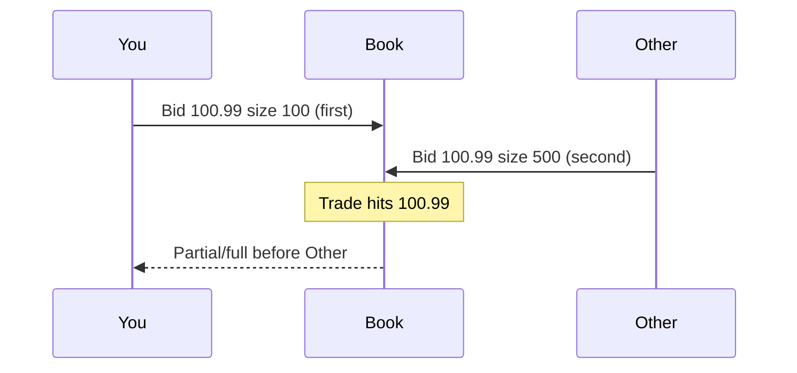

Order books & microstructure
**Microstructure** is how orders become trades: books, queues, fees, and latency. Most “alpha” decay stories are microstructure stories in disguise.

## 1. Limit order book (LOB)

```text
Asks (sells)  101.02 × 200
              101.01 × 500
              101.00 × 100   ← best ask
────────────────────────────
              100.99 × 300   ← best bid
              100.98 × 800
Bids (buys)   100.97 × 150
```

| Term | Meaning |
|------|---------|
| **BBO** | Best bid and offer |
| **Spread** | Best ask − best bid (in price or ticks) |
| **Mid** | Midpoint of BBO (handle one-sided books carefully) |
| **Depth** | Size available at each level |
| **Tick size** | Minimum price increment |

## 2. Order types (common)

| Type | Behavior |
|------|----------|
| **Limit** | Rest in book at price or better |
| **Market** | Take liquidity now (venue-defined protection rules) |
| **IOC / FOK** | Immediate-or-cancel / fill-or-kill |
| **Post-only** | Reject if it would take — maker intent |
| **Stop / stop-limit** | Trigger then submit (know venue semantics) |

Time-in-force (**DAY**, **GTC**, **IOC**) is part of the contract with the matching engine.

## 3. Maker vs taker

| Role | Action | Economics |
|------|--------|-----------|
| **Maker** | Adds resting liquidity | Often rebate or lower fee |
| **Taker** | Removes liquidity | Often higher fee |

Your simulator must apply the **fee schedule** you claim to trade under.

## 4. Queue priority

On price-time books, earlier orders at a price level fill first.



Latency to the book and **cancel/replace** behavior dominate maker strategies.

## 5. Slippage and impact

| Concept | Plain meaning |
|---------|---------------|
| **Spread cost** | Crossing the market costs ~half-spread (roughly) |
| **Slippage** | Fill vs decision price |
| **Market impact** | Your order moves the book against you |
| **Adverse selection** | You get filled when the world knows more than you |

Backtests that fill at mid with infinite size are fiction.

## 6. What to simulate at each fidelity

| Fidelity | Model | When enough |
|----------|-------|-------------|
| **Bar** | Next open/close fills | Slow strategies |
| **BBO** | Touch + spread + simple queue | Many equities signals |
| **L2** | Depth depletion | Sizeable orders |
| **L3 / order-by-order** | Full queue | HFT / maker |

## 7. Engineering artifacts

| Component | Responsibility |
|-----------|----------------|
| **Book builder** | Apply incremental depth messages → snapshot |
| **Symbology** | Map feed symbols → instruments |
| **Gap recovery** | Snapshot + resync after sequence break |
| **TCA** | Fill quality reports vs benchmarks (arrival, VWAP, …) |

## Next

[Derivatives intuition](vi-derivatives-intuition.md) — instruments whose value depends on something else.
