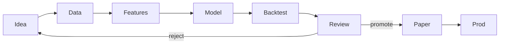

Research & backtesting
A **backtest** is a scientific experiment on historical data. Most failures are **leakage**, **wrong fills**, or **overfitting** — not missing a fancy model.

## 1. Research pipeline



| Stage | Engineer job |
|-------|--------------|
| **Data** | Versioned, as-of correct, documented adjustments |
| **Features** | Point-in-time; no future bars |
| **Backtest** | Costs, delays, constraints |
| **Review** | Holdout / walk-forward; capacity |

## 2. Point-in-time (PIT) data

| Leak | Example |
|------|---------|
| **Restated fundamentals** | Using final filing numbers on announcement day |
| **Index membership** | Knowing future constituents |
| **Survivorship** | Only stocks that exist today |
| **Timestamp cheat** | Using close to trade at open same day without lag |

Rule: every feature join is an **as-of** join at decision time.

## 3. Fill models

| Model | Assumption | Risk |
|-------|------------|------|
| **Next bar open** | You get the open | Optimistic for slow signals |
| **VWAP participation** | Fraction of volume | Needs volume series |
| **Touch / queue** | Microstructure aware | Expensive to build |
| **Fixed bps slippage** | Constant cost | Hides impact |

State **latency** (signal → order → ack → fill) explicitly — even 100 ms matters for some styles.

## 4. Walk-forward and overfitting

```text
Train window → test window → roll forward → aggregate OOS metrics
```

| Red flag | Meaning |
|----------|---------|
| Great IS, flat OOS | Fit noise |
| One magic parameter | Fragile |
| Universe hand-picked | Selection bias |
| No cost sensitivity | Edge is fees |

## 5. Metrics that matter

| Metric | Why |
|--------|-----|
| **Net return after costs** | Reality |
| **Sharpe / Sortino** | Risk-adjusted — know assumptions |
| **Max drawdown** | Capital and psychology |
| **Turnover** | Capacity and fee load |
| **Hit rate / payoff ratio** | Diagnostics, not goals alone |

Optimize one primary objective; report the rest.

## 6. Software structure

| Package | Responsibility |
|---------|----------------|
| `data/` | Loaders, calendars, symbology |
| `features/` | Transforms with PIT guarantees |
| `alpha/` | Signal definitions |
| `sim/` | Broker/exchange emulator |
| `report/` | Tearsheets, hashes of config + data version |

Pin **data version + code commit + config** on every tearsheet artifact.

## 7. From research to production

| Research | Production |
|----------|------------|
| Batch Parquet | Streaming + snapshots |
| Flexible Python | Latency / determinism constraints |
| One researcher laptop | Monitoring, kill switches, audit |

Promotion criteria should include **parity tests**: same inputs → same decisions within tolerance.

## Next

[Trading systems architecture](viii-trading-systems-architecture.md) — how live systems are wired.
